# Reference teardowns — arctic sketchbook v2

Written 2026-09-17. Every site in HANDOFF §5 was fetched live (raw HTML, rendered DOM,
CSS and JS bundles, hover and scroll screenshots via headless Chromium), except
familiatipo.com, whose host is suspended; that one was torn down from a Wayback Machine
snapshot that is byte-identical from 2011 to 2025. The four React Bits components were
read from the DavidHDev/react-bits source. Full evidence (bundles, extracted shaders,
JSON probes, ~400 screenshots) lives in the session scratchpad, not in the repo; one
representative shot per site is in `docs/refs/shots/`.

Layout: §1 is the cross-site synthesis and what it means for the open decisions in
HANDOFF §3. §2 onward is one section per site in a fixed layout (stack, fonts, layout,
effects with technique + evidence, adopt, reject, screenshots).

---

## 1. Synthesis

### 1.1 What the ten sites are actually built with

| Site | Framework | Scroll | Animation | Canvas / WebGL | Reduced motion |
|---|---|---|---|---|---|
| familiatipo.com (2013, archived) | static PHP + jQuery 1.8 | none (one viewport) | CSS `:hover` sprite jump | none | n/a |
| textjar.app | vanilla TS + Vite, Supabase | none (one viewport) | matter-js 0.20 cascade | Canvas 2D | CSS only, not physics |
| jackiezhang.co.za | Framer (React 18, motion fork) | Lenis 1.0.29, motion `useScroll` scrub | motion variants + springs, GSAP 3.11 core for a click burst | none | ignored |
| yashf.in | Framer on Netlify | Lenis 1.1.2, motion scroll-transform | motion variants, WAAPI springs | none | ignored |
| jackiehu.design | Framer | native, no scroll effects | motion `layoutId` + springs | three r169 for one 155px thumbnail | ignored |
| jesspaik.com | Framer, one custom React component | none (1440×900 desk) | framer-motion controls + `setTimeout` | Canvas 2D (alpha hit-test, calendar) | ignored |
| taliahhh.com | Framer | none (fixed spread) | motion variants | none rendered | ignored |
| davidwhyte.com/experience | WordPress + custom three.js | Lenis 1.3.2 → camera dolly | GSAP 3.14 + SplitText | three.js WebGL2, 6-pass fluid sim | ignored |
| sutera.ch | Nuxt 3 + Tailwind 4 on Vercel | Lenis 1.3.15, ScrollTrigger only as visibility gate | GSAP 3.13 (DrawSVG, Draggable, ScrambleText, CustomEase) | raw WebGL2 frame turntables, three r181 GPGPU | ignored |
| scottmilton.com | Framer | Lenis, motion `whileInView` | motion opacity-only appear | none | honoured |

Seven of ten are Framer. Nothing here needs a library we have not already allowed; the
Framer "smart component variant" pattern maps one-to-one onto `motion/react`
`whileHover`/`animate`/`drag`, and every scroll-linked move maps onto GSAP ScrollTrigger.
No site pins a section. Only one site honours `prefers-reduced-motion`.

### 1.2 How the effects Chimin noted are really made

| Chimin's note | Reality | Verdict for us |
|---|---|---|
| familiatipo: doodle goes B&W → colour on hover | A two-state PNG sprite per building; `background-position` jumps top→bottom on `:hover`, zero transition. Base drawing is one grey JPEG. | Keep the *idea* (monochrome scene, per-object colour layer in the same coordinate space), rebuild as SVG line + fill groups with a bleed mask. |
| textjar: scattered jars at varied sizes and tilts | The scatter is a transient frame ~1 s into a matter-js cascade of every public jar; at rest it is a solid wall. Jars are one scanned PNG stamped on a canvas. No hover, no idle motion. | Freeze the mid-fall look as a seeded layout with a GSAP deal-in; keep real physics for the M5 lab only. |
| jackiezhang: scribble menu hover, torn paper travels on scroll, drag | Scribble = inline SVG path with `stroke-dashoffset` L→0 over 0.3 s (what rough-notation does) plus PNG doodles fading in. Torn paper = the book's bottom page `rotateX` 50→0→−30 scrubbed between two invisible marker sections. Drag = motion `drag` with `dragMomentum:false`; bio photo adds `dragSnapToOrigin`. Torn edges are baked PNGs. | Adopt all three, with rough-notation, a ScrollTrigger scrub, and motion drag. Draw torn edges with rough.js clip paths instead of PNGs. |
| davidwhyte: watercolour, wet-paint cursor, long-press reveals the real place | Wet paint = a full six-pass GPU stable-fluids sim per painting, packed into an FBO atlas; the result offsets the painting UV by ~1% and blends a dry→ink 3D LUT. Long-press = a rAF-timed pointer state machine (0.3 s desktop, 0.6 s mobile, cancels on >15 px move), tap + Back on touch. Paintings bloom in from black ink blots via 4 seeded noise points. | Do not port the fluid sim. Port the long-press hook and the ink-bloom reveal (in SVG). A single-FBO wet smear is the one M6 shader if we want it. |
| sutera: cool 3D elements rotating, blueprint-to-reality | No 3D models at all: 111- and 121-frame WebP turntables (28.5 MB) drawn on a WebGL quad, auto-looped by one GSAP tween. Blueprint-to-reality is a hard DOM swap between three pre-rendered trees hidden under a 0.9 s glitch curtain (feTurbulence re-seeded every 50 ms + flicker). | Reject the glitch; the swap-under-a-transition idea becomes "colour soaks in under a bleed mask". A frame turntable is a viable, three-free way to spin one sketched object. |
| jackiehu: typographic restraint, symbols as punctuation | Symbols are plain Unicode in the IBM Plex Mono run, rendered by OS fallback fonts. The interesting parts are a boiling feTurbulence text filter, a `layoutId` desk-mode switcher, hover sounds. | Draw our own punctuation glyphs with rough.js; adopt the boiling filter as the "wobble" verb on linework and handwriting only. |
| jesspaik: interactive case studies | A desk of 13 PNG/GIF stickers with pixel-accurate canvas alpha hit-testing, a deal-the-deck intro, gather-and-peek on name hover; case studies are iframes of external sites in faux-OS windows. | Adopt alpha hit-testing, deal-in, gather-and-peek (as a melt) and the matter-js jar from its case study. Reject iframes and the fixed 1200px viewport. |
| yashf.in | Postcard hero that fans apart on scroll over a fixed hero, ticket cards with PNG luminance masks, hover-spinning vinyls, envelope letters, a 3.5 s blocking preloader. | Adopt fixed-hero-with-sections-scrolling-over-it, mask-based edges, hover-starts-a-loop; reject the preloader and `cursor:none`. |
| taliahhh | A fixed photographic ring-binder spread; motion variants for a 4° nav tilt, tab-driven in-place swaps, greyscale→colour cards, snap-back stickers. | Adopt the tab swap and snap-back stickers for M5; reject raster binder art and the rotated /work canvas. |
| scottmilton: type system | One typeface at one weight, set solid, sizes 48/24/18/16/15/14 with tracking tightening from −1% to −5%; hierarchy carried by colour (ink vs grey), never by weight; DM Mono 11px uppercase as the only second voice. | Adopt the discipline (one weight, colour hierarchy, mono as second voice) inside our own scale. |

### 1.3 Techniques worth copying, by our motion verb

- **draw**: stroke-dashoffset on a hand-drawn path (jackiezhang, sutera's DrawSVG callouts). GSAP DrawSVG on our SVG linework; rough-notation for underlines, circles and highlights.
- **bleed**: davidwhyte's ink-bloom (4 seeded points, staggered `startTime/stepDuration`, noise edge) rebuilt as an SVG `<mask>` of growing circles filtered by feTurbulence + feDisplacementMap. Reduced motion: opacity crossfade.
- **wobble**: the Framer University "squiggle" filter used by jackiehu, yashf.in and taliahhh: `feTurbulence baseFrequency≈0.02 numOctaves 1–2` + `feDisplacementMap scale 2–5`, seed re-randomised every 100–150 ms. Apply to linework and handwriting only; freeze the seed under reduced motion; run only while in view.
- **melt**: jesspaik's gather-and-peek (stickers shrink into a pile under the name) and React Bits SplashCursor cut down to a single decaying heat FBO (M6 only).
- **fall / settle**: textjar's cascade numbers (60 ms stagger, gravity scale 0.0014, restitution 0.12, friction 0.55, chamfered bodies 84–92% of the sprite, sleeping on), paperprayers' jar (static wall chain, per-tick speed clamp, escape rescue, pointer "boulder"), FallingText's span→body mapping. Physics only in the M5 lab; elsewhere "fall" is a GSAP `from y:-40` with `back.out`.
- **hover**: lift 2–5 px + tilt 1–4° with a spring, and the object keeps its base rotation (jackiehu's hover variant drops it, which reads as a glitch). Hover can start a loop (yashf.in vinyl) but never runs one unprompted.
- **drag**: motion `drag` with `dragMomentum={false}`; mascots get `dragSnapToOrigin` with `bounceStiffness 400, bounceDamping 30` (three sites use these exact numbers). Stop Lenis while dragging (sutera).
- **scroll**: at most one scrubbed transform per section (jackiezhang's page fold); ScrollTrigger otherwise only gates rAF loops and timelines (sutera). No pins. Lenis config from scottmilton: `duration ≈ 1`, exponential easing, off on touch.
- **hold**: davidwhyte's `useLongPress`: pointerdown → rAF progress → `longpressOn` at 0.3 s (0.6 s touch), cancel on >15 px; tap + Back button on touch.

### 1.4 What this means for the HANDOFF §3 decisions

1. **Ink-to-colour grammar with an SVG mask reveal for M1** — confirmed by the evidence. No reference does it with a shader except davidwhyte, whose version is a 6-pass fluid sim. The convincing part of davidwhyte's look is the *ink-bloom reveal*, which is four seeded blots with a noisy edge, and that is an SVG mask. Three.js stays out of M1.
2. **Pin only the index map spread** — confirmed. Zero reference sites pin. The one scroll-linked move worth having is a scrubbed page fold (jackiezhang), which is a transform on a normally flowing element, not a pin.
3. **Sun as day/night toggle, folded-corner mini-map** — no reference has either; nothing argues against them. yashf.in's fixed hero with sections scrolling over it suggests the sky band (sun, moon, snow) should be `position: fixed` behind the page so the sun is always reachable from the hero.
4. **Shantell Sans placeholder** — verified: the Google Fonts variable build carries `wght`, `BNCE` (−100..100) and `INFM` (0..100). Reference sites pair a handwriting face for labels only with a reading serif at 17–20px (yashf.in, jackiehu); none set paragraphs in handwriting.
5. **Additions** — all five are supported:
   - stroke tokens: three of the doodle sites use visibly different weights for hero drawings, frames and hairlines;
   - work scatter: textjar's look is a transient; do it as a seeded layout + GSAP deal-in (jesspaik) rather than live physics;
   - hold-to-reveal: davidwhyte's state machine, ported as a hook;
   - the fox does one thing per section: matches "one signature moment per section" and jackiehu's "hover, don't loop" reading;
   - one draggable per section: every site with more than one draggable (jesspaik, sutera) also has to fight scrolling on touch.

   New proposals from the teardowns, to decide with Chimin:
   - **Wobble filter on linework** (M1): cheap, on-brand, and three references use it. Add `<SketchWobble>` to the primitives list.
   - **Fixed sky band** (M1): hero sky with sun/moon/snow stays fixed behind the page; sections scroll over it (yashf.in).
   - **Tiled-noise grain instead of a live feTurbulence filter** over the whole page (jackiezhang, yashf.in): a 150 px PNG at 8–10% `soft-light`/`multiply`. Keep feTurbulence for watercolour edges only. Performance reason.
   - **Alpha hit-testing** for sticker-like art (jesspaik): only the ink is hoverable. Free with SVG `pointer-events: visiblePainted`.
   - **Type discipline** from scottmilton: one weight per face, hierarchy by colour, mono as the only second voice. Fits the proposed 22/28/40/64 · 17/19 · 13 scale.
   - **Never**: blocking loaders (sutera, yashf.in, davidwhyte), `cursor: none` (scottmilton, yashf.in, davidwhyte), iframes as content (jesspaik), sound without a gesture and a mute (jackiehu, jesspaik).

### 1.5 React Bits, in one line each

- **FallingText** (201 lines, matter-js): keep the span→body mapping; drop `Matter.Render`, the double engine step and the uncancelled rAF. M5.
- **SplashCursor** (1317 lines, raw WebGL, no deps): full Navier–Stokes; cut to one decaying heat FBO + `smoothstep(heat + noise)` mix in R3F. M6, and only if the SVG melt feels flat.
- **ImageTrail** (1416 lines, gsap): eight copies of a ~120-line distance-gated ring buffer; rewrite as one hook, FIFO variant, ±6° travel rotation. M3 optional.
- **Ballpit** (907 lines, three): keep the viewport-world-size helper and the IntersectionObserver/visibilitychange rAF gating; render matter-js bodies instead of its O(n²) sim. M5.

---


---

## 2. https://www.familiatipo.com/  (torn down from the Wayback Machine — live host is suspended)

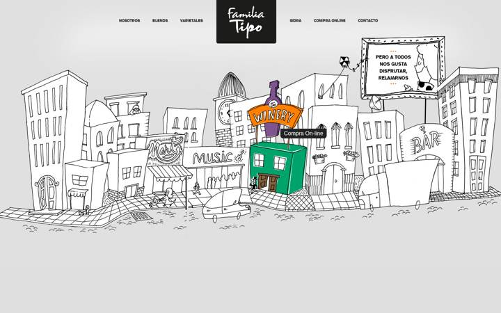


**Source note:** The live site is down (http://www.familiatipo.com/ → 301 to `/suspended.page/1_mb/`, TLS fails). Everything below comes from the Wayback capture `https://web.archive.org/web/20200108193129id_/http://familiatipo.com/` (2020-01-08; the 2023-12-04 capture is byte-identical, and CDX shows the same site from 2011 to 2025). The Simplified write-up (May 2021) and its screenshot `Familia-Tipo-Art2-1.png` match this capture exactly. Because archive.org returned intermittent 502s for assets in the browser, the Playwright run served the downloaded archived assets locally via `page.route` (`pw3.js`); the analysis itself is of the archived first-party files in `assets/`.

**Stack:** Hand-written static XHTML 1.0 Transitional + PHP pages (`index.php`, `nosotros.php`, `blends_tinto.php`…; no framework, no build). Hosting: unknown shared PHP host (now suspended). Libraries (all first-party copies, all confirmed in the browser via `jQuery.fn.jquery` etc.): jQuery 1.8.2 (`js/jquery1.8.2.min.js`, header `/*! jQuery v1.8.2`), jQuery Cycle 2.88 (`js/cycle.js`, `Version: 2.88 (08-JUN-2010)`), Easy Tooltip 1.0 by Alen Grakalic (`js/easyTooltip.js`), Shadowbox 3.0.3 (`shadowbox-3.0.3/shadowbox.js`, `version:"3.0.3"`, initialised but never used on the homepage), Google Analytics `ga.js` (UA-49474818-1). No GSAP, no three, no canvas, no SVG: computed-style scan found 0 `<canvas>`, 0 `<svg>`, 0 `filter`, 0 `mask`, 0 `clip-path`, 0 `mix-blend-mode`, 0 `backdrop-filter`, 0 CSS transitions (`computed.json`).

**Fonts:** One webfont, `gothic725_blk_btblack` (Bitstream Gothic 725 Black, `fuentes/4615_0-webfont.woff`, 24 KB, `@font-face` at top of `css/estilo.css`), used for nav (8pt ≈ 10.67px, uppercase, `#222`), inner-page `h1` (35px uppercase), `h3` (12px uppercase), buttons and submenu (12px). Body copy on inner pages is `Arial, Helvetica, sans-serif` 12px / line-height 18px `#222221`. The nav "Próximamente" tag is `Georgia` italic 11px. The homepage has no h1/h2/p at all (it is a picture with four hotspots); the "Familia Tipo" logo is a PNG (`img/marca.png`, 174×126).

**Layout & palette:** Single 900px-tall viewport, nothing to scroll (scrollHeight 900 at 1440×900; `scroll-0..5.png` are identical). `body{background:#dfdfdf url(img/fondo_home.jpg) top center no-repeat}` — one 1600×773 JPEG of a hand-drawn black-ink cityscape on a light grey vignette. A fixed-width `.wrap{width:990px;margin:0 auto;position:relative}` sits centred over it; because both the background (`top center`) and the wrap are centred, absolutely-positioned children in `.wrap` register pixel-exactly with features of the JPEG at any viewport ≥990px. Palette: greys (#dfdfdf bg, #999 hover, #222/#1c1c1b ink), white, orange accents inside the billboard slides; the hover panels bring in flat purple/orange/green (winery), ochre (nosotros), teal/yellow (bar), red (van). Mobile (≤800px): header collapses to a dark rounded box with a MENU pull (`#pull`, jQuery `slideToggle`), and the whole interactive layer is removed — `.color{display:none}` — leaving only the static drawing, which overflows the viewport (see `screenshot-mobile.png`).

**Effects**
- *Doodle hotspot: black-and-white → colour on hover* — hovering the Winery building, the small "nosotros" house, the Bar, or the van makes just that building pop into flat colour, with a black tooltip. **Technique:** CSS sprite with `background-position` jump; no transition, no filter, no SVG, no mask, no canvas. The base cityscape is a single grey JPEG on `body`. Each hotspot is an empty `<a>` with fixed pixel size/offset and a two-state PNG sprite: the top half is 100 % transparent (measured alpha 0 in all four sprites, `pw`-independent pure-Python PNG decode) so at rest the grey drawing shows through; the bottom half is the same building redrawn in colour, ~91–100 % opaque, and on `:hover` the sprite is shifted so the opaque coloured panel covers the grey one. Sprite heights are exactly 2× the CSS box: `winery_color.png` 173×664 (box 173×332), `nosotros.png` 131×316 (131×158), `contacto.png` 239×308 (239×154), `vinos_bar.png` 166×406 (166×202). **Evidence:** `css/estilo.css`:
  ```css
  a.winery{ background:url(../img/winery_color.png) no-repeat top center transparent;
            width:173px; height:332px; overflow:hidden; position:absolute; left:485px; top:103px; }
  a:hover.winery{ background-position:bottom center; }
  a.nosotros{ background:url(../img/nosotros.png) … left:78px; top:297px; }   a:hover.nosotros{ background-position:bottom center; }
  a.contacto{ background:url(../img/contacto.png) … left:801px; top:330px; z-index:9999; }  a:hover.contacto{ background-position:bottom center; }
  a.vinos{ background:url(../img/vinos_bar.png) … left:919px; top:229px; }   a:hover.vinos{ background-position:bottom center; }
  ```
  and `index.php`: `<div class="wrap color"> … <a href="#" class="winery tip" title="Compra On-line"></a> <a href="#" class="nosotros tip" title="Sobre nosotros"></a> <a href="#" class="contacto tip" …></a> <a href="blends_tinto.php" class="vinos tip" title="Nuestros vinos"></a></div>`. Playwright `hover.json`: `backgroundPosition` goes `50% 0%` → `50% 100%` on hover and back; sampling every 50 ms after mouse-leave shows only the two discrete values (no tween). Screenshots `hover-winery.png`, `hover-nosotros.png`, `hover-contacto.png`, `hover-vinos.png`.
- *Tooltip label on hotspots* — a dark rounded label ("Compra On-line", "Nuestros vinos"…) follows the cursor. **Technique:** jQuery plugin appends `<div id="easyTooltip">` on `hover`, `fadeIn("fast")`, repositions on `mousemove`, removes on leave; text comes from the anchor's `title`. **Evidence:** `js/easyTooltip.js` (`$("body").append("<div id='"+options.tooltipId+"'>"+content+"</div>") … .fadeIn("fast")`), `index.php` `$("a.tip").easyTooltip();`, `estilo.css` `#easyTooltip{background:#222;color:#fff;border-radius:0 0 8px 8px}`. `hover.json` shows `#easyTooltip` present with inline `position:absolute; top:…; left:…`.
- *Billboard slideshow* — the framed billboard in the drawing cycles three 196×131 JPEG "posters" with a crossfade. **Technique:** jQuery Cycle 2.88 `fx:'fade'` (jQuery `animate` on opacity, default 4 s timeout / 1 s speed). **Evidence:** `index.php` `$('.slideshow').cycle({ fx:'fade' })`; `estilo.css` `.slideshow{position:absolute;left:836px;top:3px}`; `slideshow.json`: images get inline `position:absolute; z-index:3/4; opacity:0.99→0.86→0.14` between t=4.5 s and 5.2 s.
- *Nav hover* — grey `#999` tab with bottom-rounded corners, white text; on "Compra Online" an italic "Próximamente" caption appears above. **Technique:** plain CSS `:hover` (no transition). **Evidence:** `nav ul li a:hover, nav ul li a.active{background-color:#999;color:#fff;border-radius:0 0 8px 8px}` and `nav ul li a:hover span{display:block;color:#ddd}`; `hover.json` (`transitionDuration: "0s"`). `hover-nav-compra.png`.
- *Mobile menu* — MENU button toggles the list. **Technique:** jQuery `slideToggle()` on `nav ul.menu`, reset on resize >320px. **Evidence:** inline `<script>` in `index.php`; `mobile.json` (`menuAfterPull: "none display: none;"`).
- *Scroll effects* — none. Page is one viewport; no scroll listeners (`grep -c "scroll" estilo.css index.php` → only the menu resize handler).

**What to adopt for the arctic sketchbook**
- *"Colour bleeds into one building on hover" as the signature moment of a sketch scene* (M3 hero / map section). Keep the structure — one monochrome base drawing plus per-hotspot colour layers that register pixel-exactly — but do it with our stack: base = rough.js/hand-traced SVG paths; each hotspot = an SVG `<g class="colour">` of watercolour fills (`feTurbulence`+`feDisplacementMap`) placed in the same coordinate space, revealed with `motion/react` `whileHover` (opacity 0→1 and a `clipPath` circle/ink-blot `r` growing = "bleed"), or with GSAP DrawSVG on the outline. The register trick (background `top center` + centred wrap) becomes trivial in a single `viewBox`. `prefers-reduced-motion`: plain opacity crossfade, which is essentially what Familia Tipo does already.
- *Hotspots as real links with a hand-lettered tooltip* (M3). Familia Tipo's `<a title>` + jQuery tooltip → a `motion` `AnimatePresence` label in the handwriting font, positioned from the pointer, with `rough-notation` underline; keep it keyboard-focusable (`:focus-visible` triggers the same colour reveal — the original only fires on `:hover`).
- *Sprite-state discipline* (M2 asset pipeline). Their per-hotspot PNG holds exactly two states, sized 2× the box. For us: export each hotspot as one SVG with `.line` and `.colour` groups so the reveal is a class toggle; no separate colour images to keep aligned.
- *Tiny picture-in-picture "billboard" that cycles content* (M4 travel-log). Their jQuery Cycle billboard → a `motion` `AnimatePresence` crossfade of 3 sketch postcards inside a rough.js frame drawn in the scene; reduced-motion = same crossfade, slower.
- *Removing the interactive layer on mobile rather than shrinking it* (M5 responsive pass). They set `.color{display:none}` under 800px. We should not drop the interaction, but the lesson stands: on touch, hover-only reveals must become tap-to-reveal (`onTap` in `motion`), and the wide scene should pan (Lenis horizontal or a `d3-geo`-style scale-to-fit) instead of overflowing like their mobile does.
- No new dependencies needed for any of the above.

**What NOT to adopt and why**
- Raster JPEG base + PNG sprites: 200 KB JPEG + 4 sprites, non-retina, fixed 990px, breaks below 800px (they simply hide it). Our rule set wants vector linework (rough.js / SVG) so it scales and can be drawn in.
- Hard swap with zero transition (`background-position` jump). Fine for 2013, but our vocabulary is draw/bleed/wobble; a 250–400 ms bleed with a reduced-motion crossfade is the target.
- Hover-only affordance with `href="#"` for three of four hotspots (winery, nosotros, contacto go nowhere) and overlapping hit boxes (`a.contacto z-index:9999` overlaps `a.vinos`, which broke Playwright's default hover). Hotspots must be real routes with non-overlapping SVG hit areas.
- jQuery 1.8.2 / Cycle / Shadowbox / GA `ga.js`: all disallowed and unnecessary.
- `border-radius: 0 0 8px 8px` grey tabs and the dark rounded header box: not sketchbook language; nav should be handwriting + rough-notation underline.
- Nothing here is scroll-linked; do not look to this site for M4/M6 scroll or physics work.

**Screenshots:** `screenshot.png` (1440×900 full page, assets served locally), `screenshot-mobile.png` (390×844), `screenshot-mobile-menu.png`, `hover-winery.png`, `hover-nosotros.png`, `hover-contacto.png`, `hover-vinos.png`, `hover-nav-blends.png`, `hover-nav-compra.png`, `scroll-0.png`…`scroll-5.png` (identical — no scroll), `Familia-Tipo-Art2-1.png` (Simplified's 2021 screenshot, second-hand). Supporting files: `requests.json`, `responses.json`, `rendered.html`, `computed.json`, `hover.json`, `hover2.json`, `slideshow.json`, `mobile.json`, `cdx.json`, `snap-2019.html` (= archived `index.php`), `snap-nosotros.html`, `assets/{css,js,img,fuentes,shadowbox}/`, `simplified-blog.html`, scripts `pw.js`, `pw2.js`, `pw3.js`.

---

## 3. https://textjar.app

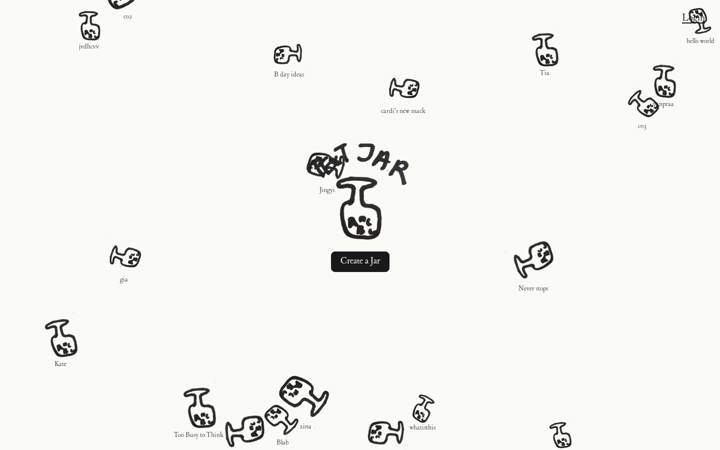
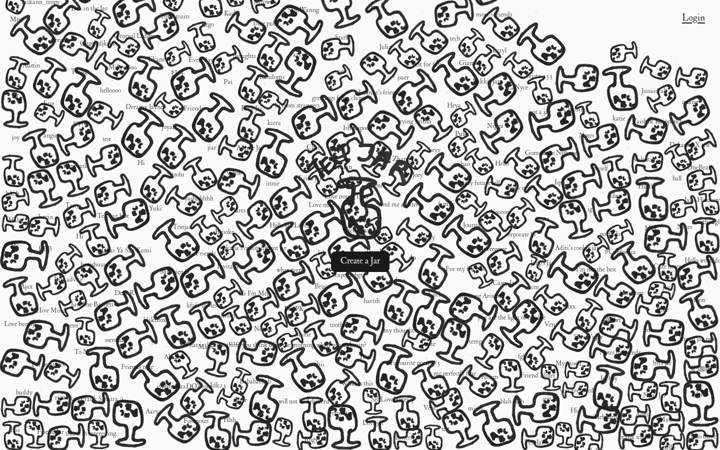

**Stack:** Vanilla TypeScript SPA built with Vite (hashed `/assets/index-DJ8C9lKh.js` + `/assets/index-DPMY9uUa.css`, `<script type="module" crossorigin>`, `<main id="app">` mount; raw HTML is 463 bytes). No UI framework: the bundle contains zero react/vue/svelte/preact/solid code; views are template strings assigned to `root.innerHTML` (`src/app__views__homeView.ts` line ~66). Hosted on Vercel (`server: Vercel`, `x-vercel-cache: HIT`). Backend is Supabase (`@supabase/supabase-js` 2.103.3 — `const Gn="2.103.3"` in `index.js`; REST endpoint `https://hsinfcblewqnhcyagbuf.supabase.co/rest/v1/jars`). Physics is **matter-js 0.20.0** (`n.version = "0.20.0"`, `http://brm.io/matter-js/` header in bundle). No gsap, ScrollTrigger, lenis, three, pixi, motion/framer, lottie, rive, roughjs, IntersectionObserver, feTurbulence — all grep counts = 0. The production sourcemap is public (`/assets/index-DJ8C9lKh.js.map`, 1.7 MB) and contains the 14 first-party TS sources; I extracted them to `src/` (homeView.ts, publicJarView.ts, physics/engine.ts, letters/dropString.ts, letters/reviveString.ts, letters/drawLetters.ts, render/canvas.ts, …).

**Fonts:** One font family actually loaded: **"Henry"** (`/fonts/HenryTrial-Regular.otf`, weight 400 only, `document.fonts` reports `Henry 400 loaded`), fallback `Georgia, serif`. It is a light, slightly irregular old-style serif ("Trial" = unlicensed trial cut). Sizes: no `h1`/`h2`/`p` exist on the home page. Home: jar labels are canvas `fillText` at `14px "Henry"` in `rgba(25,25,25,0.82)`; "Create a Jar" CTA 18px (16px ≤720px); "Login / My Jars" corner link 20px underlined (18px mobile). Jar page: `h1` 22px, back link "← jars" 14px `#655f55`, typing box 30px Henry, hint/attribution/letter-count use `system-ui` at 12–13px (not Henry), My-Jars modal `h2` 26px. Weight 400 everywhere.

**Layout & palette:** Single fixed full-viewport canvas (`.home-canvas{position:absolute;inset:0}`, `.home-canvas-shell{min-height:100dvh;overflow:hidden}`), `scrollHeight` = viewport (900px) — the page does not scroll at all. Hero (`.home-hero`) is `position:fixed; left:50%; top:46%; translate(-50%,-50%)`, z-index 35 above the canvas: 220×200 `` (marker-drawn "TEXT JAR" + jar) over one solid black pill button. Palette: paper `#fafaf6` (body + `theme-color`), ink `#191919`, muted `#655f55`, hairline `#ded8ca`/`#c8c2b8`, error `#b91c1c`. The "thick marker linework" is a **scanned PNG** (`/logo/jar-logo.png`, 686×817 RGBA, 250 KB; `/logo/textjar-logo.png`, 326×304) — not SVG, not rough.js, not canvas strokes. Jars are drawn at height 84 px × scale 0.7–1.3, so 59–109 px tall.

**Effects** (one bullet per effect):
- *Jar cascade / physics pile (the signature)* — On load, hand-drawn jars rain in from above the viewport one every 60 ms, tumble with slight spin, land on an invisible floor and pile up on each other at random tilts; each real jar has its title lettered under it. **Technique:** matter-js rigid-body sim rendered by hand on a Canvas 2D (no `Matter.Render`, no DOM per jar). Each jar is a chamfered rectangle body (`Bodies.rectangle(x, y, bodyW, bodyH, {restitution:.12, friction:.55, frictionStatic:.6, density:.0016, chamfer:{radius:6*scale}})`), body is 84%×92% of the sprite so the pile has no visible gaps, spawned at random `x` across the width and `y = -jarH*2 - random*400`, with `setAngularVelocity((rand-.5)*.08)` and tiny x velocity. World: gravity `{x:0,y:1,scale:0.0014}`, `enableSleeping:true`, 8 position/velocity iterations, 300-px-thick static floor + side walls (the ceiling wall is removed on the home page so spawns above the viewport don't collide). rAF loop: `Engine.update(engine, min(32, dt))`, `clearRect`, then per body `ctx.translate(pos) ; ctx.rotate(body.angle); ctx.drawImage(jarImg, -w/2, -h/2, w, h)`, then a second pass draws labels with `fillText(label, x, y + h/2 + 4)`. Pile size: all public jars (currently **263**) plus decorative padding up to a random 40–50 target on desktop / 15–25 on ≤720 px. **Evidence:** `src/app__views__homeView.ts` lines 96–225 (`spawnOne`, `SPAWN_INTERVAL_MS = 60`, `SCALE_MIN/MAX`), `src/physics__engine.ts` (`createPhysicsWorld`), minified in `pretty.js` 15946–16165; screenshots `home-t1.png` (1.2 s: sparse mid-air scatter), `home-t5.png` (5 s: piling), `screenshot.png` (20 s: settled wall of jars).
  - **Do the jars move?** *Load:* yes, the fall/tumble described above, ~16 s long today because 263 × 60 ms. *Idle:* **no** — once settled matter-js puts bodies to sleep; canvas pixel hash was identical across three samples 2 s apart after settling (`computed.json → canvasIdleHashes.settled: true`). Nothing wobbles or breathes at rest. *Hover:* **no visual change on the jars**; a `pointermove` handler only runs `Matter.Query.point` and flips `canvas.style.cursor` to `pointer` over a clickable jar. *Scroll:* none, page cannot scroll. *Drag:* yes — `Matter.MouseConstraint` (`stiffness .18, damping .08`, `mouse.pixelRatio = devicePixelRatio`) lets you grab and fling any jar; `drag-mid.png`/`drag-after.png` show the pile disturbed. *Tap:* a press < 400 ms that moved < 10 px navigates to `/<jar-name>` via `history.pushState` (`pointerup` handler, homeView.ts ~200).
  - **How is the scatter laid out?** Neither absolute positions nor CSS grid: it is purely emergent from the physics (random spawn x, random scale, random spin, then collisions). The "scattered off-grid, varied sizes and tilts" look in Chimin's reference screenshot (`docs/refs/textjar-app-mobile.png`, ~10 jars floating at different heights, "Never stops" overlapping the logo) is a **frame taken ~1–1.5 s into the cascade** (60 ms stagger ⇒ ~20 jars spawned, still falling). My `home-t1.png` reproduces it exactly. At rest the jars are a dense pile along the bottom, and with today's 263 public jars the settled state is a wall covering the whole viewport (`screenshot.png`, `screenshot-mobile.png`). The `canvas_x`/`canvas_y` columns on the jar records are fetched but never used for placement.
  - **SVG, PNG or canvas?** One PNG sprite (`/logo/jar-logo.png`, a scanned marker drawing with transparent background) drawn N times with `drawImage` onto a single `<canvas id="home-canvas">` sized `innerWidth × innerHeight × devicePixelRatio` (`src/render__canvas.ts`: `canvas.width = round(w*dpr)`, `ctx.setTransform(dpr,0,0,dpr,0,0)`). Zero `<svg>` elements in the rendered DOM; the hero logo is a second PNG in an ``.
- *Hero logo tilt / rock on hover* — Hovering the big "TEXT JAR" logo tilts it ±4° toward the cursor side; hovering its middle third makes it rock back and forth. **Technique:** CSS classes toggled by JS from the cursor's x position within the image: `pointermove` computes `(clientX-left)/width`; `<0.33 → .tilt-right`, `>0.67 → .tilt-left`, else `.rocking`; `pointerleave` clears. CSS: `.home-logo-jar{transform-origin:bottom center; transition:transform .24s ease}`, `.tilt-left{transform:… rotate(-4deg)}`, `.rocking{animation:logo-wobble .9s ease-in-out infinite alternate}` with keyframes -4° → 4°. **Evidence:** `index.css` `.home-logo-jar…` rules; homeView.ts `setLogoState`; `hover.json` (class `tilt-right` → `matrix(0.9976,0.0698,…)`, class `rocking` → `animationName: logo-wobble`); `hover-logo-left.png`, `hover-logo-mid.png`.
- *CTA pulse* — "Create a Jar" button scales 1→1.04→1 continuously while hovered and gains a 2 px hard shadow. **Technique:** CSS `.hero-cta:hover{animation:cta-pulse .9s ease-in-out infinite; box-shadow:0 2px #00000026}`. **Evidence:** `index.css`; `hover.json` (`animationName: cta-pulse`, transform matrix 1.037); `hover-cta-left.png`.
- *Login link hover* — opacity to .72. **Technique:** CSS `.myjar-corner-link:hover{opacity:.72}`. **Evidence:** `hover.json`.
- *Reduced motion* — `@media(prefers-reduced-motion:reduce)` removes the logo tilt/rock and CTA pulse (verified: with `reducedMotion:'reduce'` the logo reports `animationName: none`, `reduced-motion.png`). The canvas physics cascade is **not** gated — the only `matchMedia` in the source is `(hover: none)` (publicJarView.ts line 24).
- *Jar page: letters as physics bodies* (`/blah` etc.) — Existing notes lie at the bottom of the screen as loose, tumbled letters ("Sup bro" → scattered glyphs). You type into a centred `contenteditable` box (30 px Henry); Enter makes every glyph detach from its exact DOM position and fall into the pile; double-clicking a letter "revives" the note — its letters fly back into the typing box. **Technique:** `probeCharRects` walks the text nodes with `Range.getClientRects()` to get each glyph's screen rect, spawns a `Bodies.circle` per glyph (radius `max(rectW,30)/2*0.58`, `restitution .25, friction .7, density .002`, `plugin:{char, stringId, charIndex}`), and `drawLetters` renders with `ctx.rotate(angle); fillText(char)` in `400 30px 'Henry'`. Revive is a 420 ms per-line tween (`MOVE_DURATION_MS=420`, `INTER_LINE_DELAY_MS=60`) toward target rects laid out invisibly (`.typing-box.reviving{visibility:hidden}`), driven by `stepRevive` inside the rAF loop, then bodies are made static. Same shared world (`createPhysicsWorld`) including the ceiling. **Evidence:** `src/letters__dropString.ts`, `src/letters__drawLetters.ts`, `src/letters__reviveString.ts`, `src/physics__letterBody.ts`; `jarpage-blah.png`, `jarpage-typing.png`, `jarpage-drop-1.png`, `jarpage-drop-2.png`. (The devicemotion "shake" mentioned in code comments is not in the shipped bundle: `grep devicemotion pretty.js` = 0.)
- *My Jars modal* — plain `<dialog>` with `box-shadow:0 18px 60px`, 5-col grid of 84 px jar PNG tiles with `mix-blend-mode:multiply` and `:hover{transform:scale(1.04)}`. **Technique:** CSS only. **Evidence:** `index.css` `.myjar-*`.
- No canvas 2D beyond the two pages above, no WebGL, no shaders, no SVG filters, no masks/clip-paths, no `backdrop-filter`; only `filter`/blend usage is the modal tile `mix-blend-mode:multiply`. (`computed.json → fx`.)

**What to adopt for the arctic sketchbook**
- *Physics "fall / settle" cascade with a single hand-drawn motif* — the exact feel Chimin liked is matter-js chamfered-rectangle bodies + Canvas 2D `drawImage`, spawned above the viewport with a 60 ms stagger, gravity scale ~0.0014, restitution ~0.12, friction ~0.55, sleeping enabled. Reuse for the **M5 design-lab** (matter-js is already allowed): draw the motif once with rough.js to an offscreen canvas (or rasterise the rough SVG to an `Image`) and stamp it per body, instead of a scanned PNG. Keep the 84 %/92 % body-vs-sprite shrink and `chamfer` so piles look tight. No new dependency.
- *Freeze the "mid-fall" frame as the hero composition* — the sparse, tilted, off-grid scatter in the reference is a transient. If the landing (**M2 hero / cover**) should look like that permanently, do NOT run physics: precompute ~15–25 `{x, y, scale∈[0.7,1.3], angle∈[-25°,25°]}` seeds (rejection-sampled for minimum spacing), lay them out as absolutely-positioned rough.js `<svg>`s, and animate them in with GSAP (`from y:-200, rotation:seed±20, stagger:0.06, ease:"power2.in"` then a tiny `bounce.out` "settle"). Same look, deterministic, reduced-motion → crossfade. No new dependency.
- *Per-body sizing / density scaling* — density constant, so bigger sprites are heavier and shove smaller ones: nice "weight" for the M5 lab pile. matter-js already allowed.
- *Click-vs-drag disambiguation on a canvas* (`<400 ms && <10 px` ⇒ click, else fling) and `Matter.Query.point` for cursor feedback — copy verbatim for any M5 interactive canvas; motion/react is not needed for canvas hit-testing.
- *Letters-as-bodies* (jar page): glyph positions from `Range.getClientRects()` → one circle body per glyph → `fillText` rotated per body, and the reverse 420 ms revive tween. This is a ready-made "melt / fall" for the **M4 typography moment** (e.g. a heading whose letters drop into a pile on click). With allowed libs: SplitText for the char rects, matter-js for the fall, GSAP for the revive tween. No new dependency.
- *Paper + ink palette* — `#fafaf6` paper, `#191919` ink, `#655f55` muted, warm hairlines `#ded8ca` — a good baseline for the sketchbook's warm paper tokens (**M1 tokens**), before adding the grain.
- *Small serif captions under motifs* — 14 px serif at 82 % ink, centred `h/2 + 4px` below each body, drawn in the same canvas pass. For us: same rule with the handwriting font, either canvas `fillText` (M5) or `<figcaption>` (M2).
- *Reduced-motion gating* — they only gate the CSS bits. We must also gate the physics: `matchMedia('(prefers-reduced-motion: reduce)')` → skip the cascade and place bodies directly at their settled seeds (or the static seeded scatter) with an opacity crossfade. (Brief rule, applies to M2 and M5.)

**What NOT to adopt and why**
- *Scanned PNG sprite for the motif* — 250 KB raster, blurry at 1.3× on 2× screens, cannot be re-stroked/animated (no DrawSVG). We draw with rough.js/SVG and rasterise only for the physics canvas.
- *Unbounded pile size* ("real jars are never dropped") — with 263 items the settled state is a solid wall that buries the hero and CTA (`screenshot.png`, `screenshot-mobile.png`), and the cascade takes 16 s. Cap the count (≤ 25 desktop / ≤ 12 mobile) and keep spacing.
- *Physics running on the landing hero* — 16 s of rAF + 263 bodies on load, no reduced-motion gate, no `IntersectionObserver` pause; contradicts "one signature moment per section" and reduced-motion rule. Physics belongs only in the M5 lab.
- *Hover affordances* — `cta-pulse` (infinite scale pulse) and the 2 px hard `box-shadow`, the modal's `0 18px 60px` drop shadow and the 30 px card shadow all break the "no drop shadows" rule; the pulse is generic SaaS. Our hover vocabulary is draw/wobble (rough-notation or a re-stroke), not scale.
- *`Henry Trial` font* — a trial cut of a commercial typeface, not licensable; also loaded as a 23 KB OTF without subsetting. Use our handwriting face.
- *No-scroll single-screen page* — fine for a toy, but our site has sections; the fixed-canvas pattern would fight Lenis/ScrollTrigger.
- *Supabase* — irrelevant to a static personal site.

**Screenshots:** `screenshot.png` (1440×900, settled pile, 20 s), `home-t1.png` (1.2 s cascade — matches Chimin's reference), `home-t5.png` (5 s), `screenshot-mobile.png` (390×844 @2x), `hover-logo-left.png`, `hover-logo-mid.png`, `hover-cta-left.png`, `hover-cta-mid.png`, `hover-login-left.png`, `hover-login-mid.png`, `drag-mid.png`, `drag-after.png`, `reduced-motion.png`, `scroll-0.png` … `scroll-5.png` (identical — page height = viewport), `jarpage-blah.png`, `jarpage-typing.png`, `jarpage-drop-1.png`, `jarpage-drop-2.png`. Also saved: `raw.html`, `headers.txt`, `index.js`, `index.css`, `index.js.map`, `pretty.js`, `src/*.ts` (from sourcemap), `site/` (mirror incl. `logo/*.png`, `fonts/*.otf`), `jars.json` (263 public jars), `messages-blah.json`, `requests.json`, `rendered.html`, `rendered-mobile.html`, `rendered-jarpage.html`, `computed.json`, `hover.json`, `console.txt`, `capture-local.js`.

**Method note:** headless Chromium in this sandbox does not trust the egress-proxy CA (`ERR_CERT_AUTHORITY_INVALID`), and the sandbox denied both adding the CA to Chromium's NSS store and pinning it, so the live origin was not rendered in a browser. Instead I curl'd every asset the 463-byte HTML references (JS, CSS, both PNGs, the OTF — byte-identical, same hashed filenames), served them from `127.0.0.1:8765`, and answered the page's Supabase REST calls with JSON curl'd from the same public endpoints the page calls. `requests.json` therefore lists the local-mirror URLs plus the one real `supabase.co/rest/v1/jars` fetch; the request set (document, 1 script, 1 stylesheet, 1 fetch, 2 images, 1 font — 7 requests, no third-party CDN, no analytics) is what the live page makes.

---

## 4. https://jackiezhang.co.za

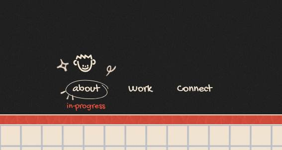
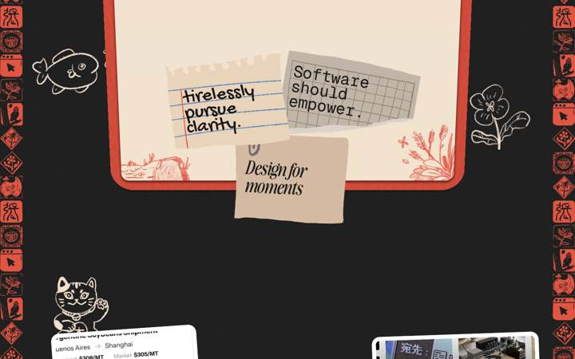


**Stack:** Framer (not Webflow/Next). Evidence: raw.html line 2 `<!-- Made in Framer · framer.com ✨ -->`, `<meta name="generator" content="Framer beb597f">`, all bundles served from `framerusercontent.com/sites/684hnbMBXBVbej1PQ2QXEz/*.mjs` (rolldown-runtime, react, motion, framer, page chunks). Hosting: Framer CDN (framerusercontent.com), published Dec 17 2025. Libraries actually loaded (js/ dir):
- React (react.D6X0ds_s.mjs, 145KB) and Framer's bundled **motion** fork (motion.DAQOXUUB.mjs, 138KB: `drag:`, `dragConstraints`, `whileHover`, `whileDrag`, `scrollYProgress`, `ScrollTimeline`, `pathLength`) — every hover/drag/scroll effect on the page is motion under Framer's runtime.
- **Lenis 1.0.29** inside a Framer code component named "Smooth Scroll" (LoIW6msUk.Bl9vkhCx.mjs: `c.lenisVersion=\`1.0.29\``, `ca.displayName=\`Smooth Scroll\``, driven by a `requestAnimationFrame` loop with `new oa({duration:t/10})`).
- **GSAP 3.11.3** core, bundled only for the "Click Effects" code component (same file: `Or.version=\`3.11.3\``, `Q.timeline().to(e,{x:o*.4*Math.cos(r),y:...,duration:n,ease:\`power2.out\`...`). `ScrollTrigger` appears only as GSAP core's plugin hook (`ze.ScrollTrigger||He(\`scrollTrigger\`,t)`), the plugin itself is NOT loaded.
- No three/ogl/pixi/lottie/rive/canvas (computed.json: `canvas: []`, `lottie: 0`, 16 inline `<svg>`, 0 `feTurbulence`/`feDisplacementMap`).
- Framer editor bar (framer.com/edit, app.framerstatic.com chunks, Inter-Regular) loaded only because of the on-page-editing bootstrap; not part of the site design.
- Page bundle: n3aQpPOIiQ-….BR2SGY8g.mjs (268KB) = home page tree; LoIW6msUk (183KB) = code components (Smooth Scroll, Click Effects, Navi / Navi Linkie / Navie Face, Circle 1/2, Side panel instance, Assets, grain overlay).

**Fonts:** (the "Inter + JetBrains Mono, green/white" write-up is wrong for the live site) Loaded per requests.json/`document.fonts`: **Gochi Hand 400** (Google, handwriting: nav 22px, hero accent word "natural/easy" 51px, note "tirelessly pursue clarity." 32px, side-tile labels 16px), **Awesome Serif Semi Bold Tall 600** (custom woff2 from framerusercontent, hero headline "Software should feel" 45px, section label "3 things I strongly believe in" 22px), **Awesome Serif Italic Semi Bold Extra Tall 600** ("Design for moments" 27px), **Averia Serif Libre 300/400** (h3 "Cape Town • GMT +2:00" 20px), **Geist Mono 400** ("Software should empower." 27px). DM Sans is declared in the inline @font-face block but never requested. There is no `<h1>`/`<h2>`: all display text is Framer `<p>` rich text; the only heading tag is the `<h3>` location line.

**Layout & palette:** Single long page (7158px at 1440). Dark charcoal `rgb(33,33,33)` body; cream/paper token `--token-71c304aa… rgb(242,227,207)` ("BG-light"); coral `rgb(227,83,66)` for headline, book cover and side stamps; ink `rgb(23,23,23)`; paper `rgb(245,225,206)`. Composition: centered 3-item handwriting nav with a smiley "face" icon → an open sketchbook (coral leather cover, cream grid-paper page with red-line hero illustration) → the bottom page folds down on scroll → three torn-paper value notes → 2-column scattered project screenshots with doodles → a "cutting mat" (grid with ruler numbers) holding draggable screenshot cards → an "About me" tab → checklist footer. Both edges carry a full-height column of red-stamp tiles ("Left Frame"/"Right Frame", 7168px tall) with hover labels. No sticky elements except the fixed grain overlay. Mobile: everything stacks to a single column; book and mat still present, sticky nav row.

**Effects**
- *Paper grain over everything* — soft speckle on the dark background. **Technique:** a fixed, full-viewport `<div data-framer-name="🔊 [FILTER] - Noise top">` with `mix-blend-mode: soft-light`, containing a code component that tiles a PNG noise texture (`backgroundImage:url(…/rR6HYXBrMmX4cRpXfXUOvpvpB0.png)`, `backgroundSize:153px`, `opacity:.1`). No SVG filter. **Evidence:** computed.json `mixBlend: framer-17p1iur soft-light`, interact.json `pos:'fixed', h:900`; LoIW6msUk: `re={width:\`100%\`,…backgroundRepeat:\`repeat\`,backgroundImage:\`url('https://framerusercontent.com/images/rR6HYXBrMmX4cRpXfXUOvpvpB0.png')\`}`.
- *Leather book cover texture* — coral cover looks like grained leather. **Technique:** a JPG leather photo (`FqqwJe3cXajmh3c17ziisS6QOJU.jpg`) layered at `mix-blend-mode: multiply`, opacity .54 over the flat coral fill; a `linear-gradient(rgb(245,225,206) 0%, rgb(227,83,66) 62%)` "rim light" wrapper behind it. **Evidence:** interact.json `Leather texture … mb:'multiply', op:'0.54'`; page bundle `className:\`framer-1cot4kh\`,"data-framer-name":\`Leather texture\``.
- *Grid-paper hero page* — faint blue grid that fades out toward the bottom. **Technique:** a grid PNG at opacity .29 with a CSS **mask-image gradient**, no clip-path. **Evidence:** rendered.html `.framer-d2kp2j{opacity:.29;…-webkit-mask:linear-gradient(#000 0%,#0000 55%);mask:linear-gradient(#000 0%,#0000 55%)}`.
- *Menu scribble hover* — hovering "about / Work / Connect" draws a hand-drawn oval around the word (stroke visibly draws in over ~0.3s), a set of small doodle PNGs pops up around the item (face + sparkles for About, a framed portrait for Work, LinkedIn/X/GitHub doodles for Connect), the smiley "face" icon changes expression, and a red "in-progress" tag appears under About. **Technique:** Framer smart-component variants driven by motion: the nav is one component with 7 variants (`bs={"About - Active","About - Hover","Connect - Hover","Face hover","Work - Active","Work - Hover",Default}`), `gestureHandlers` switch variant on hover with a spring `gs={bounce:.1,delay:.08,duration:.4,type:\`spring\`}`. The oval is an inline `<svg viewBox="0 0 95 43">` code component ("Circle 1"/"Circle 2") whose `motion.path` uses Framer's path-length stroke effect: it sets `stroke-dasharray: L L` and animates `stroke-dashoffset` from L→0 (`pathLengthTransition:{duration:.3,ease:[.44,0,.56,1],type:\`tween\`}`, `strokeEffectTotalLength:204.49`). The doodles are absolutely-positioned PNG image layers whose opacity goes 0→1 per variant (`style:{opacity:0},variants:{WQiba330R:{opacity:1}}`) with small y-nudges (Navie3 `translateY(-13px)`, Navie4 `translateY(-59px)`). The active-page underline is a separate wobbly SVG path. Not DrawSVG, not Lottie, not a sprite. **Evidence:** js/LoIW6msUk: `Ko.displayName=\`Circle 1\`` with `d:\`M 81.49 16.931 C 81.49 1.676 14.701 -11.069 1.021 14.985 …\`,pathLengthTransition:Wo,stroke:\`var(--token-71c304aa…)\`,strokeEffectTotalLength:204.49069213867188`; interact.json hover frames sampled every 70ms: `stroke-dasharray '204.49 204.49'`, `stroke-dashoffset 204.29 → 165.0 → 87.7 → 23.1 → 0`; hover variant class `framer-v-1gz1ho3` + `data-framer-name="About - Hover"`. Screenshots hover-about/work/connect.png, hover-face.png.
- *Book page fold on scroll ("torn paper travels into the work section")* — the sketchbook's bottom page (the values page) hinges from ~60° down flat (rotateX 50→10 on load), then folds backwards to -20° as you scroll past the hero, so the notes on it slide into the values section. **Technique:** Framer "Scroll Transform" (`__framer__transformTrigger:\`onScrollTarget\``) which Framer implements with motion's `useScroll` + `interpolate` writing to motion values every frame (JS scroll-linked, not CSS `animation-timeline`; no GSAP ScrollTrigger). Keyframes: `rotateX:50` → `0` at target section "⬜︎ #Section - Book open" (y≈796) → `-30` at "⬜︎ #Section - Book close" (y≈1596) on an element with `originY:0, transformPerspective:3310`. Same mechanism translates the value cards `x:0 → -122` toward the "Photo of me" section. Invisible absolutely-positioned marker sections (opacity 0) are the scroll targets. **Evidence:** page bundle: `__framer__transformTargets:[{target:{…rotateX:50…}},{ref:se,target:{…rotateX:0…}},{ref:ce,target:{…rotateX:-30…}}],__framer__transformTrigger:\`onScrollTarget\`,…className:\`framer-1hw0qkc\`,"data-framer-name":\`Bottom Page\`,style:{originY:0,rotateX:10,transformPerspective:3310}`; framer.B2l6xyRN.mjs `Vc(...){… l=e===\`onScrollTarget\` … Be((e,{y:t})=>{ … s.values[e].set(ge(t.current,r,a[e])) })` (Be = useScroll, ge = interpolate); interact.json scrollSamples: `y:0 rotateX(59.9deg)`, `y:200–600 rotateX(10deg)`, `y:800 rotateX(-1.3deg)`, `y:1000 rotateX(-20deg)`. Screenshots book-scroll-500/800/950/1100/1400.png.
- *Torn-paper value notes* — three notes ("tirelessly pursue clarity." on ruled paper with a torn spiral edge, "Software should empower." on grid paper, "Design for moments" on kraft paper with a paperclip). **Technique:** each is a PNG cut-out image (the torn edge is baked into the raster; no clip-path or SVG mask found in computed styles) with live text laid on top in Gochi Hand / Geist Mono / Awesome Serif Italic; the stack sits inside a 3-variant smart component ("Resting" → "Values 1" → "Values 2" → "Values 3") whose variants are switched by scroll-target in-view triggers and animate the cards' `rotate(-4/3/10deg)` and `scale(1.5→1)` with springs. **Evidence:** computed.json `clipPath: []`, only mask is the grid fade; interact2.json values: `y:1000 "Resting" scale(1.5,1.5)` → `y:1700 "Values 1" translate(-50%,-50%) rotate(-4deg)` → `y:2500 "Values 2"`; page bundle `"data-framer-name":\`Value 1 -> 2\`… \`Values 2 -> 3\``.
- *Hero page tilt/hover* — top cream page sits at `rotateX(-5deg)` with `transformPerspective:4105` and flattens with a soft shadow on hover. **Technique:** motion `whileHover`. **Evidence:** page bundle `"data-framer-name":\`✍️ Paper Page\`,style:{originY:1,rotateX:-5,transformPerspective:4105},whileHover:bi` where `bi={boxShadow:\`0px -5px 4px 0px rgba(0,0,0,0.13)\`,rotateX:0,…transition:{duration:.45,ease:[.44,0,.56,1]}}`.
- *Cutting-mat drag* — screenshot cards on the grid mat can be picked up and moved anywhere (cursor grab → grabbing), they stay where dropped. **Technique:** Framer "Draggable" = motion `drag` prop on each card container (`drag:!0, dragMomentum:!1, whileTap:{cursor:'grabbing'}`), pointer-events based (motion sets `touch-action:none`, `user-select:none`, `draggable=false`), transform written as `translateX/Y`. No GSAP Draggable, no HTML5 DnD. **Evidence:** page bundle `className:\`framer-1qcgxrb\`,drag:!0,dragMomentum:!1,onMouseDown:Q,whileTap:$` with `$={cursor:\`grabbing\`}`; interact.json drag: `beforeTr:'none' → midTr:'translateX(250px) translateY(120px)' → afterTr same`; `touchAction:'none', cursor:'grab'`. Screenshots drag-framer-1qcgxrb-before/during/after.png.
- *Bio photo under the mat* — the "Fundam" photo frame (`framer-1x1fi4z`) below the mat is also draggable but with **snap-back**: `drag:!0, dragMomentum:!1, dragSnapToOrigin:!0, dragTransition:{type:\`inertia\`,bounceStiffness:400,bounceDamping:30}`. At 1440×900 headless it is fully covered by the mat cards (`document.elementFromPoint` hit no exposed pixel; interact3), so the "drag it out" moment could not be reproduced; the code confirms the mechanism. **Evidence:** page bundle `"data-framer-name":\`Fundam\`,drag:!0,dragMomentum:!1,dragSnapToOrigin:!0,dragTransition:Et` with `Et={bounceDamping:30,bounceStiffness:400,type:\`inertia\`}`.
- *Side stamp tiles* — red woodblock-stamp tiles down both edges; hovering one reveals a handwriting label ("Fynbos", "Night owl", "Grew up in a resturant"). **Technique:** Framer component variant on hover, label opacity 0→1. **Evidence:** interact2.json tileHover `cls:'… framer-v-fke3t8 hover', labelOp:'1'`; hover-sidetile.png.
- *Click ripple* — clicking anywhere spawns a small hand-drawn "wavy" burst. **Technique:** "Click Effects" code component (Framer University) rendering absolutely-positioned SVG lines/divs animated with a GSAP timeline. **Evidence:** page bundle instance `interactionMode:\`wavy\`,effectSize:85,strokeWidth:3`; LoIW6msUk `Q.timeline().to(e,{x:…,duration:n,ease:\`power2.out\`,onComplete:…})`. (Not captured in click-effect.png — the element is removed after 0.4s.)
- *Smooth scroll* — Lenis wraps the document (`html.lenis`), duration = intensity/10, paused when an `#overlay` child opens. **Evidence:** LoIW6msUk `n.current=new oa({duration:t/10})`, `html.lenis { height: auto; }`.
- *Appear animations* — `__framer__transformTrigger:\`onInView\`` and `data-framer-appear-id` elements use Framer's appear effect (IntersectionObserver + motion spring). CSS: 0 `@keyframes`, 1 `animation-timeline` rule (Framer's built-in, unused here) — nothing scroll-linked is CSS.

**What to adopt for the arctic sketchbook**
- *Draw-on scribble around hovered nav items* (M2, nav/hover): reproduce exactly: one `<motion.path>` per link with a hand-drawn oval `d`, `pathLength` 0→1 on `whileHover` (motion/react does the dasharray/dashoffset for us) — or `rough-notation` `type:"circle"` which is the same effect with built-in roughness. Add 2–3 PNG/SVG doodles that fade in per item with a tiny y-nudge and `delay:.08` spring. No new dependency.
- *Scroll-hinged page fold* (M3, hero→work transition): use GSAP ScrollTrigger with `scrub:true` on a `rotateX` tween (`transformOrigin:"top"`, `perspective` on the parent) between two marker sections — same keyframes (10° → 0 → -20°) feel right. Keep the page as a real layout element so the notes on it travel into the next section. Degrade to a crossfade under prefers-reduced-motion. No new dependency.
- *Torn-paper notes* (M2/M3): do the torn edge as an SVG `clipPath` generated with rough.js / perfect-freehand instead of a baked PNG, so it can "bleed" (watercolour fill) and be recoloured; keep live text on top.
- *Cutting-mat drag* (M4, design lab): `motion/react` `drag` with `dragMomentum={false}` and `whileTap={{cursor:'grabbing'}}` — identical to Framer's; for the bio photo use `dragSnapToOrigin` + `dragTransition={{bounceStiffness:400,bounceDamping:30}}`. For a physics feel, hand off drop velocity to matter-js bodies. No new dependency.
- *Paper grain* (M1): a fixed full-viewport div with a tiled noise PNG at 10% + `mix-blend-mode:soft-light` is cheap and works on every GPU; it is a nicer default than a live `feTurbulence` filter over the whole page (keep feTurbulence for the watercolour fills only).
- *Texture via multiply* (M1): leather/paper JPG at `mix-blend-mode:multiply`, opacity ~.5, over a flat colour — good pattern for cover/paper materials without gradients.
- *Edge stamp columns with hover labels* (M2): sidebars of small hand-drawn tiles whose labels fade in on hover — a low-cost way to get the "scrapbook margin" feel.
- *Smooth scroll* (M1): Lenis + GSAP ticker, same as this site.

**What NOT to adopt and why**
- Framer runtime / smart-component variant machinery — we hand-write React + motion; variant swaps with 6 doodle PNG layers per link is heavy; use 1–2 SVG doodles.
- Baked-PNG torn edges and PNG doodles for everything (65 image requests): clashes with our rough.js/SVG-first rule and can't recolour or animate.
- Box-shadow on the hero page hover (`0px -5px 4px rgba(0,0,0,.13)`) and the `linear-gradient` rim-light behind the cover and the gradient "Gradient" VFX layers — our rules forbid drop shadows and gradients; use a second ink stroke / hatched shadow instead.
- GSAP core bundled just for a click-burst; if we want a click effect, do it with the GSAP we already load, or with motion.
- Fixed `transformPerspective` values (3310/4105) tuned to the Framer canvas; derive from viewport width.

**Screenshots:** screenshot.png (full page 1440), viewport-top.png, screenshot-mobile.png (390×844 full page), scroll-0.png … scroll-5.png, book-scroll-500.png, book-scroll-800.png, book-scroll-950.png, book-scroll-1100.png, book-scroll-1400.png, hover-about.png, hover-work.png, hover-connect.png, hover-face.png, hover-sidetile.png, drag-framer-1qcgxrb-before/during/after.png, drag-framer-1bjxlag-before/during/after.png, fundam-before/during/after.png, click-effect.png. Data: requests.json, rendered.html, raw.html, computed.json, interact.json, interact2.json, js/*.mjs.

---

## 5. https://yashf.in

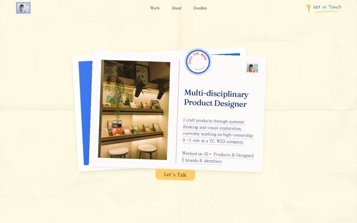

**Stack:** Framer-hosted React SPA (`<!-- Made in Framer -->`, `<meta name="generator" content="Framer 089ff9b">`), served via Netlify edge (`server: Netlify`, `cache-status: "Netlify Edge"` in headers.txt). Bundles are ES modules from framerusercontent.com (rolldown-runtime, react.C-aP7MH3.mjs = React **18.2.0** (`version:\`18.2.0` x3), framer.CU8bbjou.mjs = Framer runtime, motion.CpiQqyZj.mjs = Framer's bundled framer-motion fork (MotionValue/scrollYProgress/whileHover present; no version string), shared-lib, 4 page bundles). No canvas, no WebGL, no three/ogl/pixi/gsap/lottie/rive (all greps negative — "ogl/rive/drag" hits were substrings). Third-party Framer University code components inside page bundle w1BiiXTyO.D9oY_0kp.mjs: **Lenis 1.1.2** ("Smooth Scroll", `c.lenisVersion=\`1.1.2\``, `new U({duration:(r||10)/10})` i.e. intensity 10 → duration 1s), **"Squiggle Effect"** (SVG feTurbulence+feDisplacementMap), **"Stop Scroll"** (`html,body { overflow: hidden !important; }`), "Social Tap". Other named components in FwjLdPJ64…mjs: `Preloader`, `Flap Flap Image`, `Work Card`, `Testimonial Card`, `3D Hover`, `Hero Button`; YNf7BengC…mjs: `Work Catalogue`/`Catalogue Item` (vinyls). Analytics: GA4 gtag + events.framer.com. The ~1 MB HTML is Framer's SSR output: every variant/breakpoint is pre-rendered (`ssr-variant hidden-*` divs), plus inline `data:image/svg+xml` backgrounds for every doodle, plus an inline `animator` (10.9 KB) that runs the appear animations before hydration.
**Fonts:** Loaded (document.fonts): **Fraunces 400** (Google, display/headings), **JejuMyeongjo Regular 400** (custom woff from framerusercontent — body/nav/UI serif), **Indie Flower 400** (Google — handwriting labels), **Manrope 500/700** (dates/badges). Geist is declared in @font-face but never used at runtime. Sizes (computed): hero title "Multi-disciplinary Product Designer" Fraunces 32px/38.4 ls -0.02em, colour rgb(5,38,104); section titles ("Featured Work", "All roads lead to one") Fraunces 40px/48 ls -0.02em; work-card title Fraunces 40px; testimonial name Fraunces 24px; hero body JejuMyeongjo 18px/27; card subtitle & testimonial body JejuMyeongjo 20px/28–30; vinyl labels JejuMyeongjo 24px; nav/footer/copyright JejuMyeongjo 16px; work date Manrope 500 16px; "Get in Touch"/"Let's Talk" Indie Flower 20px ls 0.6px; ticket initials Fraunces 12.3px at 50% black. Footer "All Designs Shippable" and the "Why me?" notepad are images/SVGs (no DOM text) — size undetermined (~130px visual).
**Layout & palette:** Single long page 7333px @1440. Fixed 64px nav (stamp-portrait logo left, 3 links centre, hand-written "Get in Touch" right). Sections: fixed hero (900px spacer) → Featured Work (5 airline-ticket cards, sky/cloud photo bg) → More Work Catalogue (4 vinyl records) → Words of Trust (4 envelope+letter cards on #FAFAFA) → About collage on dotted cream paper (#FFFDF1 + dots PNG: Win95 notepad, sun doodle, torn "Why me?" note, tweets/Slack screenshots, cat polaroid) → footer on hand-painted blue/white checkerboard with draggable cat. Palette: hero paper rgb(255,250,226) with folded-paper texture; body/bg blue rgb(55,113,229); navy text rgb(5,38,104); link blue rgb(16,137,230); butter yellow rgb(255,218,138); envelope pastels (yellow, periwinkle, pink, grey); accent lime rgb(137,239,52); CTA peach rgb(250,165,123). Mobile (390px) keeps the same order, single column; hero postcard stacks vertically. Heavy use of box-shadows and drop-shadows (against our rules).
**Effects** (one bullet per effect):
- *Preloader "welcome to"* — full-screen #FAFAFA scrim with blue cursive "welcome to", "A portfolio that feels like warm hug" and wobbling flower/heart doodles; scroll locked; at ~3.3s the scrim wipes upward off-screen (Scrim Container transform `matrix(1,0,0,15.0166,0,77.2)` mid-tween then `top:-100`), body overflow hidden→visible. **Technique:** Framer `Preloader` component variants (`Default Large`→`Over Large`), Framer University `Stop Scroll` style tag toggles `html,body{overflow:hidden}`; scrim moves via variant transition. **Evidence:** probe2.json intro timeline (bodyOverflow hidden until t≈3.5s); FwjLdPJ64…mjs `Ot.displayName=\`Preloader\`…optionTitles:[\`Default Large\`,\`Over Large\`,…]`, `ot.displayName=\`Stop Scroll\``; intro-t1000.png / intro-t2600.png.
- *Hero postcard entrance choreography* — after the preloader, the blue "Portfolio Cover" springs in (scale 1.1→1, rotate 0→-3°, bounce .5, delay 2.2s), the cream postcard follows (scale 1.1→1, rotate 0→2°, bounce .6, delay 3.3s), the "Let's Talk" button drops in from y:-48 with rotate -2→0 (bounce .6, delay 4.5s), then the red "OPEN FOR WORK" stamp slams down (rotate -15→-2°, scale 1.05→1, opacity, bounce .3, delay 5.5s). **Technique:** Framer "appear" effects: JSON in `<script type="framer/appear" id="__framer__appearAnimationsContent">` executed pre-hydration by inline `animator.animateAppearEffects` (spring → WAAPI `linear()` easing string generator `$=(e,r,t=10)=>…linear(…)`). **Evidence:** raw.html appear JSON (`"k2eix0":{…"animate":{"rotate":-3,"transition":{"bounce":0.5,"delay":2.2,"duration":0.7,"type":"spring"}}}`, `"naadk":{…"initial":{"rotate":-15,"scale":1.05}…"delay":5.5`); intro-t4600.png (stamp absent) vs viewport-initial.png (stamp present). Reduced motion is NOT honoured: the runtime is called with `…,"__Appear_Animation_Transform__",false)` and the `reducedMotion:'reduce'` context still showed `opacity:0.001` mid-sequence (reduced-motion.json).
- *Postcards fan apart on scroll (fixed hero revealed under sections)* — hero is `position:fixed; z-index:1` behind a 900px "Hero Blank Space" spacer; as you scroll, the two cards slide apart horizontally and rotate further (cover: translateX 0→-141px, rotate -3→-7.2° at scrollY 1400; postcard mirrored +141px, 2→5°), while Featured Work (`position:relative; z-index:2`) scrolls over it. **Technique:** Framer scroll-transform effect (motion `scrollYProgress` → transform strings written inline, ~0.1px per scrolled px, linear). **Evidence:** probe2.json heroScroll (`translateX(-15.16px) translateY(-3.64px) rotate(-3.45deg)` @150 → `translateX(-141.49px)…rotate(-7.24deg)` @1400); sectionBg (`Hero pos=fixed z=1`, `Featured Work pos=relative z=2`); scroll-1-y1072.png.
- *Postcard photo "Flap Flap" swap on hover* — hovering the hero postcard swaps the photo to the next of 10 travel snapshots (rose petals, laptop, etc.) with a crossfade; the stamp/Let's Talk layers are momentarily hidden while the variant swaps. **Technique:** Framer component variant cycle (class `framer-v-v8cqay`→`framer-v-1k3z4du`→`framer-v-1yws6uc`), each variant a different ``; no 3D. **Evidence:** hover-results.json postcard0 (`clsBefore:"…framer-v-v8cqay" clsAfter:"…framer-v-1k3z4du"`, img nodes swapped); FwjLdPJ64…mjs `J.displayName=\`Flap Flap Image\`…optionTitles:[\`1\`…\`10\`]`; hover-hero-postcard.png, hover-hero-cover.png.
- *Folded-paper hero texture* — cream paper with fold creases and grain. **Technique:** PNG texture layer `Texture BG` with `mix-blend-mode: multiply` (+ `filter: drop-shadow(0 1px 1px rgba(0,0,0,.25))`) over flat rgb(255,250,226). **Evidence:** page-info.json styleHits.mixBlend `div[Texture BG] => multiply`; sectionBg `Texture BG … blend=multiply img=…dnQIi8fAnp4E1vnrxcXFbdUvxc.png`.
- *Custom dot cursor with exclusion blend* — native cursor hidden everywhere (`cursor:none` on body, #main and 1296 elements); a 20px white circle follows the pointer and inverts whatever is under it; over links it shrinks to 4px. **Technique:** Framer built-in Cursor feature: fixed div (`z-index:13; pointer-events:none; mix-blend-mode:exclusion`) positioned with `transform: translate(-50%,-50%) translateX(px) translateY(px)` from pointer events, variant swap (`framer-v-idw5nh`→`framer-v-h0tloz`) on link hover. **Evidence:** probe2.json cursor c1/c2/c3 (`bodyCursor:"none"`, `blend:"exclusion"`, r.width 20→4 on nav); cursor-on-nav.png. Reproduce cost is trivial but see "NOT adopt".
- *Nav link hover: hand-drawn underline + blue ink* — text goes rgb(16,16,16)→rgb(16,137,230) and a squiggly blue underline SVG fades in beneath. **Technique:** Framer hover variant (`Colored - Default`→`Colored - Hover`), CSS-variable colour swap `--extracted-r6o4lv`, `Underline` child opacity 0→1 (spring). **Evidence:** probe3.json navDiff (`Underline|…|opacity:0` → `opacity: 1; will-change: transform`); hover-nav0.png; "Get in Touch" hover: flower icon rotates -8° and text goes peach rgb(250,165,123) (probe2.json getInTouch).
- *Airline-ticket work cards* — white ticket with a semicircular notch where the stub joins the body; thumbnail is greyscale and turns full colour on hover, plane icon swaps to "VIEW ↗", card gets the `hover` class. **Technique:** ticket edge = CSS `mask: url(png) luminance` on the `Foreground` layer (`1J8Fzi3vwiuBxFk55kEv6OeqezI.png`, 900×300) — an image mask, not clip-path; grey→colour is an **image swap** (two pre-rendered images, `Thumbnail Hover` opacity 0→1 over `Thumbnail Default`), not a CSS filter (`grayscaleEls: []`); layered hover variant. **Evidence:** probe2.json fwBefore/fwAfter (`TH.st "opacity:0"`→`"opacity: 1"`, different src …pTvrrFdvdzb2… vs …WBvHal1mc…); hover-work-card-full.png vs scroll-1-y1072.png.
- *Vinyl records spin and tonearm swings in* — hovering a record: it starts rotating (one revolution / 3s, linear), the grey tonearm fades in and swings from -30° to 0°, the centre label shows an ↗ arrow; on leave it stops and the arm retracts. **Technique:** motion tween `rotate:360, duration:3, ease:[0,0,1,1]` on hover variant (measured 94.7°→214.6° in 1.0s ≈ 120°/s), `Player Container` from `opacity:0; rotate(-30deg)` to identity with spring. **Evidence:** YNf7BengC…mjs `F={delay:0,duration:3,ease:[0,0,1,1],type:\`tween\`},I={opacity:1,rotate:360,…}` in `Catalogue Item`; probe2.json vinylHover v1/v2; hover-vinyl-detail.png.
- *Envelope testimonials with letter peeking out* — four tilted pastel envelopes (all flaps are inline `data:image/svg+xml` background layers: Top Cover Infold / Back Cover / Left+Right Infold / Bottom Fold) with a cream letter sticking out and a perforated stamp-avatar; the letter drifts ±9px vertically with scroll. **Technique:** flat layered SVGs, no perspective (persp list empty); `Testimonial Card` variants `Large Default`→`Large In` differ in `Letter top` (In: `top:280px`) — the DOM sits in the "In" variant; the scroll drift is a Framer scroll-transform on `Letter` (`translate3d(0, 8.3px, 0)` @3553 → `-8.8px` @4061). Hover does nothing (envBefore == envAfter). The Default→In "letter slides out" trigger was not observed live: **undetermined** (likely appear-on-viewport variant switch). **Evidence:** probe2.json envBefore/letterScroll; FwjLdPJ64…mjs `it.displayName=\`Testimonial Card\`…optionTitles:[\`Large Default\`,\`Small Default\`,\`Large In\`,\`Small In\`]`, `.framer-v-1t4h737 .framer-11pq28h { top: 280px; }`; scroll-4-y4289.png.
- *Wobbling doodles ("Squiggle Effect")* — the flower/heart/cloud doodles in the preloader and footer boil like hand animation, re-drawing their outline every 100ms. **Technique:** Framer University "Squiggle Effect" in overlay mode: an SVG `<filter>` with `feTurbulence type=fractalNoise baseFrequency≈0.022 numOctaves=2 seed=N stitchTiles` + `feDisplacementMap scale≈5 xChannelSelector=R yChannelSelector=G`, applied as **both** `filter:url(#id)` and `backdrop-filter:url(#id)` on a pointer-events-none overlay div; a `setInterval` re-randomises `seed` and `scale ± strength%` every `delay` ms. **Evidence:** w1BiiXTyO…mjs `G.displayName=\`Squiggle Effect\`…defaultProps={…frequency:2,octaves:2,scale:5,animation:{animate:!0,strength:5,delay:100}}`, `setInterval(()=>{let e=Math.floor(Math.random()*1e3)…S.current.setAttribute(\`seed\`,…)`; page-info.json svgFilters (5 filters, seeds 374/763/757/905/416, scales 4.8–5.2); probe3.json squiggle (owners: preloader `Desktop`, `Clouds Decor Group`, `Flowers Frame`, `Flower Frame`, `Heart Frame`).
- *Draggable sleeping cat in footer* — the cat lying on "Shippable" can be dragged anywhere (cursor "grabbing"), and springs back to its spot on release. **Technique:** motion drag: `drag:!0, dragMomentum:!1, dragSnapToOrigin:!0, dragTransition, whileTap`. **Evidence:** w1BiiXTyO…mjs `"data-framer-name":\`Eepy Cat\`,drag:!0,dragMomentum:!1,dragSnapToOrigin:!0`; probe3.json catDrag (`translateX(150px) translateY(-80px)… cursor: grabbing`) → catAfterRelease (`translateX(-50%)`); drag-cat.png.
- *Footer social "tabs" rise on hover* — LinkedIn / Twitter / Email are yellow tabs poking up from the bottom edge; on hover the tab lightens (rgb(255,218,138)→rgb(255,228,171)), its shadow softens and label dims to 75%. **Technique:** hover variant (`framer-v-rwt1ez`→`framer-v-lvgl1o`, spring bounce .2 dur .4). **Evidence:** hover-results.json social0; w1BiiXTyO…mjs `ye={Default:\`B59fnPyVN\`,Hover:\`NgTiwL1OZ\`,Press:\`nz62doinf\`}`, `_e={bounce:.2,delay:0,duration:.4,type:\`spring\`}`; hover-social-detail.png.
- *About-section clutter appears on scroll* — clouds/flowers group and the Figma-style "Yash" comment cursor settle in as the section enters view (`opacity:0; translateY(16px) scale(.85)` → identity; comment cursor translateX -81.8→-80 settle). **Technique:** Framer appear-in-viewport spring effects; the comment cursor is a static PNG (`T5KEfOOs08EPScCBC7iSf3gafc.png`), not a live loop. **Evidence:** probe3.json clouds (`Clouds Decor Group … opacity: 0; transform: translateY(-50%) translateY(16px) scale(0.85)` off-screen) vs probe2.json mover (`translateY(-50%)`, opacity 1 in view); commentCursor samples stop changing after 0.5s.
- *Smooth scroll* — inertial wheel scrolling. **Technique:** Lenis 1.1.2 via Framer University "Smooth Scroll" (duration 1.0s, `smoothWheel`, anchor-click `scrollTo` hook). **Evidence:** w1BiiXTyO…mjs `c.lenisVersion=\`1.1.2\``, `W.displayName=\`Smooth Scroll\``, `new U({duration:(r||10)/10})`.
- *3D tilt component (bundled, not seen on home)* — a `3D Hover` code component (pointer-driven `perspective(500px) rotateX/rotateY` ±15°, scale 1.1, "evade"/"gravitate", debounced 2ms, CSS `transition: transform .2s`) ships in FwjLdPJ64…mjs but no element on the home page showed a perspective transform on hover. **Technique:** pointermove → inline transform string. **Evidence:** FwjLdPJ64…mjs `K.displayName=\`3D Hover\`,K.defaultProps={tiltLimit:15,effect:\`evade\`,scale:1.1,perspective:500}`; probe2 persp list empty. Where it is used: undetermined (probably project pages).
**What to adopt for the arctic sketchbook** (milestones assumed: M1 foundation/type/paper, M2 hero, M3 scroll sections, M4 hover/drag micro-interactions, M5 shaders, M6 design lab/polish)
- **Boiling-line doodles (Squiggle Effect) → our "wobble" verb (M1 core primitive, M4 everywhere).** Same feTurbulence/feDisplacementMap we already plan for watercolour; add a `<SketchWobble>` wrapper that re-seeds `feTurbulence seed` on a 100–150ms `setInterval` (or GSAP `repeat:-1` ticker) and jitters `feDisplacementMap scale` ±5%. Use `filter:url()` only (skip yashf.in's `backdrop-filter` duplicate; it's expensive). Under `prefers-reduced-motion` freeze the seed. No new dependency.
- **Appear choreography with spring "slam" (M2 hero).** The stamp landing (rotate -15→-2, scale 1.05→1, short delay after the cards) is exactly our "settle". Do it with GSAP timeline (`back.out(1.7)` or `elastic.out(1,.5)`) instead of Framer springs; delays after Lenis/preloader; crossfade under reduced motion. No new dependency.
- **Fixed hero revealed by sections scrolling over it + cards fanning apart (M2/M3).** Sketchbook cover stays `position:fixed` under a spacer; ScrollTrigger `scrub:true` maps scroll 0→900 to translateX ±140px / rotate ±4° on two "loose pages". No scroll-jacking (pure scrub). No new dependency.
- **Image mask for torn/ticket edges (M1/M3).** They use a luminance PNG `mask`; we can do the same with a rough.js-generated SVG mask (or perfect-freehand stroke outline) applied via CSS `mask-image` — resolution-independent and on-brand. No new dependency.
- **Vinyl-style "hover starts a loop" affordance (M4).** Rotating record = motion/react `animate={{rotate:360}} transition={{repeat:Infinity, ease:"linear", duration:3}}` gated by `whileHover`; for us: a compass needle or hand-drawn globe spins on hover in the travel section (d3-geo already allowed). No new dependency.
- **Draggable mascot that snaps home (M6 design lab / M4).** motion/react `drag dragSnapToOrigin dragMomentum={false}` for a sticker/ink-blot; in the physics lab hand it to matter-js instead. No new dependency.
- **Handwriting label font as accent only (M1).** They pair Fraunces (display) + JejuMyeongjo (reading) + Indie Flower (labels only). Keep our handwriting font for labels/annotations, not body copy — reading text at 18–20px serif is what makes their page legible.
- **Hand-drawn nav underline on hover (M4).** Their underline is a static SVG fading in; ours should draw in with rough-notation `underline` (type "underline", animationDuration ~400ms) — better fit for "draw" verb. No new dependency.
- **Lenis + anchor `scrollTo` hook (M3).** Same lib; copy the pattern of intercepting `a[href^="#"]` clicks and calling `lenis.scrollTo(el,{offset})`. Note lenis 1.1.2 there vs our version — trivial.
**What NOT to adopt and why**
- Custom `cursor:none` exclusion-dot cursor: hides the native pointer on 1,296 elements, breaks accessibility/touch expectations and reads as "agency template", not sketchbook. If a cursor idea is wanted, a small pencil-tip that only appears on the design-lab canvas is enough.
- 3.5s blocking preloader with scroll lock (`html,body{overflow:hidden!important}`): pure delay, and the cascade of 2.2–5.5s appear delays means content is invisible for ~6s on first load. Our hero should draw in under ~1.2s.
- Ignoring `prefers-reduced-motion` (Framer appear runtime passes `false`): violates our rule; every GSAP timeline must have a `matchMedia` crossfade branch.
- `backdrop-filter:url(#svg)` + `filter` doubled on every doodle, plus box-shadows/drop-shadows on cards, letters, tabs: expensive and against "no drop shadows / no glass". Use paper-multiply texture and rough outlines for depth instead.
- Greyscale→colour thumbnail via two pre-rendered images: doubles image payload; use a single image + `filter:saturate(0)` transition (or, on-brand, a watercolour "bleed" mask reveal).
- 1 MB SSR HTML with every breakpoint variant pre-rendered and inline data-URI SVG doodles: Framer artefact; our Vite build should ship SVG doodles as components/sprites.
- Cloud photo background + PNG dotted paper as full-bleed raster images: replace with procedural paper grain (feTurbulence) so it stays crisp and small.
**Screenshots:** viewport-initial.png, screenshot.png (full page 1440), screenshot-mobile.png (390×844 full page), intro-t300.png, intro-t1000.png, intro-t1800.png, intro-t2600.png, intro-t3500.png, intro-t4600.png, intro-t5800.png, intro-t7000.png, scroll-0-y0.png, scroll-1-y1072.png, scroll-2-y2144.png, scroll-3-y3217.png, scroll-4-y4289.png, scroll-5-y5361.png, scroll-6-y6433.png, hover-nav0.png, hover-nav1.png, hover-nav2.png, cursor-on-nav.png, hover-getintouch.png, hover-hero-postcard.png, hover-hero-cover.png, hover-postcard0.png, hover-work0.png, hover-work1.png, hover-work2.png, hover-work-card-full.png, hover-vinyl0.png, hover-vinyl1.png, hover-vinyl2.png, hover-vinyl-detail.png, hover-letter0.png, hover-letter1.png, hover-letter2.png, hover-envelope.png, hover-cta0.png, hover-cta-detail.png, hover-featimg0.png, about-section.png, hover-social0.png, hover-social1.png, hover-social2.png, hover-social-detail.png, drag-cat.png, reduced-motion-initial.png. Data: requests.json (205 requests), rendered.html, raw.html, headers.txt, page-info.json, hover-results.json, scroll-probe.json, cursor-probe.json, reduced-motion.json, probe2.json, probe3.json, console.txt, bundles/ (all 20 JS modules).

---

## 6. https://jackiehu.design

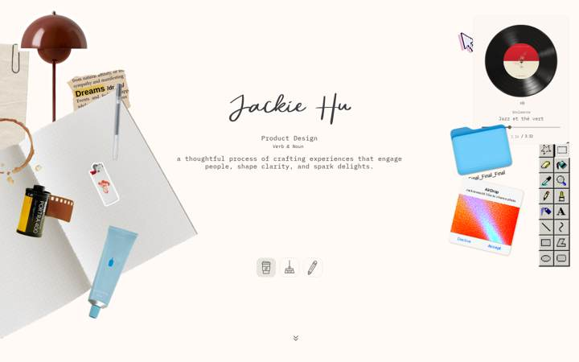

**Stack:** Framer-published site (`<meta name="generator" content="Framer ed41f9e">`, `<!-- Built with Framer -->`, bundles served from framerusercontent.com/sites/1Wyeyj3EflSEmpgnjpfley/*). React 18.2 (`init_npm_react_18_2` / `npm_react_dom_18_2` in script_main.BFkp_L1D.mjs). Framer's bundled Motion (motion.Bi9jhAEM.mjs: `whileHover`, `useSpring`, `drag`, `useScroll`; no version string exposed). three.js r169 (`<canvas data-engine="three.js r169">`) + @react-three/fiber + camera-controls 2.9.0 (`data-camera-controls-version="2.9.0"`) + ShaderGradient (shared-lib: `name:'shadergradient-mesh'`, uniforms `colors,uTime,uSpeed,uLoadingTime,uNoiseDensity,uNoiseStrength,uFrequency,uAmplitude,uIntensity`). Framer University "text distortion" code component (shared-lib: `` v=`framer-university-${...}` `` building `<filter><feTurbulence><feDisplacementMap>`). number-flow (`<NUMBER-FLOW-REACT>` custom element inside the music player). Sound effects via plain `new Audio(url)` loaded from raw.githubusercontent.com/wenqian-hu/sound-effects (12 files). Analytics: gtag G-QPTTC5N3CM + events.framer.com. No GSAP, no Lenis, no Locomotive, no Rive/Lottie (only substring false positives: "rive" inside "derive"/"drive"), no smooth-scroll (`scroll-behavior: auto`), no canvas 2D drawing, no mix-blend-mode, no backdrop-filter, no CSS masks/clip-paths. Hosting: Framer CDN (framerusercontent.com); DOM height 3072px at 1440 wide. 79 requests total: 31 images, 17 scripts, 12 media (audio), 11 fonts, 2 fetch, 0 stylesheets (all CSS inlined in the HTML, 490KB document).

**Fonts:** (families actually requested, from requests.json; sizes from getComputedStyle)
- IBM Plex Mono (Google Fonts, gstatic, weights 400/500/600) is the workhorse: 99% of copy. Sizes: section headers 20px/500 ("Currently cooking ☺︎", "Recently Made ▶", "Other Work ⁕"), "About ⌘" 24px/500, body paragraphs 16px/400 (hero blurb, project one-liners), About body 18px/400 line-height 1.5, project titles 18px/600 ("Zenly", "JUST", "Alora"…; "Drigmo" 20px/600), meta labels 12px/400 ("Chrome extension | 2020"), links 14px/400 (LinkedIn/Twitter), "Verb & Noun" 12px italic (letter-split), tiny 9px ("Souleance"). Colours: headers rgb(62,62,66), body rgb(105,100,94), muted labels rgb(143,141,140).
- Historia Sky Script (framerusercontent asset rTj1xxnpP5jTWpRxKrqvFUeAQ8.woff2) — the name "Jackie Hu" only, 85px/400. CDP `CSS.getPlatformFontsForNode` confirms 9 glyphs rendered from HistoriaSky.
- Felt Tip Senior Regular (MlOKWgIuJnSh6sBA8Sb90W6Y.woff2) — one phrase, "The Little Things", 25px, handwriting font used as an inline "sticker" mid-sentence.
- JetBrains Mono 500 (fontshare via framerusercontent) — music timer "/ 3:32" 9px, letter-spacing -0.03em.
- SF Pro Variable / SF Pro Text Semibold (framerusercontent .ttf/.woff2) — only inside the fake macOS "AirDrop" dialog (8–13px), to imitate system UI.
- Inter 500 (16px, "You" cursor label) and Satoshi 700 (16px, "Jackie" cursor label) — only in the two fake multiplayer cursors.
- Manrope: 18 @font-face rules inlined but never requested (not in requests.json) — dead CSS.
- Decorative symbols: ☺︎ (U+263A + VS15), ▶ (U+25B6), ⁕ (U+2055), ⌘ (U+2318), ✈️ (U+2708 + VS16), ☺ — these are **plain Unicode characters typed into the IBM Plex Mono text run**, not icons, SVG or a symbol font. Evidence: they are text nodes inside `<p class="framer-text">` with computed font-family "IBM Plex Mono"; CDP platform-fonts shows each header as `IBM Plex Mono Medium` (N glyphs) + 1 glyph from the fallback (`DejaVu Sans Mono`/`DejaVu Sans` in headless Linux; on macOS this would be Apple Symbols/Menlo). So the glyph shape is OS-dependent and unstyled; only ✈️ is a colour emoji. All other icons (link 🔗 in cards, the three mode buttons, the chevron) are ``/SVG-as-background from framerusercontent.

**Layout & palette:** Single page, three breakpoints (1200+, 810–1199, <810). Body background rgb(255,250,245) (warm off-white paper), cards rgb(252,247,242) with 1px rgba border and 24px radius, text greys 62/105/143. Accent colours come only from photos (dark-red lamp, blue folder, blue Bluebottle tube, orange "Jackie" cursor rgb ~ #F26B3F). Hero (900px tall) is a "messy desk" collage of ~15 absolutely-positioned, individually rotated cut-out PNGs (lamp, notebook, coffee stain, film roll, lighter, Doliprane box, pen, MS-Paint toolbar, pixel cursor, folder, AirDrop dialog, vinyl player); rotation angles baked as `rotate(-14deg)`, `rotate(-26deg)`, `rotate(-47deg)` etc. Below: left-aligned 1280px column: "Currently cooking", "Recently Made" (4 link rows, 500px wide), "Other Work" (2x2 flip cards), "About". Mobile (390px) stacks everything; hero collage shrinks into a 390x~700 stack, cards become 1 column, letter-split subtitle still works. No grid/bento; generous whitespace; no drop shadows except on the PNG cut-outs (baked into the images) and a soft `box-shadow` on the music-player card.

**Effects** (one bullet per effect):
- *Hero "desk mode" switcher (Chaos / Cleaned-up / Notebook)* — three icon buttons (coffee cup, broom, pencil) under the hero; clicking the broom tidies every object into a neat grid ("cleaned-up mode" tooltip), the pencil swaps to an open-notebook layout, the cup returns to chaos. Every object glides/rotates to its new spot. **Technique:** one Framer component with three variants (`framer-v-2ie9pl` "Chaos", `framer-v-uokqdq` "Cleaned-up", `framer-v-tbz7vx` "Notebook"); Framer/Motion shared-layout animation (`layoutId` on 146 nodes) with spring `{bounce:.25,duration:.45,type:'spring'}` (JF/KL in shared-lib). **Evidence:** probe3.json: after click on `clean` the root variant changed to `Cleaned-up|…|framer-v-uokqdq` and `Doliprane` moved from `0,640 rotate(-16deg)` to `186,49 none`; screenshots click-btn-clean.png / click-btn-Pen.png.
- *Per-object hover lift* — desk objects (lamp, mouse, music player, flowerpot…) scale to 1.1 on hover with a spring. **Technique:** Framer hover variant → inline `transform: scale(1.1)` via Motion `whileHover`. **Evidence:** hover-results.json: `framer-1mlgcm9` style `transform: none` → `transform: scale(1.1)`; `framer-pzcce4` `translateY(-50%) rotate(-14deg)` → `translateY(-50%) scale(1.1)` (note the rotation is dropped in the hover variant, so it snaps upright).
- *Hover sound effects* — mousing over the lamp, film roll, lighter, folder, AirDrop card, notebook, pen, Doliprane box, mouse, AirDrop plays a themed sample (desk-lamp.mp3, analog-camera.mp3, lighter.wav, folder-2.mp3, AirDrop.wav, turnpage.mp3, writing-scribble-on-paper.wav, pill.mp3, mouse-click.mp3, water-drop.mp3, windows-xp.mp3, paper-ripping.mp3). **Technique:** Framer code overrides that wrap each layer with `onMouseEnter` (or `onTouchStart` when `'ontouchstart' in window`) calling `HTMLAudioElement.play()` on a preloaded `new Audio(url)` at volume 0.8. **Evidence:** shared-lib.CIhockM7.mjs: ``function iF(e,t=.8){let n=E(new Audio(e));…}`` and ``function oF(e){return t=>{let n=iF(yF.airdrop),r=()=>n.play(),i=aF()?{onTouchStart:r}:{onMouseEnter:r};return T(e,{...t,...i})}}`` (12 such overrides); probe2.json monkeypatched `play()` log: Flowerpot→desk-lamp.mp3, Film→analog-camera.mp3, Lighter→lighter.wav, Folder→folder-2.mp3, Airdrop→AirDrop.wav, Muji-notebook→turnpage.mp3.
- *Lamp turns on* — hovering/entering the flowerpot lamp fades in a warm glow PNG ("Interaction frame"). **Technique:** Framer hover variant, opacity 0→1 on a pre-rendered glow image (no CSS glow/shadow). **Evidence:** hover-results.json `framer-1qcvs1q` `opacity: 0` → `opacity: 1`; click-Flowerpot.png shows yellow halo.
- *Spinning vinyl + equaliser* — the record rotates continuously; five grey bars pulse. **Technique:** Motion tween loop `{delay:0,duration:5,ease:[0,0,1,1],type:'tween'}` to `rotate:360` (linear, 5s/rev); bars are divs with animated `transform: scale(1, y)` + `border-radius: 500%/N%` (Motion keyframes). Timer "1:10 → 1:31" is a number-flow ticker. **Evidence:** shared-lib: `sI={delay:0,duration:5,ease:[0,0,1,1],type:'tween'},cI={opacity:1,rotate:360,…}`; probe2.json `music` transform differs at every sample even with no mouse movement; `<NUMBER-FLOW-REACT>` in musicInner; hover-results bars `framer-6qqqnn` `scale(1, 0.979)`→`scale(1, 0.5006)`.
- *Fake multiplayer cursors ("You" / "Jackie")* — a black Figma-style cursor label "You" follows the pointer with a lag; an orange "Jackie" cursor sits at the right of the projects list and drifts a few px with the mouse. **Technique:** Framer code overrides that inject a `<style>` rule with `transform: translate() matrix(...) !important` on a `data-followcursor` / `data-parallaxfloating` attribute, updated per pointermove with a spring (the "You" box was at 884,592 100ms after the pointer reached 900,600, then settled exactly at 900,600). **Evidence:** probe2.json followCursor: `[data-followcursor="CMxUbuNneGKEE"] { transform: translate(0px, 0px) matrix(1,0,0,1,700,-774.406) !important }`, `[data-parallaxfloating="pKyOMENDvuAVQ"] {… matrix(1,0,0,1,2.167,0)}`; youFollow numbers; mousemove-diffs.json.
- *Wobbly hand-drawn text distortion* — "The Little Things" (Felt Tip) and the four About paragraphs subtly jitter like ink on paper. **Technique:** per-block inline `<svg><filter id="framer-university-xxxx"><feTurbulence type="fractalNoise" baseFrequency="0.02" numOctaves="1" seed="N" stitchTiles="stitch"/><feDisplacementMap in="SourceGraphic" scale="~2" xChannelSelector="R" yChannelSelector="G"/></filter></svg>` applied via `style="filter:url(#id)"` on the text div; a `setInterval` re-randomises `seed` (0–999) and `scale` (2 ± strength%) every `animation.delay` ms, so the distortion "boils". **Evidence:** shared-lib: ``setInterval(()=>{let e=Math.floor(Math.random()*1e3)…h.current.setAttribute(`seed`,e.toString()),g.current.setAttribute(`scale`,r.toString())…},s.delay)``; probe2.json filterSamples: seeds 296/780 → 824/496 between 700ms samples (all 5 filters changed); filterHosts lists exactly the 5 text blocks.
- *Letter-split subtitle appear* — "Product Design" / "Verb & Noun" are split into one `<span style="display:inline-block; opacity:1; filter:blur(0px); transform:none; will-change:transform">` per character (49 spans), animated on load. **Technique:** Framer built-in Text Effect (character split, opacity+blur+y stagger) driven by Motion. **Evidence:** rendered.html `<span style="display: inline-block; opacity: 1; filter: blur(0px); …">P</span>…`; 55 computed `filter: blur(0px)` entries in computed.json; end state only was captured (the animation finished before screenshot) so the exact from-values are undetermined.
- *Load-in appear animations* — every desk object fades in (opacity 0.001→1) and springs to its final rotation (-14°, -12°, -26°, 17°…). **Technique:** Framer appear-effects: `<script type="framer/appear" id="__framer__appearAnimationsContent">` JSON with `{"initial":{"opacity":0.001,"rotate":0},"animate":{"opacity":1,"rotate":-14,"transition":{"bounce":0.2,"delay":0.2,"duration":0.5,"type":"spring"}}}` run by `animator.animateAppearEffects` in the inline script. Note the runner is called with the reduced-motion flag hard-coded to `false` (`(…)("data-framer-appear-id","__Appear_Animation_Transform__",false)`), so these run even under `prefers-reduced-motion: reduce`; the vinyl keeps spinning too (probe2 reducedMotion music1≠music2). **Evidence:** raw.html lines with `__framer__appearAnimationsContent`; `data-framer-appear-id` attributes on 20+ layers.
- *Draggable pill box* — the Doliprane box shows `cursor: grab` and has `touch-action:none; user-select:none` (Motion drag props). In headless the mouse-down/move/up did not move it (transform stayed `none`), so drag behaviour is **undetermined** (likely pointer-events routed to a child image, or drag constrained to the "Chaos" parent). **Evidence:** probe2.json draggables `['Doliprane']`, drag before/after identical; only element with `cursor:grab`.
- *Project card flip* — clicking "100 Days of UI" flips the card 180° to a dark back face with a paragraph. **Technique:** CSS 3D: parent `transform: perspective(1200px)` → variant `perspective(1200px) rotateY(-180deg)` with `will-change: transform`; Back face pre-rotated (`matrix3d(-1,…)` = rotateY(180deg)) with backface-visibility. Trigger is click (hover did nothing: cardFlip before==after). **Evidence:** probe3 cardClick: style `transform: perspective(1200px)` → `transform: perspective(1200px) rotateY(-180deg)`, parent variant `framer-v-17rmzlk`→`framer-v-1bgred3`; click-card.png.
- *Link row / text-link hover* — "Recently Made" rows scale 1.05 (`transform: scale(1.05)` inline via whileHover, spring); footer links darken rgb(143,141,140)→rgb(105,100,94) with `transition: all`. **Evidence:** probe2 rowHover / linkHover.
- *Bobbing "scroll down" chevron* — the ⌄⌄ chevron at the bottom of the hero oscillates ±4px vertically. **Technique:** Motion keyframe loop on `y` (7.6 → 11.1 px observed). **Evidence:** mousemove-diffs.json `More: matrix(1,0,0,1,0,7.616)`→`(…,11.12)`; scroll-observations y=434 `Menu`/`More` transforms.
- *AirDrop preview image* — the "photo" inside the fake AirDrop dialog is a live animated noise gradient (red/blue/white). **Technique:** WebGL: three.js r169 via @react-three/fiber + ShaderGradient plane mesh, 155x97 canvas, uniforms `uTime, uSpeed, uNoiseDensity, uNoiseStrength, uFrequency, uAmplitude, uIntensity, colors[3]`; camera-controls 2.9.0 attached (dolly/zoom disabled by size). **Evidence:** `<canvas data-engine="three.js r169" width="155" height="97" data-camera-controls-version="2.9.0">` whose ancestor chain is `image < Airdrop < Chaos`; shared-lib `` A(`mesh`,{name:`shadergradient-mesh`,…uniforms:{colors:[c,l,u],uTime:d,uSpeed:f,uLoadingTime:1,uNoiseDensity:p,uNoiseStrength:m,uFrequency:h,uAmplitude:g,uIntensity:.5}`` ; canvas-area.png. Cost: ~1.5MB shared-lib for one 155px thumbnail.
- *Scroll effects* — **none**. No sticky/fixed layers, no scroll-linked transforms, no parallax (scroll-observations.json shows only static absolute transforms across 6 steps; `useScroll` exists in the Motion bundle but nothing on the page subscribes: the "You" cursor is the only element whose position changes with scroll, because it tracks the pointer in page coordinates). Native scrolling, `scroll-behavior: auto`.
- *Tooltip on mode buttons* — hovering/clicking a mode button shows a black pill tooltip "cleaned-up mode" / "notebook mode" in IBM Plex Mono 12px. **Technique:** Framer hover variant on the button component (opacity/y). **Evidence:** click-btn-clean.png, click-btn-Pen.png.

**What to adopt for the arctic sketchbook**
- *Unicode punctuation-symbols in headings* ("Recently Made ▶", "Other Work ⁕", "About ⌘", "…smile ☺") — cheap, zero-asset section punctuation. HOW: keep it as text but **wrap the symbol in a `<span class="glyph">` with an explicit fallback stack** (e.g. `font-family: "Noto Sans Symbols 2", "Apple Symbols", "Segoe UI Symbol"`) or, better for our sketch aesthetic, replace with tiny inline rough.js-drawn glyphs (arrow, asterisk, compass) so they are consistent across OSes and can be redrawn on hover. Milestone M2 (type system). No new dependency.
- *One-phrase handwriting "sticker" inside a monospace sentence* ("Designing something new called [The Little Things],") — our handwriting font is already in the plan; do the same: body in a restrained mono/serif, handwriting only for proper nouns/annotations, at ~1.4x body size, baseline-aligned with `vertical-align: -0.1em`. M2. No new dependency.
- *Boiling feTurbulence text* — this IS our "wobble" motion word. HOW: one shared `<svg><filter id="wobble">` with `feTurbulence baseFrequency 0.02 numOctaves 1` + `feDisplacementMap scale 2`; drive `seed`/`scale` from a GSAP ticker (`gsap.ticker.add`) at ~8 fps only while the block is in view (ScrollTrigger `onToggle`), pause under `prefers-reduced-motion`. Apply to handwriting captions and to rough.js SVG paths (wobble the linework, not paragraph body text — 18px mono body under displacement hurts legibility, as it does on this site). M3 (motion vocabulary), can also serve as the paper-edge "bleed" on watercolour fills (M1 shaders). No new dependency.
- *Layout-morphing "mode" switcher* (chaos → tidy → notebook) — great fit for the "design lab" / a sketchbook "tidy the desk" moment. HOW: `motion/react` `layout` + `layoutId` on each object inside a `LayoutGroup`, toggle a `mode` state; spring `{type:'spring', bounce:0.25, duration:0.45}`; reduced-motion → `layout={false}` + crossfade. Or physics variant: matter-js bodies with a "settle" impulse for the tidy state (M6 design lab). M4 (hero/desk) / M6. No new dependency.
- *Hover-triggered micro-sounds* — a real delight factor here. HOW: preload with `new Audio()` (as they do) but gate behind first user gesture (their version fails silently on autoplay policy), `onPointerEnter` on desktop / `onPointerDown` on touch, volume ≤0.5, a global mute toggle stored in localStorage, and respect `prefers-reduced-motion` (treat as "quiet"). Tie to our verbs: draw = pencil scratch, bleed = water drop, fall = paper flutter, settle = soft thud. M5 (polish). No new dependency; ship own small OGG/MP3 assets, not raw.githubusercontent.
- *Card flip with CSS 3D* — for project cards, front = rough.js sketch, back = one paragraph. HOW: `motion/react` `animate={{rotateY: flipped ? 180 : 0}}` on a `perspective: 1200px` wrapper, `backface-visibility: hidden` faces; click on desktop AND touch (they use click). M4. No new dependency.
- *Spring "lift" on hover with the rotation preserved* — adopt scale 1.05–1.1 but **keep the object's rotation in the hover variant** (their `rotate(-14deg)` → `scale(1.1)` snap is a bug: the object un-tilts). HOW: `whileHover={{scale:1.08, rotate: baseRotate}}`. M3.
- *Spinning vinyl / continuous linear loop* — pattern for our compass needle or a sun dial: GSAP `gsap.to(el,{rotation:360,duration:5,ease:'none',repeat:-1})`, paused under reduced-motion. M3.
- *Appear-in springs for scattered objects* — each cut-out fades in AND springs to its tilt. HOW: GSAP `from({opacity:0, rotation:0}, {rotation: final, ease:'elastic.out(1,0.6)'})` staggered 0.05s; under reduced-motion use the crossfade only. Ours should "fall" (y from -40) rather than fade to match the motion vocabulary. M3/M4.
- *Cursor label follower* — a "You" pointer tag is fun but generic; the sketchbook version could be a small pencil/compass SVG following the pointer with `motion` `useSpring(useMotionValue(x))`. Optional, M5. No new dependency.

**What NOT to adopt and why**
- three.js + ShaderGradient just to render a 155×97 noise thumbnail — 1.5MB of shared-lib for a decorative texture; ours is R3F-for-shaders-only, and a static feTurbulence-generated or pre-rendered PNG achieves the same look.
- Framer's hard-coded reduced-motion bypass (`…,false)`) and the ever-spinning record/boiling filters under `prefers-reduced-motion` — violates our "degrade to crossfades" rule.
- feDisplacementMap on 18px body paragraphs (About section) — blurs and shimmers running text; restrict wobble to display type/linework.
- Unstyled system-fallback symbols (⁕ ⌘ ☺︎ render in whatever font the OS has; on Linux they came from DejaVu) — inconsistent weight next to IBM Plex Mono; wrap or draw them.
- Hot-linking audio from raw.githubusercontent.com — no cache headers/CORS guarantees; self-host.
- Baked-in drop shadows on cut-out PNGs and the soft box-shadow on the music card — our rules say no drop shadows; use rough.js hatching or a paper-edge offset instead.
- Fake macOS AirDrop dialog / MS-Paint toolbar / SF Pro imitation — skeuomorphic OS chrome is off-brand for a hand-drawn sketchbook.
- Hover variants that drop the object's rotation (objects un-tilt on hover) — reads as a glitch.
- 18 dead Manrope @font-face blocks and 490KB of inline CSS — Framer bloat, not a design choice.
- Drag on a single object that doesn't work in headless (undetermined) — if we want drag, do it deliberately with `motion` `drag` + `dragConstraints`, on every desk object, not one.

**Screenshots:** screenshot.png (full page 1440), viewport-top.png, screenshot-mobile.png (390x844 full), scroll-0.png … scroll-5.png, hover-0-h0.png (Sidebar), hover-3-h4.png (Mouse), hover-4-h6.png (Music Player), hover-5-h7.png (record), hover-card-flip.png, hover-row.png, after-mousemove.png, canvas-area.png (three.js AirDrop thumbnail), click-Flowerpot.png (lamp glow), click-Noteclip.png, click-Airdrop.png, click-btn-Coffee.png, click-btn-clean.png (tidy layout), click-btn-Pen.png (notebook layout), after-pen-draw.png, click-card.png (flipped card), after-drag.png, reduced-motion-top.png.
Other saved files: raw.html, rendered.html, requests.json, computed.json, hover-targets.json, hover-results.json, scroll-observations.json, mousemove-diffs.json, probe2.json, probe3.json, bundle-urls.txt, bundles/ (framer.8E368JtN.mjs, motion.Bi9jhAEM.mjs, react.CTegide-.mjs, shared-lib.CIhockM7.mjs, script_main.BFkp_L1D.mjs, rolldown-runtime.ao81ExY3.mjs, jc5kce….mjs), pw.js / pw2.js / pw3.js.

---

## 7. https://jesspaik.com (→ https://www.jesspaik.com/)

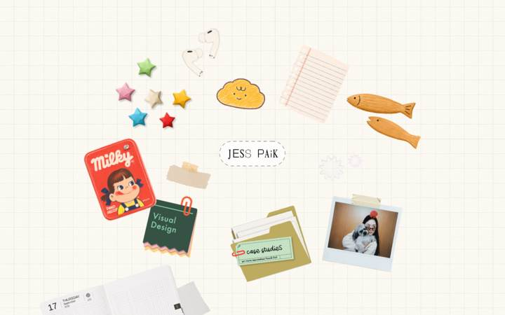
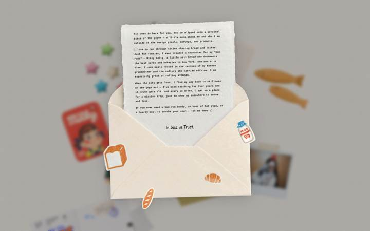


**Stack:** Framer-published site (`<meta name="generator" content="Framer 25dfa11">`, "Made in Framer" comment, published 2026-09-02) hosted on framerusercontent.com; Framer analytics `events.framer.com/script?v=2`. The whole home page is ONE custom Framer code component (React, `E.div` = framer-motion `motion.div` with `drag`, `animate` controls, `whileHover`, `initial/animate/exit`) living inside `shared-lib.B2sUFLPm.mjs` (381 KB; component starts at byte ~345k, `os=h(function({card,index,onNavigate,draggable,onHoverSound,onClickSound,...})`). Bundles: `rolldown-runtime`, `react.DJdwiC4E.mjs` (React 18.2.0 — string `18.2.0` x4 in bundle), `framer.BdmsXIsi.mjs` (Framer runtime), `motion.DOrPziY1.mjs` (framer-motion, no version string embedded), `shared-lib`, `script_main`. No GSAP, Lenis, three, pixi, lottie, rive, or WebGL anywhere (grep of every .mjs: 0 hits for gsap/ScrollTrigger/lenis/THREE/shader/uniform/feTurbulence; `ogl`/`rive` hits are substrings inside unrelated words). Page height = 900 px (viewport): there is NO scrolling at all; `<meta viewport content="width=1200">` so phones render a 1200 px desktop layout scaled down (mobile.json: innerWidth 1200). Sound: `clickSound` = `https://github.com/Fox779/pop/raw/refs/heads/main/pop.mov` played via `new Audio()` (`function Lo(e,t,n){... let i=new Audio(e); i.volume=...; i.loop=n ...}` and `Ro(e){t.currentTime=0; t.play()}`); `hoverSound` empty; `bgMusicVolume: 0.3` but no bgMusic URL set (no music button rendered).
Case studies are NOT pages on this site: each sticker click opens a draggable, resizable faux-OS window (`Uo` component) whose body is an `<iframe src=…>` to an external site (paperprayers.netlify.app, vocal-rabanadas-170f96.netlify.app, sbcapp.framer.website, visualstack.framer.website, daengistudios.framer.website, batch-water-92247702.figma.site, a Google Drive preview, a Vimeo player, a Spotify embed). Opened & torn down two of them: **paperprayers.netlify.app** (hand-written vanilla JS + CSS + `matter-js@0.19.0` from jsDelivr) and **sbcapp.framer.website** (a plain Framer page).

**Fonts:** Home page loads NO web fonts (requests.json: 0 font requests; `document.fonts` empty). The "JESS PAIK" name tag is a PNG (`centerImage: HQTsvU4ThQaTQRtJzS5U9cnV0.png`, 6568x2703, rendered ~190 px wide); every other "text" on the desk is baked into sticker PNG/GIFs. Text that IS rendered: live calendar card drawn on canvas with `"Helvetica Neue", Helvetica, Arial` at 200/400 weight (`m.font = \`200 ${h}px "Helvetica Neue"…\``); popup window chrome in `'Courier New', Courier, monospace` 10–14 px; bio letter in monospace ~9.5 px (`bioFontSize: 9.5`) with a handwriting sign-off; email form in monospace 11 px uppercase. The component lazily injects Google Fonts `Patrick+Hand` (`Bo` component adds a `<link id="jess-handwriting-font">`) and references `'Vintage Machine'` — used only when `centerText` is shown instead of the image, i.e. not on the live page. Case study (paperprayers): Google Fonts `Major Mono Display` 36 px h1, `Reenie Beanie` 26 px subtitle, `Dawning of a New Day` (unloaded). Case study (sbcapp): Helvetica Neue h1 50 px/300, h2 28 px/400, p 17 px/300.

**Layout & palette:** Single 1440x900 "desk": full-bleed paper-grid PNG background (`OIQMLwicGqm0BrAAhQysCFHHI.png`, 5000x3750, cream #F8F6F0-ish with faint grey grid) set as Framer background image; in the middle a 1790x600 "world" div (`transform: scale(0.65)`, `cursor: grab`, `touch-action: none`) holding 13 absolutely-positioned sticker cards (origami stars, AirPods, bread cloud GIF, notebook page GIF, wooden fish, Milky candy, "Visual Design" notepad, "case studies" folder, polaroid, washi tape, a live calendar/journal card 600x450) around the centre name tag. Palette: cream paper #F5F0E4/#EDE8DC, ink #3E3830/#1a1815, warm accents from the stickers (orange, red, olive folder). Popup windows: cream `#EDE8DC` with 1.5 px `#3E3830` borders, 10 px radius, big soft box-shadows; modal backdrop `rgba(26,24,22,0.35)` + `backdrop-filter: blur(6px)`. No nav, no footer, no headings, no `<a>` in the initial DOM at all.

**Effects** (one bullet per effect):
- *Intro "deal the deck"* — on load the name tag fades/scales in, then each sticker pops out of the centre pile (blurred, 0.8 scale) and flies to its scatter position with an overshoot arc. **Technique:** framer-motion `useAnimation` controls per card, imperatively sequenced with `setTimeout`/`await` staggers (60 ms then 45 ms per card); 4-keyframe tween of x/y/rotate/scale/filter over 1.3 s with `times:[0,.22,.33,1]`, filter animated `blur(5px)→blur(5px)→blur(2px)→blur(0px)`. Not scroll-linked, not GSAP. **Evidence:** shared-lib.pretty.js L6600-6690: `e.goKeyframes([n.x, n.x*0.3, n.x*0.05, r.x],[n.y, n.y-70, n.y*0.05, r.y],[n.r, n.r*1.5, n.r*2.2, r.r],[0.8,0.86,0.92,1],[0,0.22,0.33,1],1.3,[\`blur(5px)\`,\`blur(5px)\`,\`blur(2px)\`,\`blur(0px)\`])` inside `setTimeout(..., t*45)`; scatter targets `Qo=[{x:-500,y:-220,r:-8},{x:-160,y:-310,r:5},…]`, pile offsets `Zo=[{x:16,y:-6,r:4.5},…]`. Screenshots intro-300…intro-4000.png.
- *Pixel-accurate hover (only the opaque part of a sticker is hot)* — hovering the transparent bounding box of a PNG does nothing; hovering the drawn pixels lifts the sticker. **Technique:** each PNG card is drawn once into an offscreen 2D canvas; `onMouseMove` un-rotates/un-scales the pointer into image space and reads `getImageData(x,y,1,1).data[3] > 10` (rotation-aware: uses `Math.cos/sin` of the live `rotate` value captured from motion's `onUpdate`). GIF cards skip the test (`/\.gif$/i.test(e.image)` → always hot). **Evidence:** L7423-7470: `let n=re.current.getContext('2d') … p=(d*s+f*c)/u, m=(-f*s+d*c)/u … return n.getImageData(h,g,1,1).data[3]>10`. Console warns "Multiple readback operations using getImageData". Cursor sampling in clicktest2.json confirms `pointer` only on opaque points.
- *Sticker lift on hover* — hovered sticker scales 1.05 and rises 5 px from its bottom edge. **Technique:** plain CSS transition on an inner wrapper. **Evidence:** L7620-7628: `transform: p&&!g ? 'scale(1.05) translateY(-5px)' : 'scale(1) translateY(0px)', transition: 'transform 0.38s cubic-bezier(0.22,1,0.36,1)', transformOrigin: 'center bottom'`. hover2-1.png.
- *GIF "freeze until hovered"* — stickers are animated GIFs that sit still until you hover, then play from frame 1. **Technique:** first GIF frame is `drawImage`d into a `<canvas>` shown by default (`opacity:1`); on hover the canvas fades to 0 and the real `` fades to 1 (both `transition: opacity 0.22s`); a `display:none; offsetWidth; display:block` reflow restarts the GIF. **Evidence:** `Io` component L5262-5306: `i.drawImage(t,s,c,…)`, `e.style.display='none', e.offsetWidth, e.style.display='block'`; rendered.html canvases with `opacity: 1; transition: opacity 0.22s`; hover.json shows canvas opacity 1→0 on hover. Server-side `gifDuration: 2300` prop.
- *Drag any sticker / drag the whole desk* — every sticker is grab-draggable (z-index jumps to 200 while dragging, snaps back after) and the empty paper pans the entire world within clamped bounds. **Technique:** framer-motion `drag` prop with `dragMomentum:false, dragElastic:0` per card; world pan is hand-rolled Pointer Events (`setPointerCapture`, `onPointerMove` sets motion values `x/y` with `Math.max(-t,Math.min(t,…))` clamps). **Evidence:** L7580-7607 `y(E.div,{animate:f, drag:r, dragMomentum:!1, dragElastic:0, onDragStart:()=>{…zIndex='200'}}`; L6720-6760 `nt=(e)=>{e.currentTarget.setPointerCapture(e.pointerId); … document.body.style.cursor='grabbing'}`. drag-card.png, drag-world.png.
- *Gather-and-peek on name-tag hover* — hovering "JESS PAIK" sucks every sticker into a blurred mini pile under the tag (scale ~0.08–0.15, blur 5 px, 0.65 s), then one sticker at a time pops up 140 px above the tag (scale 0.88, sharp) and sinks back, cycling every ~1.25 s; leaving the tag scatters everything back (0.95 s). **Technique:** framer-motion controls driven by `onMouseEnter`/`onMouseLeave` + recursive `setTimeout` loop. **Evidence:** L6520-6590: `Ye` (`t.go(n.x*0.2,-140,n.r*0.35,0.88,1,0.5,…)` then `setTimeout(Ye,600)`), `Xe` (`e.go(0,0,n.r*0.15, es[t], 1, 0.65, [0.22,1,0.36,1], 'blur(5px)')`), `Ze` (scatter); L6809-6810 `onMouseEnter: Xe, onMouseLeave: Ze` on the centre `E.div`. gather-0.8s.png, gather-2.5s.png, scatter-back.png.
- *Faux-OS case-study windows* — clicking a sticker plays a pop sound, dims + blurs the desk, and spawns a cream window with a URL bar, ↗ open-in-new-tab, `_ □ ×` buttons, an `<iframe>` of the external case study, a `resize: both` handle, drag-anywhere by the title bar, and a rotated "sticky note" PNG hanging off one side (e.g. "donate here" speech bubble linking to a giving page). Multiple windows stack (click one to focus/raise). **Technique:** React state list of popups rendered as `position:fixed` layers; window is a motion.div with `drag`, `initial:{scale:.94,opacity:0,y:d+14} → animate:{scale:1,opacity:1}` 0.3 s; sticky note is `E.a` with `initial:{scale:0,rotate:-10} animate:{rotate:-8} whileHover:{scale:1.1,rotate:-4}` delayed 0.38 s; backdrop `rgba(26,24,22,0.35)` + `backdrop-filter: blur(6px)`. **Evidence:** `Uo` L5761-5990 (`m('iframe',{src:v,title:'Link preview',allow:'fullscreen; autoplay'…})`, `resize:'both', minWidth:320`), popup2-0.json/popup2-5.png (two windows: figma.site + sbcapp.framer.website), card props `popupW: 820, popupH: 620`, `stickySide: 'left'`.
- *Bio letter in an envelope* — clicking the polaroid opens a large envelope with a torn-edge paper letter and stamp-stickers; the paper is rotated `-1.5deg` and drop-shadowed. **Technique:** static PNG envelope/paper layers + monospace text, motion.div entrance with `drop-shadow` filter (`filter: drop-shadow(0 8px 28px …)`), transform `translateX(-30px) translateY(-140px) rotate(-1.5deg)`. **Evidence:** popup2-11.json (`.paper-scroll` style tag, 1200x1200 draggable paper), `Vo` component L5588+, `bio:` prop text "Hi! Jess is here for you…". popup2-11.png.
- *Contact form window* — the "hello" GIF opens a "GET IN TOUCH" cream window with NAME/EMAIL/MESSAGE fields. **Technique:** plain React form (`Ko` component) inside the same modal shell; `emailContact: !0` prop. **Evidence:** popup2-8.json/png.
- *Spotify mini-player window* — the cassette/CD GIF opens a fixed 500x152 Spotify embed with custom ⏸/⌄/✕ buttons that talk to the iframe via `postMessage({command:'pause'})` and listen for `playback_update`. **Evidence:** `Go` L5993-6100; `spotifyUrl` prop holds the raw `<iframe …>` embed code, parsed by `Wo()` regex `/\bsrc=["']([^"']+)["']/`.
- *Live calendar/journal card* — the big notebook card shows today's date ("17 THURSDAY September W38"), day-of-year, and a moon-phase disc, all correct for the visit day. **Technique:** Canvas 2D drawn on mount (`new Date()`, ISO week fn `Ao`, day-of-year `jo`, moon phase `Mo` = days since 2000-01-06 mod 29.53), `fillText` in Helvetica Neue, `arc()` filled with alpha = illumination. Clicking the card toggles a stacked "entry" paper (`entryVisible` → extra `` layers with `paperSrc1/2/3`), and clicking the little sticky in its corner opens the linked window. **Evidence:** `No` L4869-4990 (`m.font=\`200 ${h}px "Helvetica Neue"…\`; m.fillText(String(a),S,o*0.5) … m.arc(w,T,C,0,Math.PI*2); m.fillStyle=\`rgba(26,24,21,${(re*0.9).toFixed(3)})\``); DOM canvas `600x46` at `top:31.2px;left:11.5px;z-index:20`; `liveJournal: !0` prop. Visible in screenshot.png bottom-left ("17 THURSDAY September").
- *Click "pop" sound* — every successful sticker click plays a short pop. **Technique:** HTMLAudioElement (`new Audio(url)`, `currentTime=0; play()`), source is a `.mov` on GitHub raw. **Evidence:** `Lo`/`Ro` L5369-5394; requests.json media `https://github.com/Fox779/pop/raw/refs/heads/main/pop.mov`.
- *Reduced motion* — NOT handled by the custom component: `prefers-reduced-motion`/`matchMedia` = 0 hits in shared-lib; with `reducedMotion:'reduce'` the same blurred intro pile plays (reduced-motion-4s.png identical to intro-4000.png). Only Framer's own `data-framer-appear-animation="no-preference"` gate exists and nothing on this page uses it.
- *Case study 1: paperprayers.netlify.app ("Japan Mission Trip 2026")* — hand-drawn grid paper background, ~60 coloured square "papers" scattered on both sides (`paper-flutter` CSS keyframe wobble on hover: `rotate(-2.5deg) translateY(-3%)` 0.9 s infinite; drag with Pointer Events + `setPointerCapture`; recoloured on the fly by drawing an outline PNG to canvas: `colorizeOutlinePaper(hex)`), click one → modal paper with a textarea, a "dog-ear" fold button, then the paper folds into an origami crane (a 137-frame GIF, `GIF_DURATION_MS = 13700`, recoloured per paper hue by canvas: `colorizeCraneImage(hex)`), and the crane **drops into a hand-drawn jar and physically settles on the pile**. **Technique:** `matter-js@0.19.0` (script tag from cdn.jsdelivr.net): `Matter.Engine.create(); engine.world.gravity.y = 1.1`; jar walls = chains of static `Bodies.rectangle` 24 px thick; each crane = `Bodies.circle(startX,195,20,{restitution:.15,friction:.5,frictionAir:.02,density:.002})`; a `requestAnimationFrame` `physicsTick` calls `Matter.Engine.update(engine, delta≤33)` and writes each body's position/angle to a DOM `` via `el.style.left/top = %` + `transform: translate(-50%,-50%) rotate(${body.angle}rad)` (no Matter.Render, no canvas). A hidden cursor "boulder" body (`CURSOR_BOULDER_RADIUS`) follows the pointer so you can nudge the pile; speed clamp 25 px/step and an escape-bounds rescue prevent tunnelling. Count is shared via a Google Apps Script JSONP endpoint (`script.google.com/macros/...exec?callback=`) + `localStorage` fallback; a flip-clock countdown (`flip-tile-fall/rise` keyframes, `rotateX` flaps). Fonts Major Mono Display / Reenie Beanie; drop-shadow filters everywhere (56 elements). **Evidence:** case-paperprayers/script.js L626-700, L740-761; style.css `@keyframes paper-flutter|flip-tile-fall|flip-tile-rise|bob|fold-settle|stamp-impact`; pp-hover.json shows crane `left/top/rotate` inline styles changing every frame; pp-screenshot.png.
- *Case study 2: sbcapp.framer.website* — conventional long-scroll Framer article (9000 px): Helvetica Neue type, tag pills, 16:9 image cards with big radius + shadow, one autoplaying muted looping `<video>` (`framerusercontent.com/assets/GgZJmTpc03B2JbGBDN66Z6sNJvM.mp4`), a `mask-image: linear-gradient(rgba(0,0,0,0) 65%, #000 100%)` fade on one card, SVG data-URI mask on 2 elements, no hover/scroll effects detected (sbc-hover.json empty; 0 canvases; Framer appear-animation attribute present but 1 element). **Evidence:** sbc-computed.json, sbc-requests.json. So "interactive case studies" really means: the interactive shell is the desk + windows; the case studies themselves range from a full physics toy (paperprayers) to a plain article.

**What to adopt for the arctic sketchbook**
- *Desk-of-stickers hero with pixel-accurate hit-testing* (M2 hero / M4 design lab): keep our rough.js/watercolour stickers as transparent PNG/SVG; do the offscreen-canvas alpha test (`getImageData(x,y,1,1).data[3] > 10`, un-rotate the pointer with cos/sin as they do) so only the ink is hot; this pairs perfectly with hand-cut sketch shapes. For SVG stickers we can skip the canvas and use `pointer-events: visiblePainted` on the path instead — zero new deps. Set `willReadFrequently:true` on the canvas to silence the warning.
- *Draggable stickers + pannable desk* (M4 design lab): use `motion/react` `<motion.div drag dragMomentum={false} dragElastic={0}>` exactly as they do, plus Pointer-Events pan with `setPointerCapture` and clamped motion values. Stickers should "settle" (our vocabulary) with a tiny rotate wobble on drop — `onDragEnd` → `animate({rotate:[r+3, r-2, r]})`. No new dependency.
- *"Deal the deck" intro* (M2 hero): recreate with a GSAP timeline instead of nested setTimeouts: `gsap.from(cards, {x:0,y:0,scale:.8,filter:'blur(5px)',stagger:0.045, ease:'expo.out'})` with a MotionPath-free 3-point arc via keyframes (`keyframes:[{y:-70},{y:0}]`). Under `prefers-reduced-motion` degrade to a plain 400 ms opacity crossfade (they do not — this is a gap we must close).
- *Gather-and-peek on name hover* (M2 hero signature moment): hovering our name tag melts the stickers into a pile under it and peeks one at a time — great "melt/settle" moment. GSAP timeline with `repeat:-1` for the peek loop, `overwrite:'auto'` on leave. Replace their `filter: blur()` with a watercolour "bleed" (animate feDisplacementMap `scale` 0→8 via GSAP on the SVG filter) to obey "no blur-as-glass" rules.
- *GIF-freeze-until-hover* (M3 project cards): same idea but with our SVG line drawings: render the static state, on hover run a DrawSVG stroke animation (`gsap.fromTo(path,{drawSVG:'0%'},{drawSVG:'100%'})`) — the canvas-snapshot trick is only needed for raster GIFs; if we do ship raster GIFs, copy the `<canvas>` first-frame + `display:none/offsetWidth` restart trick, no deps.
- *Faux-window case-study viewer with a hanging sticky note* (M3 case studies / M5 polish): open case studies in an in-page draggable "window" (motion drag, `resize: both`), but as an internal route rendered in a `<Suspense>` panel rather than an `<iframe>` of an external site; keep their URL-bar + `_ □ ×` chrome idea but draw the frame with rough.js rectangles and use a paper-textured sticky with `whileHover:{rotate:-4, scale:1.1}`. Replace `backdrop-filter: blur(6px)` + box-shadows (forbidden: glass/drop shadows) with a paper-grain overlay at 35% and a rough.js hatched border.
- *Live canvas calendar / moon phase card* (M4 design lab or footer): ~80 lines of Canvas 2D, zero deps; draw it with rough.js `arc()`/`circle()` for the moon and our handwriting font via `ctx.font` for a "today's page" sketchbook stamp. Reuse their ISO-week / day-of-year / moon formulas (`Mo(e)` = days since 2000-01-06 mod 29.53058867).
- *Physics jar (paperprayers)* (M4 design lab): exactly our matter-js use case — static wall chain from a hand-drawn SVG path (`Bodies.rectangle` segments 24 px thick), circle bodies smaller than the artwork so the pile packs densely, `Engine.update` in rAF and write `left/top/rotate` to DOM nodes (or to a rough.js-drawn canvas) — no `Matter.Render`. Copy their three robustness tricks: per-tick speed clamp, escape-bounds rescue, and a pointer "boulder" body for nudging. Our "fall / settle" motion words map 1:1.
- *Click pop sound* (M5 polish, optional): `new Audio()` gated behind a user gesture; keep it tiny and mute-able. No dependency.

**What NOT to adopt and why**
- `<iframe>` of external sites as "case studies": every window loads a third-party page (Netlify, Framer, Figma Sites, Google Drive, Vimeo) with its own fonts/scripts; slow, breaks reduced-motion/keyboard/a11y, and the URL bar is fake (`^https?` regex only). We keep case studies as internal routes.
- `<meta viewport width=1200>` "desktop-optimised" strategy: phones just get a shrunken desktop; the 1790 px world at `scale(0.65)` is unusable on touch (touch-action:none on the whole page). We need a real mobile layout (stacked stickers, no pan).
- Nested `setTimeout`/`await qe()` animation sequencing (L6640-6690): unabortable, drifts, and can't respect reduced motion; use one GSAP timeline.
- `getImageData` on every `mousemove` for 13 cards without `willReadFrequently` (console warnings); for SVG stickers use `pointer-events` on the painted path instead.
- Framer's runtime (React 18 + framer-motion + Framer router ≈ 1.1 MB of JS for a page with no text) and the Framer editor-bar injection; also the `.mov`-from-GitHub-raw audio and Google Apps Script backend on the case study — not on our allowed list and not needed.
- Heavy `box-shadow`s (`0 20px 60px rgba(0,0,0,.18)`), `backdrop-filter: blur(6px)`, `filter: blur(5px)` transitions, `drop-shadow` on 56 elements (paperprayers): all violate our no-shadow/no-glass rules; swap for paper-grain overlays and rough.js hatching.
- Text baked into images (name tag, "case studies" label, sticker captions): zero accessibility, no font loading at all. We keep real text with SplitText for reveals.
- No reduced-motion path (blurred intro plays regardless) — we must add the crossfade fallback.

**Screenshots:** screenshot.png (1440x900 desk after intro), screenshot-mobile.png (390x844 → scaled desktop, mid-pile), intro-300.png, intro-900.png, intro-1500.png, intro-2200.png, intro-3000.png, intro-4000.png (deal-the-deck sequence), reduced-motion-900ms.png, reduced-motion-4s.png, scroll-0…6.png (identical — page does not scroll), hover-0…7.png (first hover pass), hover2-0…11.png (clipped per-sticker hover with GIF playing), hover-card-1.png, hover-card-8.png, drag-card.png, drag-world.png, gather-0.8s.png, gather-2.5s.png, scatter-back.png, probe-2.png, popup2-0.png (paperprayers window + "donate here" sticky), popup2-1.png, popup2-2.png (Drive preview), popup2-3.png, popup2-5.png (two stacked windows: figma.site + sbcapp), popup2-6.png, popup2-7.png (Vimeo), popup2-8.png (contact form), popup2-9.png (Spotify), popup2-11.png (bio envelope letter), clickdebug-1/2/11.png, pp-screenshot.png, pp-scroll-0…6.png, pp-hover-0…7.png, pp-screenshot-mobile.png (paperprayers case study), sbc-screenshot.png (9000 px full page), sbc-scroll-0…6.png, sbc-hover-0/1.png, sbc-screenshot-mobile.png (sbcapp case study). Supporting data: requests.json, rendered.html, computed.json, hover.json, cards2.json, clicktest2.json, popup2-*.json, mobile.json, pp-*.json, sbc-*.json, bundles/ (all JS incl. prettified shared-lib.pretty.js), case-paperprayers/ (index.html, script.js, style.css).

---

## 8. https://taliahhh.com

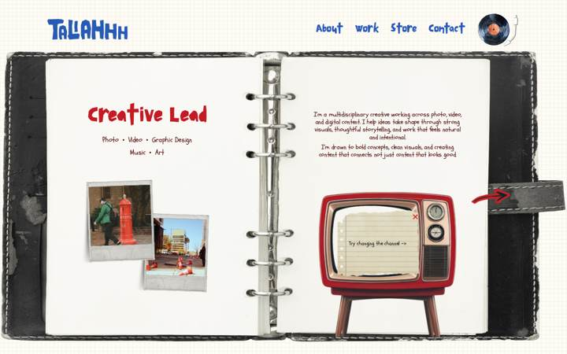

**Stack:** Framer (no-code) site — `<!-- Made in Framer -->`, `<meta name="generator" content="Framer eb3d845">`, published Aug 27 2026; hosted on Framer CDN (`framerusercontent.com/sites/16AwNpZocABTpzVym1Ovcr/*`, bundled with rolldown: `rolldown-runtime.Dh6celcD.mjs`). Runtime = React (`react.R-aQbqIr.mjs`, 145 KB) + Framer's fork of motion/framer-motion (`motion.BhK-tB_l.mjs`, 151 KB; `framer.BP1Jd8Op.mjs`, 497 KB — contains Framer's `Ticker`, appear-effects, `Transition` prop controls). No exact version strings are exposed in the minified chunks (only `2.0.0` inside framer.mjs, unrelated); Framer strips them. Page chunk `WYLHSQJk3.ByhSpNgC.mjs` (1.04 MB, shared by all routes) also bundles an unused-on-home WebGL "paper-shaders" component (`data-paper-shaders`, `createShader`, uniforms `u_time`, `u_pixelRatio`, `u_resolution`) and a feTurbulence text-distortion component — **no `<canvas>` is ever rendered on any route I loaded** (home/about/work/store/contact), so the shader is dead weight. No GSAP, Lenis, Locomotive, three.js, pixi, matter, lottie, rive, barba, swup, curtains (grep of all 11 bundles: zero hits; "rive"/"three" hits were substrings of "derive"/"three distinct pieces"). Analytics: `events.framer.com/script?v=2`. 50 requests on home: 20 script, 17 image, 7 font, 2 media (mp4), 1 fetch, 1 ping, 2 document (second doc is Framer's editor-bar iframe).
**Fonts:** Actually downloaded on home (requests.json): **PAGKAKI Regular** (`assets/agTCs6B3UQdaK9voL4RfHEEt6Q.woff2`, custom upload — chunky hand-cut display face, used for nav/H5 30px `#285ab8` and H2/H3/H4 48/40/34px `#c51b25`), **NF-PAGKAKI Full** (`.woff`, weight 500 — H1 "Creative Lead" 60px/60px, letter-spacing -1.2px, `#c51b25`; H1 on /work 140px), **Schoolbell** (Google, 400 — all body copy: 14–18px, line-height 1.2, letter-spacing -0.02em, colour `#4d0000` dark maroon), **Cormorant Garamond 700** (footer "Made by" 16px), **Neue Regrade Bold** (footer "Doing Moore" 16px), **Inter 600** (footer copyright 14px), plus one Fontshare face. Declared but not loaded on home: Gochi Hand (H5 26px on /work), Edu TAS Beginner, Fira Code, Fragment Mono, Excon, Inter Display. Labels (nav) = PAGKAKI 30px; Polaroid captions/tab labels = Schoolbell 14px.
**Layout & palette:** One fixed-height "spread" per route (home 1440×989, no scroll at all; /work is a 90°-rotated portrait binder 2873px tall). A photographic 6-ring binder PNG (`sUSpuETVmlGNlF7FTDGlVS5HFpI.png` 1888×971, spine `zbrh9vR1YPiO8JFieDKi9p80pwM.png`) sits on a cream page `#fffcf5` with a tiled graph-paper texture (`background-image:url(6mcf62….png?width=256) repeat; background-size:128px auto`). Everything on the "pages" is absolutely positioned via `translate(-50%,-50%)` (Framer canvas layout). Palette tokens (body `--token-*`): reds `#fdf2f2 #f8d8d8 #f99f9f #f66a6a #c51b25 (primary) #e30d0d #bc0b0b #9a0909 #780707 #5c0000 #4d0000`, blues `#81a4e4 #5785db #285ab8 (nav) #1d4287 #0a214d #071736`, accents `#f7ba13 #e47e2f #efb385 #a25215 #753b0f #582804`, olives `#b0c082 #b0b46e #475129 #252b13`, ink `#0e141d`, paper `#f8f9f5 #f9f9f5`. Real drop shadows are baked into the PNG assets (Polaroids, TV), not CSS; the only CSS `box-shadow`-ish thing is an SVG inner-shadow filter (`feGaussianBlur`+`feColorMatrix`, `filter0_ii_659_1546`) on the vinyl icon. Mobile (390px): nav stacks under logo, single page shown, vinyl top-right.
**Effects** (one bullet per effect):
- *Nav link tilt on hover* — "About/Work/Store/Contact" rock 4° clockwise on hover, spring back on leave. **Technique:** Framer component hover variant → motion `rotate` (inline `transform: matrix(0.9976,0.0698,…)` = 4°), spring transition. **Evidence:** `bundles/rU5Wib2qQ.C9aV1wyh.mjs`: `style:{…,rotate:0},…variants:{"qeRdBznGv-hover":{rotate:4}}`; hover.json shows the `<a>` gaining class `hover` and child DIV transform `none → matrix(0.997564, 0.0697565, …)`.
- *Hand-drawn circle around the current page* — on /about and /work the active nav word has an orange scribbled oval. **Technique:** image swap by variant, not hover: a PNG (`Artboard 13@2x`, 123×41) rendered at `opacity:0` in the "Desktop" variant and `opacity:1` in "Desktop Highlighted"; hover does not reveal it (verified: still opacity 0 during hover). **Evidence:** interact-work.json `Desktop Highlighted` node on /work; interact-work2.json `navHoverAfter` → `Artboard 13@2x|opacity:0`.
- *Spinning vinyl record (always on)* — the LP in the top-right rotates continuously ~6 s/rev. **Technique:** Framer "loop" appear effect: motion `animate` to `rotate:360` with linear tween of 1 s, repeated; inline style updates every frame (`transform: rotate(186.9deg)` → `235.86deg` after 800 ms ≈ 61°/s), `will-change: transform`. **Evidence:** `bundles/WYLHSQJk3.ByhSpNgC.mjs`: `El={delay:0,duration:1,ease:[0,0,1,1],type:'tween'},Dl={opacity:1,rotate:360,…}`; interact.json `recBefore.cd` vs `recHover.cd`.
- *Tonearm drops + music plays (click)* — clicking the record/arm swings the tonearm from −14° to +3° (pivot at its top-right) and starts a looping MP3; second click lifts it and pauses. **Technique:** Framer component with `Pause`/`Play` variants; arm = motion `rotate` with `transform-origin: 100% 0%`; audio = `<audio loop preload="none" src=…WI5GmcRvg0bsaeI41ikboOEpa48.mp3>` toggled via `onTap`. **Evidence:** interact.json `recClick`: `hand cover|transform: rotate(3deg); transform-origin: 100% 0% 0px`, `pause: Play|framer-v-15c36no`, `audio.paused:false`; `recClick2` reverts to `rotate(-14deg)`/`Pause`/`paused:true`.
- *Pulse ring behind the record* — a blue (`rgb(25,49,207)`) circle breathes behind the vinyl (mostly hidden by it). **Technique:** motion loop on scale + opacity (`Outer Circle` `scale(0.56→1.0)`, `opacity 0.07→0.25`; `Inner Circle` opacity 0.56→1.0), targetOpacity .5. **Evidence:** interact-work2.json `pulse` samples; `bundles/rU5Wib2qQ.C9aV1wyh.mjs` `"data-framer-name":\`Outer Circle\`,…__targetOpacity:.5`.
- *TV "change the channel" knob* — clicking the top knob rotates it (0 → −105° → −225°) and swaps the picture on the screen to a different looping muted video; the lower knob is a second selector (rotates +94°). **Technique:** Framer smart component cycling variants on `onTap` (Variant 1→2→4→3), each variant mounts a different `<video autoplay loop muted>`; knob = motion `rotate` variant values; transition spring. **Evidence:** `bundles/WYLHSQJk3.ByhSpNgC.mjs`: `onTap:ne,style:{rotate:0},…variants:{c6YK8LDPf:{rotate:-105},gXiTTOSAJ:{rotate:-225},…}`; interact.json `tvAfterClick1`: `Layer 1: rotate(-105deg)`, video src `M4Lvu…mp4 → Es94v3…mp4`, name `Variant 1 → Variant 2`. (Videos stayed `paused` in headless Chromium — no H.264 — so playback itself is inferred from the `autoplay loop muted` attributes.)
- *Page-load fade-in* — the TV block (`10wnzip`) and two others fade from opacity 0.001→1 with a 0.4 s spring after 0.4 s delay. **Technique:** Framer "appear" animations, JSON in `<script id="__framer__appearAnimationsContent">`, applied via `data-framer-appear-id`. **Evidence:** rendered.html: `"animate":{"opacity":1,…"transition":{"bounce":0.2,"delay":0.4,"duration":0.4,"type":"spring"}}`. A word-by-word blur-in text effect is also defined (`kf={filter:'blur(10px)',opacity:.001,y:10}`, `tokenization:'word'`, `startDelay:2.6`) but I could not observe it firing on the home paragraphs (spans=0 at every sample) — probably used on a sub-page; undetermined which.
- *Polaroid grows on hover (About page)* — the large Polaroid scales to 1.1. **Technique:** motion hover variant `scale:1.1` with spring `{bounce:.2,duration:.4}`. **Evidence:** interact-work.json `aboutHover`: `transform: none → scale(1.1)`; bundle `Nf={…scale:1.1,…transition:bf}`, `bf={bounce:.2,delay:0,duration:.4,type:'spring'}`. Home-page Polaroids have **no** hover (10-level ancestor diff empty).
- *Binder tabs (Work page)* — four paper tabs "Photo/Video/Editing/Design" along the top of the rotated binder; hover nudges a tab 5 px, click raises the active tab and dims the others to 50 %, swapping the page content in place (no navigation; URL stays /work). **Technique:** Framer component variants; tab = motion `x:5` on hover (`translateX(5px)` composed before `rotate(-90deg)`), inactive `opacity:.5`; content swap = variant switch (Video tab mounts a camera-LCD video block + "Film strip ticker"). **Evidence:** interact-work.json `Tall tab style: translate(-50%,-50%) rotate(-90deg) → translate(-50%,-50%) translateX(5px) rotate(-90deg)`; bundle `variants:{actdSVN8R:{opacity:.5},…}`, `Hp={…rotate:-90,…transition:Bp,x:-5}`; screenshot work-after-tab-video.png.
- *Greyscale → colour project cards (Work page)* — the four "Main Projects" photos sit desaturated and pop to full colour on hover. **Technique:** CSS `filter` animated by motion: rest `filter: contrast(0.85) grayscale(1)`, hover `filter: contrast(1) grayscale(0)`. **Evidence:** interact-work3.json `cardBefore` (`contrast(0.85) grayscale(1)`) vs interact-work2.json `cardHover` chain while pointer on image (`filter: contrast(1) grayscale(0); will-change: transform`).
- *"view more ->" expands the page in place* — clicking a project caption grows the binder page (document height 2873 → 3465 px) and shows an "extended page / Long page / go back" variant. **Technique:** Framer variant switch of the page component (no route change). **Evidence:** interact-work2.json `afterViewMore`: url unchanged, `h: 3465`, new names `['extended page','Long page','go back',…]`.
- *Draggable stickers/Polaroids* — 25 image layers (`Aspire`, `Mir`, `Dake`, `Camera 1@2x`… `Brunch club`) are declared draggable with a grabbing cursor and snap back to origin. **Technique:** motion `drag` prop (`drag:!0, dragMomentum:!1, dragSnapToOrigin`, `Of={cursor:'grabbing'}`), inertia transition `{bounceDamping:30,bounceStiffness:400}`. **Evidence:** `bundles/WYLHSQJk3.ByhSpNgC.mjs` `"data-framer-name":\`Aspire\`,drag:!0,dragMomentum:!1,…style:{rotate:44}`; 10× `dragSnapToOrigin`. **Undetermined where they render** — none of the routes/tabs I could reach mounted them (probably inside deeper project pages behind the Editing/Design tabs whose clicks did not switch in headless).
- *Film-strip ticker (Work → Video tab)* — a horizontal 35 mm film strip of video thumbnails. **Technique:** Framer's built-in `Ticker` component (`framer.BP1Jd8Op.mjs` exports `Ticker`; props `speed:35/45`) — rAF-driven translate marquee. Movement not observed in headless (transform identical across 800 ms samples; likely paused because the child videos can't play or `hoverFactor`/reduced-motion) — **undetermined** in practice.
- *Store page wobbly text* — the only live use of the shipped feTurbulence component: "Coming Soon!!!" is displaced by fractal noise. **Technique:** SVG filter `<feTurbulence type="fractalNoise" baseFrequency="0.022" numOctaves="2" seed="270" stitchTiles="stitch"/><feDisplacementMap in="SourceGraphic" scale="2.07" xChannelSelector="R" yChannelSelector="G"/>`, seed re-randomised on a `setInterval` (`clearInterval` in the component). **Evidence:** interact.json `pages['/store'].turb`; bundle `baseFrequency:i/100*1.1**(s-1),numOctaves:s,seed:d`.
- *3D-tilted stack card* — one layer is set with `rotate:4, rotateY:-10, skewX:3, skewY:1, transformPerspective:1200, z:96` (a slightly lifted, skewed photo). **Technique:** static motion transform (no interaction). **Evidence:** bundle `style:{rotate:4,rotateY:-10,skewX:3,skewY:1,transformPerspective:1200,z:96}`.
- *Scroll effects* — **none.** No scroll-linked transforms on any route (scroll.json / `scrollLinkedDiff: []`), no sticky/fixed elements except Framer's hidden editor iframe, no smooth-scroll lib, `useScroll` appears once in the chunk but nothing subscribes to it. No custom cursor (no `cursor:url(...)`, no fixed pointer-events:none follower element); only `cursor:grabbing` on drag layers.
- *No mix-blend / backdrop / mask tricks* — one `mix-blend-mode: overlay` div exists (`framer-9xkrsy`, inside the Logo "No texture" variant, effectively unused) and `filter: invert(0)`, `grayscale(0) saturate(1)` idle values; no `backdrop-filter`, no CSS masks/clip-paths.

**What to adopt for the arctic sketchbook**
- *Physical "spread" as the page* (binder + tabs metaphor) → our sketchbook spread: draw the page edges/ring binding with rough.js paths instead of a photo, keep the graph-paper tile idea as a lightweight SVG pattern (2–4 KB) rather than a 256 px PNG. **M1** (shell/layout). No new dep.
- *Tab-driven in-place content swap with a 5 px tab nudge and 50 % dimming* → sketchbook section tabs (About / Design lab / Travel) using motion/react `layout` + `whileHover={{x:5}}`, inactive `opacity:.5`; swap content with `AnimatePresence` crossfade (this also satisfies reduced-motion). **M2**.
- *Greyscale → colour on hover for project photos* → our project cards: motion `whileHover` on `filter` is fine, but better on-brand: watercolour "bleed" — animate the `feDisplacementMap scale` / a rough-notation highlight in, with `filter: grayscale(1)→0` as the reduced-motion fallback. **M3** (work grid).
- *Draggable stickers that snap back* (`drag`, `dragSnapToOrigin`, `cursor:grabbing`, spring inertia) → the "design lab": motion/react `drag dragSnapToOrigin dragTransition={{bounceStiffness:400,bounceDamping:30}}` for sketch stickers; hand off real physics to matter-js only where things should *fall/settle*. **M5**. No new dep.
- *Rotating knob that cycles variants* (TV channel) → a hand-drawn "compass/knob" that cycles map layers or theme: rotate via motion `animate={{rotate: index*-105}}` spring, content swap via AnimatePresence; use `<video muted loop playsInline>` only if we actually have footage — otherwise swap SVG scenes. **M4** (map/interactive). 
- *Continuous LP spin + tonearm toggle with audio* → optional "ambient sound" toggle: GSAP `gsap.to(el,{rotation:360,duration:6,ease:'none',repeat:-1})` paused by default, tonearm `rotate` tween on click; `<audio loop preload="none">` gated behind user click (autoplay policy). Reduced-motion: no spin, just crossfade icon. **M6** (polish). No new dep.
- *Nav word tilt 4° on hover* → same idea with motion `whileHover={{rotate:4}}` spring `{bounce:.2,duration:.4}`; for the hand-drawn "current page" circle use **rough-notation** `circle` annotation animated in (draw vocabulary) instead of a static PNG. **M1**.
- *feTurbulence text wobble* (Store page) → matches our "wobble" verb: apply the same `feTurbulence fractalNoise baseFrequency≈0.02 numOctaves 2` + `feDisplacementMap scale 2–4` filter to headings, and re-seed on an interval or on hover (keep scale ≤4 so text stays legible). **M2**. No new dep.
- *Appear animations as data* (JSON of initial/animate/transition per node id, spring bounce .2/0.4 s/0.4 s delay) → codify our own "settle" preset in a single `motionPresets.ts` (`settle: {type:'spring',bounce:.2,duration:.4}`) and reuse everywhere. **M1**.

**What NOT to adopt and why**
- Photographic raster assets for the frame (1888×971 binder PNG, spine PNG, Polaroid PNGs with baked shadows, 2.3 k-px paper texture): heavy (17 image requests on a single screen) and off-brand — ours is hand-drawn linework + watercolour, and baked drop shadows violate the no-drop-shadow rule.
- Fixed 1440×989 "no scroll" spread with absolute `translate(-50%,-50%)` positioning for every element: unresponsive (mobile just shows one page), no scroll story at all; our site needs GSAP/ScrollTrigger + Lenis flow and one signature moment per section.
- The /work page rotating the whole binder 90° and laying content on a 2873 px rotated canvas: confusing reading order, tabs are rotated text, and hover nudges move in the "wrong" axis.
- Shipping a WebGL shader library and a text-distortion component in a 1 MB shared chunk that no page renders: dead weight — we only load R3F where a shader is actually on screen.
- Autoplaying `<video>`s inside a decorative TV and a media-heavy film-strip ticker: bandwidth + autoplay-policy flakiness (they didn't play in headless Chromium); use SVG scenes or poster-first videos.
- Framer-style hidden editor iframe / analytics ping on load: irrelevant to a static Vite build.
- Custom PAGKAKI display font (`.woff`, no woff2) plus 10 declared families with only 6 used: keep to one handwriting face + one display face, woff2 only, subset.

**Screenshots:** screenshot.png (full page 1440), viewport-top.png, screenshot-mobile.png (390×844), scroll-0.png … scroll-6.png (home, identical — page does not scroll), hover-nav-a0.png … hover-nav-a4.png, nav-hover-about.png, hover-named-Logo0.png, hover-named-CD_cover1.png, hover-named-Pulse2.png, hover-named-hand_cover3.png, hover-named-hand4.png, hover-named-Book_Frame5.png, hover-named-Book_Frame_BOTTOM_6.png, hover-named-Book_Frame_TOP_7.png, hover-named-Polaroid_with_shadow8.png, hover-named-Polaroid_with_shadow9.png, hover-card-a0.png, hover-btn0.png, hover2-polaroid.png, tv-hover-knob.png, tv-click-1.png, tv-click-2.png, tv-click-knob2.png, record-hover.png, record-click.png, home-load-0.8s.png, home-load-2.3s.png, page-about.png, about-hover.png, page-work.png, page-work-scroll1..3.png, work-scroll-0..5.png, work-hover-tab0..4.png, work-hover-link0-__.png, work-card-hover.png, work-card-hover2.png, work-after-viewmore.png, work-after-tab-video.png, work-tab-photo.png, work-tab-editing.png, work-tab-design.png, page-store.png, page-contact.png, mobile-menu-open.png, mobile-work.png. Data files: requests.json, rendered.html, rendered-work.html, computed.json, fx.json, sections.json, hover.json, scroll.json, interact.json, interact-work.json, interact-work2.json, interact-work3.json, interact-work4.json, bundles/*.mjs (11 files, 2.0 MB), raw.html.

---

## 9. https://davidwhyte.com/experience/

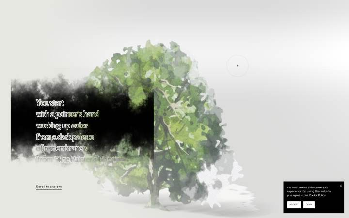


**Stack:** WordPress theme `davidwhyte` (body class `wp-theme-davidwhyte`, `page-template-unsubscribed`; WooCommerce 10.9.4, MemberPress 1.14.1, Yoast) behind Cloudflare (`/cdn-cgi/scripts/.../email-decode.min.js`, `cdn-cgi/rum`). One 3.97 MB theme bundle `wp-content/themes/davidwhyte/app.js?ver=1789550385` (webpack/babel, GLSL via glslify — every shader string starts with `#define GLSLIFY 1`) plus `style.css` (537 KB) and `loader.css`. Libraries found in `app.js` (pretty-printed copy at `app.pretty.js`, 210k lines):
- **three.js** — `REVISION: 16x` (two copies at L46373 and L198510, minifier truncated the string; `KTX2Loader` + `basis_transcoder.js/.wasm` at `assets/xp/libs/basis/`, `WebGLRenderTarget`, `RawShaderMaterial`, `VideoTexture`, `sampler3D` LUTs → WebGL2). Raw WebGL/ogl/curtains/pixi: none.
- **gsap 3.14.2** (`version: "3.14.2"` at L14613 core and L14916 ScrollTrigger) + SplitText (3 hits; cursor label "See the poems" split to `.char-anim` divs).
- **Lenis 1.3.2** (`version: "1.3.2"` L207706; `html.lenis` css rule; wheelMultiplier patched at runtime L174114 to slow the experience scroll).
- **detect-gpu 5.0.38** (`https://unpkg.com/detect-gpu@5.0.38/dist/benchmarks` L144914) → `mW.gpu.tier` / `mW.gpu.isMobile` gate every quality decision.
- **mapbox-gl 3.14.0**, **tarteaucitron 1.17.0** (cookie banner), **dash.js ControlBar**, **hCaptcha**, **Stripe**, **jQuery 3.7.1** — all WordPress/global, unused by the experience.
- Sound: plain `<audio>` elements in `.xp-assets` (`loop-main.mp3`, `loop-poem.mp3`, `loop-painting.mp3`, `over-cta-back.mp3`, `over-cta-painting.mp3`) driven by an AudioManager (`switchThemeTo` L146698, `playSound` L146716: `currentTime=0; volume=1; play()`). No Howler, no WebAudio graph.
- No react/vue/framer/matter/lottie/rive/barba/swup. Long-press: 25 hits `longpress` (own pointer state machine, see Effects). `prefers-reduced-motion`: 0 hits in app.js and 0 in style.css.
- No visible "Immersive Garden" credit string in the HTML or bundle (agency attribution comes from outside knowledge; bundle style — `$viewManager`, `$paintManager`, `$audioManager`, `data-component` autoloader — is consistent with their in-house framework).

**Fonts:** self-hosted `Canela Text` (Thin 100, Light 300, LightItalic, Regular 400 — `.woff2` preloaded) and `Roobert` (Light 300, Regular 400, Medium 500). `html { font-size: 1px }` so sizes are written as `14rem` = 14px. Loader "Loading" label: Roobert 12px/14px; enter description: Canela Text 100 14px/18px; poem text (`.xp-section .xp-text p`): Canela Text 100, 30px desktop / 25px small, color `#413a39`, max-width 13em — but the poem you actually see is rendered in WebGL from an MSDF atlas of the same face (`/xp/msdf/CanelaText-Light/CanelaText-Light.json + .png`) and from a pre-rendered `/xp/poem/text.png`; cursor label: Roobert 400 14px `#a94c21`; "Scroll to explore": Roobert 14px. (Computed values from Playwright in `styles.json` — see appendix at the bottom.)

**Layout & palette:** full-viewport fixed `<canvas class="xp-canvas">` (1440x900, WebGL2) under a 5866px-tall document; scroll is only a progress value (Lenis) that drives a camera dolly through a 3-D paper-diorama scene (`/xp/models/scene.glb`, 189 KB). Paintings are flat "paper" planes with painted ground blobs and grass. Palette: warm paper `#efeae2` html background, fog colour `vec3(0.796,0.796,0.761)` (a grey-beige), ink text `#413a39`, accent rust `#a94c21`, black loader `#000`. UI is minimal: fixed custom SVG cursor (two circles), a "Scroll to explore" underline link, a sound toggle bottom-right, "Back" buttons for full-paint and poem modes. Below the canvas, ordinary WordPress sections: "Advantages" (3 steps + CTA to `/register/membership/`), FAQ accordion, footer.

**Effects** (one bullet per effect):
- *Intro loader / gate* — black `#loader` (SVG signature + 1px progress bar) then a `.loader-experience` overlay: "Loading" label + a small WebGL Perlin-ink blob (`.middle-w`) that grows on hover and, on click, bleeds to fill and fades out over 4s, then the experience starts. **Technique:** first loader is inline JS (`setTimeout(updateProgress,30)` fake 0→100% scaleX bar). Second is a tiny three.js scene (ortho camera, one plane, fragment shader with uniforms `uProgress, uforce, uNoiseSpread, uNoiseSpread2, uNoisePrecision, uOffset, uPosX, uColorDivider, uBkgColor`, 8-octave Perlin; `handleMouseenter` tweens `uProgress→125` 2.5s expo.out, `handleClick` tweens `uProgress→470` over 4s linear + fades `el`/`textEl`), then GSAP fades `.center-wrapper` 0.7s and emits `start-watercolor-scene`. Gate waits for `document.fonts.ready` and all `resources.items` (L181990). **Playwright:** `elementHandle.click('.middle-w')` fails ("element is not visible" — the loader's own WebGL canvas covers it), so after `networkidle` + ~10 s wait use `page.mouse.click(vw/2, vh/2)` on the viewport centre (this is what worked: `console.log` → `clicked center`, then `after-enter.json` shows the cursor in `hoverPainting` state and the 1440×900 WebGL2 canvas live); or simply load `?skipLoader` (L147087 `hY = aY.has("skipLoader")` → `this.skip = true`, element hidden, scene auto-starts) and `?skip` to hide the black WP `#loader` too. There is no audio prompt: sound starts muted-off (`.sound.is-off`) and only plays after the user clicks the toggle. **Evidence:** `raw.html` inline `<script>` in `#loader`; `app.pretty.js` L181893–182080 (class `ent`), L182440–182520 (LoaderExperience.enter/init/attach).
- *Wet-paint cursor distortion on paintings* — moving the cursor over a painting smears it like wet watercolour, the trail slowly settles; pressing pushes paint outward. **Technique:** NOT a radial displacement and not a plain flow-map: a full 2-D GPU fluid simulation (stable-fluids) per painting, packed into an atlas of ping-pong FBOs, whose velocity/intensity texture is then sampled by the paint shader to offset the atlas UVs and to blend a "wet ink" 3-D LUT. Passes (each a `RawShaderMaterial` on one instanced quad geometry with an `atlasRange` attribute so all papers simulate in one draw): `externalForce` → `advection` → `divergence` → `pressure` (Jacobi, `pressure.iterations: 1`) → `gradientSubtract` → `accumulation`, with FBOs `velocity_0/1`, `divergence`, `pressure_0/1`, `accumulation_0/1` swapped each frame (`_updatePasses` L158740–158800: `this.fbos.pressure_0 = n; this.fbos.pressure_1 = e`). Mouse injection shader (L156708/156710) uniforms: `vec2 force[], center[], lastCenter[]; float scale[], lastScale[]; bool isMouseDown[]; vec2 fboSize[]; float intensity[], ratio[], wasActive[]`; `sampler2D src`. Key lines:
  ```glsl
  float sdf = sdEllipse(uv - vCenter, vec2(vScale, vScale * (1. + (planeRatio-1.) * .5)));
  sdf = max(0., -sdf / max(vLastScale, vScale));
  vec2 dir = normalize((uv - vCenter) / vScale) * df;          // df = length(vForce)
  float inputIntensity = min(prevData.z + vIntensity, 1.);
  newVelocity = (vIsMouseDown > 0.5) ? dir * sdf * vForce.x : mix(vForce, dir, 0.2) * sdf;
  gl_FragColor = vec4(prevData.xy + newVelocity, newIntensity, 1.);
  ```
  Advection (L156000) semi-Lagrangian back-trace with noise-broken flow (`uniform sampler2D velocity, noise; float randomDirection, firstNoiseScale, secondNoiseScale, velocityThreshold, gapVelocityBoost; vec2 gapAmount; float intensityDim`): `vec2 uv2 = vSimulationUv - mix(vel, noiseDirection*length(vel), randomDirection) * vDt * ratio; vec3 newData = texture2D(velocity, uv2).xyz; gl_FragColor = vec4(vel * vDeceleration, newIntensity, 0.);` — the "noiseDirection" mix is what makes the smear feather like pigment instead of a smooth fluid. Tuning object L152950: `hover:{mouseForce:50, deceleration:0.98, attenuation:0.96, cursorSize:400, dt:0.008}`, `mousedown:{mouseForce:0.3, deceleration:1, attenuation:0.98, cursorSize:500}`, `advection:{randomDirection:0.8, velocityThreshold:0.05, intensityDim:0.001, gapAmount:{min:.468,max:.51}}`. Sim resolution L158503: per-paper tile `min(1200, paperWidth*26)` px (1024/×5 on tier≤1 or mobile), fullscreen sim 1024 (512 low-tier); on mobile the per-paper sim list is empty (`if (!mW.gpu.isMobile)` L158585) so touch devices get no smear. Consumer = paint fragment shader (L160968, 22.7 KB, `#ifdef RENDER_PAINT`), uniforms `uSimulationTexture, uPaintAtlasTexture, uMaskAtlasTexture, uSdfAtlasTexture, uNormalMapTexture, uInkLut3d, uDryLut3d (sampler3D), uLutEnable, uLutSize, uPaintIntensity, uDisplacementStrength, uNormalMapStrength/Scale, uLighterColor, uFogState, tNoiseTexture, uTime, uResolution`:
  ```glsl
  vec4 data = texture2D(uSimulationTexture, simulationUv);
  vec2 dir = -data.rg; float vel = data.b; float intensity = data.a;
  float blend = smoothstep(0., 0.1, vel); float offset = smoothstep(0.05, 0.15, vel);
  paintOffsetUv += normalize(dir) * smoothstep(0.001, 0.05, vel) * 0.01 * textureEdge;
  vec4 texelOffset = texture2D(uPaintAtlasTexture, paintOffsetUv);
  vec4 texel = texture2D(uPaintAtlasTexture, paintUv);
  texel = mix(texel, texelOffset, offset);
  float mixValue = mix(uPaintIntensity.x, uPaintIntensity.y, intensity) * blend;
  color = mix(inkColor, baseColor, mixValue);
  vec3 lutColor = mix(texture(uDryLut3d, uvw).rgb, texture(uInkLut3d, uvw).rgb, mixValue);
  color = mix(color, lutColor, uLutEnable);
  ```
  so the displacement is only ~1% of UV along the flow direction; most of the "wet" look is the dry→ink LUT colour shift (`/xp/lut/ink.3DL`, `/xp/lut/dry.3DL`, 6.8 KB each) gated by the sim's intensity channel. A second, simpler consumer (L160344, ground blobs: `uAtlasTexture, uSimulation, uNoise, uSimulationIntensity`) does `blend = smoothstep(0.,0.1,data.b) * uSimulationIntensity; gl_FragColor = vec4(color, blend * boxDist * vAlpha)` — the wet halo on the ground. **Evidence:** `shaders/L156710.glsl`, `shaders/L156000.glsl`, `shaders/L160968.glsl` (main at lines 471–600), `shaders/L160344.glsl`; `screenshot-03-mouse-trail.png`.
- *Ink-bloom reveal of each painting* — as you scroll to a painting it appears as black ink blots that bloom outward and turn into colour. **Technique:** in the same paint shader, `computeInkReveal(color, baseColor, uv, vRevealProgress, planeRatio, uNoiseFinalTexture, vRevealPoints, vRevealPointsPos, maxProgress)` — per-instance `mat4 uRevealPoints[]`/`uRevealPointsPos[]` (4 seed points with scale/startTime/stepDuration) + noise texture, progress `uRevealProgress[INSTANCE_COUNT]` tweened by GSAP from scroll (`startAt` per paper: `tree_1 0, cow_1 1.25, cow_2 2, cow_3 7, land_back_1 8.25 …` L153650–154000). **Evidence:** `shaders/L168692.glsl` lines ~120–170 (`computeInkReveal`), `screenshot-02-after-enter.png` (mid-reveal black) vs `screenshot-03` (fully coloured).
- *Long-press on a painting → video of the real place* — hold on a painting: the cursor's outer ring blows up and fades, the painting "un-blooms" back to ink and a full-screen paint plane fades in whose texture is two looping MP4s (base + over) of the real landscape, still smeared by the fluid sim; "Back" button (`.xp-fullpaint-btn`) or release hides it; sound theme switches to `loop-painting`. **Technique:** own `Mouse` singleton (class `MJ` L156330–156545) — `window.addEventListener("pointerdown")` always; if `lZ()` (= `"ontouchstart" in window || navigator.maxTouchPoints > 0`) then `touchmove`/`touchend`, else `mousemove`/`pointerup`. No timers: a `requestAnimationFrame` loop computes `downTime = (Date.now()-downStartTime)/1000` and `longpressProgress = min(1, downTime / longpressTriggerTime)`; movement `> 15px` (`Math.max(diff.x, diff.y) > 15`) resets `downStartTime`; while down it emits `"longpressing"` each frame, then `"longpressOn"` once progress hits 1, `"longpressOff"` on up. `longpressTriggerTime` default 1 s but set at scene creation to **0.3 s desktop / 0.6 s mobile** (L173452 `LJ.longpressTriggerTime = mW.gpu.isMobile ? 0.6 : 0.3`). Consumer `onLongpressOn` (L173024) requires `isPaintInteractionEnabled` and `htmlTarget === canvas`, calls `reevaluateLongpress()` → `show()`, which picks `sceneIndex` from the hovered paper, sets `videoBase.src = assets/xp/videos/{desktop|mobile}/base/{n}.mp4`, `videoOver.src = …/over/{n}.mp4` (n = 1..6; desktop base/1 = 3.76 MB, over/1 = 3.57 MB, mobile base/1 = 1.30 MB), `play()`s both muted `playsinline` `<video>`s (three `VideoTexture`), then a GSAP timeline: `switchThemeTo("loop-painting")`, `switchFogToOpaque(1, "power1.inOut")`, reveal tween 0.8 s `sine.inOut` on `uVisibleProgress`. Full-paint shader (L168692, uniforms `uPaintTexture, uPaintTexture2, uPaintTextureSize, uSimulation, uVisibleProgress, uNoiseTexture, uColor, uAlpha`): `float blend = smoothstep(0.,0.1,vel); vec3 color = mix(paintColor, paintColor2, blend); color *= 1. + (blend-0.5)*0.1; gl_FragColor = computeInkReveal(uColor, color, vUv, uVisibleProgress, …, 0.65);`. On mobile `show()` forces `hasCloseBttn = true` (L173132) so the hold is replaced by a tap-to-open + "Back" button. Progress ring: **none** — the cursor only toggles classes. `.cursor-w.longpressed .out-circle { opacity:0; transform:scale(2); transition: transform .75s cubic-bezier(.77,0,.175,1) }`, `.in-circle` same, `.in-circle-down { opacity:1; transform:scale(0) }` (style.css). `longpressProgress` is passed in the event payload but no consumer reads it outside the Mouse class. **Evidence:** `app.pretty.js` L156330–156545, L173024–173230, L172870–172900 (video paths), `style.css` `.cursor-w.longpressed…`; `screenshot-04-hold-700ms.png`, `screenshot-05-hold-2200ms.png` (painting reverting to ink with colour only near the press; the videos did not get a `src` in headless swiftshader — `hold.json` shows `vidBase.src: ""` — so the video phase itself is undetermined in this capture, the code path above is from the bundle).
- *Custom cursor* — two SVG circles (`viewBox 0 0 34 34`, 95px) + "See the poems" label; outer ring grows 1.5× on `[data-hover]` elements, shrinks to a dot on paintings (`hoverPainting`), label chars stagger-fade over the poem. **Technique:** GSAP quickTo (`xToIn/yToIn/xToOut/yToOut/xToText`) on `translate3d` (inline style in `hold.json`), states are CSS classes with `transition` (`.cursor-w .out-circle { transition: transform .75s cubic-bezier(.165,.84,.44,1) }`), SplitText chars with `stagger: 0.02`. Hidden on mobile/tablet via `.hide-mobile.hide-tablet { display:none!important }`. **Evidence:** L122020–122150, style.css `.cursor-w*`.
- *Poem text in the scene* — the poem sits as a soft-edged black ink cloud with white lettering that blurs/feathers near the cursor and scrolls with the page. **Technique:** a quad textured with a pre-rendered `text.png` (883 KB) sampled at three blur levels (`uSharpUvs, uLowBlurUvs, uHighBlurUvs`) mixed by noise + cursor distance: `float dist = length((vUv - uCursorPosition) / vec2(1., uQuadRatio)); … displacement = displacement * displacementAmount - vec2(0.01,0.); vec2 uv = vUv + displacement + fadeDisplacement*0.5;` with `uScrollProgress` offsetting the sample y; separate MSDF text material (L166356, `uMouseNdc`, `uMouseNoiseInputRange/OutputRange`, `uMouseGlobalInputRange/OutputRange`, `uBlurInputRange/OutputRange`) for titles: `float distToMouse = length(uMouseNdc - vNdcVertex); alpha *= cremap(distToMouse, …); alpha *= mix(sharpSDF, blurredSDF, blur);` — text sharpens as the mouse approaches. **Evidence:** `shaders/L169210.glsl`, L166356; `screenshot-02/03`.
- *Scroll = camera dolly through paper diorama* — scrolling moves past standing paper cut-outs (tree, cows, walker, sheep, moors) with ground blobs, grass blades and fog. **Technique:** Lenis 1.3.2 smooth scroll → normalized progress → three.js camera along `scene.glb` path; papers are instanced planes with `uCurveCoef` bend, drop shadows via an SDF shadow map pass (L161605 `uShadowSpread, uShadowAttenuation, uShadowSkew`), depth fog with 3 blended settings (`getBaseSettings/getOccultedSettings/getOpaqueSettings`, `uFogState`), grass = instanced blades with wind (`uWindDisplacement, uWindIntensity, uWindSpeed`), leaves particle system (`uParticleSize, uLifeTime, uSpeedReveal`). Post: bloom (5 mip blur), chromatic aberration + barrel (`uCAMaxDistortion, uCAScale, uCASize`), depth-of-field (`tBlur, tDepth, tDepthCurve`). No ScrollTrigger in the experience (ScrollTrigger is used by the WordPress sections below: `scrollTrigger: { trigger: t, start: "top 92%" }` L22806). Document height 5866px is a scroll runway only. **Evidence:** L150470–151425 (post passes), L163297 (grass), L164424 (leaves), `screenshot-scroll-1..6.png`.
- *Sound toggle* — icon is an SVG waveform whose two paths animate `stroke-dashoffset` (176.6) on hover/toggle; audio themes crossfade between the three loops. **Technique:** CSS `stroke-dasharray/stroke-dashoffset` transitions (`.xp-section .sound … transition: stroke-dashoffset .7s`), HTMLAudio volume tweens. **Evidence:** style.css `.xp-section .sound*`, L146698.
- *Nav hover text / buttons* — header links reveal a `.hovered-text` companion line; CTA buttons have a double `.button-text` for a slide swap. **Technique:** CSS transitions in style.css (no JS). **Evidence:** `hover.json`, `screenshot-hover-*.png`.
- *Reduced motion* — **none**: 0 `prefers-reduced-motion` rules in style.css and none in app.js; the only degradation is device-based (detect-gpu tier ≤1 → DPR 1 and smaller sims; `isMobile` → no fluid sim, no grass, no titles, mobile MP4s, tap+Back instead of hold, cursor hidden). `data-component="MobileResize"` on body handles `--vh` on resize.

**What to adopt for the arctic sketchbook**
- *Ink-bloom reveal (M3 — section reveals)*: replace three.js/GLSL with SVG: paint the sketch in a `<mask>` whose content is 3–4 `<circle>`s filtered by `feTurbulence` + `feDisplacementMap`, and GSAP-tween their `r` with staggered `startTime/stepDuration` exactly like `uRevealPoints` (scale, startTime, stepDuration). Same read: blots bloom then colour arrives. No new dependency.
- *Wet-paint smear on hover (M4 — R3F shader moment, ONE section only)*: do not port the six-pass fluid; port only the *cheap* part — a single ping-pong trail FBO (velocity + intensity, ellipse SDF brush at the pointer, `deceleration 0.98`) with R3F `useFBO` and a `drei` `shaderMaterial`, then offset the painting UV by `normalize(dir) * smoothstep(0.001,0.05,vel) * 0.01` and mix towards a "wet" colour (`mix(dry, wetter, intensity)`). Keep their tuning numbers as a starting point. three/R3F/drei are already allowed.
- *Long-press to reveal (M4)*: copy the pointer state machine — `pointerdown` on window, rAF-driven `progress = min(1, held/0.3s)`, cancel when moved > 15px, `longpressOn/Off` events — as a small React hook (`useLongPress`) with motion/react for the cursor ring; degrade to a plain tap + "Back" on touch (as they do) and to an instant crossfade under reduced motion. Video of the place = a `<video muted playsinline>` behind the sketch, faded with a `feTurbulence` mask rather than a shader.
- *Cursor states as classes (M2 — global chrome)*: their cursor is just `translate3d` via GSAP quickTo + class toggles with CSS transitions; reuse that pattern with `motion` values; hide on touch devices.
- *Sound as opt-in* (M6 polish): looped `<audio>` elements with `preload="none"`, muted-off by default, toggled by a stroke-dashoffset SVG — no WebAudio needed.
- *Quality tiers*: their `detect-gpu` gating is a good idea; we can do the cheap version with `navigator.hardwareConcurrency`/`deviceMemory` + `prefers-reduced-motion` and skip R3F entirely on low tiers (M4). (`detect-gpu` would be a new dependency — flag.)
- *Fonts*: Canela Text (thin serif) + Roobert (grotesk) is a licensed pairing; we keep our handwriting font but the *scale* (1px root, 14px UI labels, 25–30px verse) is a useful reference for M1 typography.

**What NOT to adopt and why**
- The full stable-fluids pipeline (advection/divergence/pressure/gradient subtract, atlas-packed instanced FBOs, 3-D LUT ink colourimetry, KTX2/Basis atlases, MSDF text, bloom/CA/DoF post) — weeks of shader work, WebGL2-only, and nothing on the page is usable without it. Our design rule is "R3F only for shaders, one signature moment per section".
- A blocking two-stage loader with a 4-s click-to-enter dissolve: violates "no scroll-jacking" spirit and hurts first paint; we should stream in.
- Scroll runway of 5866px with no DOM content behind it (pure camera dolly) — search/accessibility dead zone; our scroll should stay Lenis + ScrollTrigger over real sections.
- No reduced-motion path at all — we must provide crossfades.
- 4096² JPEG atlases (2.1 MB colour + 0.6 MB mask) + 1.4 MB KTX2 + 0.9 MB text PNG + 3.7 MB videos per scene: too heavy for a personal site; use per-image WebP/AVIF ≤ 1600px.
- Fixed custom cursor that hides the native one on desktop; keep native cursor and only decorate.

**Screenshots:** screenshot-00-initial.png, screenshot-01-loaded.png, screenshot-02-after-enter.png, screenshot-03-mouse-trail.png, screenshot-04-hold-700ms.png, screenshot-05-hold-2200ms.png, screenshot-06-after-release.png, screenshot-hover-_xp_poem_btn.png, screenshot-hover-_xp_scrollToExplore.png, screenshot-hover-header__page_companion.png, screenshot-hover-header__become_member.png, screenshot-hover-_sound.png, screenshot-scroll-1.png … screenshot-scroll-6.png, screenshot-full.png, screenshot-mobile-01.png, screenshot-mobile-02.png, screenshot-mobile-03-hold.png, screenshot-mobile-full.png. Data: requests.json, rendered.html, styles.json, hover.json, hold.json, loader-state-1/2.json, after-enter.json, mobile-state.json, console.log, shaders/*.glsl (21 extracted shaders), app.pretty.js.

**Appendix — Playwright capture facts (`styles.json`, `requests.json`, `mobile-state.json`)**
- Computed fonts: h2/`.a-title` = "Canela Text" 100 52px/64.48px; h3 = "Canela Text" 100 32px/40px; body `p` (first = cursor label) = Roobert 400 14px `rgb(169,76,33)`; `a` = "Canela Text" 400 15px `rgb(216,145,76)`; header logo = "Canela Text" 250 20px; nav `.page` = Roobert 400 14px; `.loading-text` = Roobert 12px/14px; `.enter-description` = Canela Text 100 14px/18px; hidden DOM `.xp-text` falls back to Times New Roman 30px (it is never shown — the WebGL copy is what renders). No `<h1>` on the page. `document.fonts` loaded: Canela Text 100/400, Canela Text Italic 100, Roobert 300/400 (Light 300 / Medium 500 / LightItalic preloaded but unused). body background = transparent over `html { background-color: #efeae2 }`.
- 81 requests at 1440×900 (5 document, 22 script, 8 stylesheet, 9 font, 17 image, 9 fetch, 5 xhr, 6 media). Experience payload: `scene.glb` 190 KB, `atlas/texture.jpg` 4096² 2.09 MB, `atlas/texture_mask.jpg` 4096² 0.60 MB, `atlas/sdf.png` 1024² 1.57 MB, `grounds/atlas.ktx2` 1.41 MB (Basis, transcoded by `basis_transcoder.wasm`), `poem/text.png` 0.88 MB, MSDF `CanelaText-Light.png` 152 KB + `.json`, `lut/ink.3DL` + `dry.3DL` 6.8 KB, paper `normal.jpg` 225², `matcap.png`, 4 noise PNGs, grass/leaves atlases; audio loops fetched right after start (`loop-main/poem/painting.mp3`, 1.3 MB each; `preload="none"` in markup but the AudioManager loads them). Videos are NOT requested until a long-press succeeds (none in this capture). No requests to Immersive Garden domains; nothing 403'd.
- Only one `<canvas>` (`.xp-canvas`); zero SVG `feTurbulence/feDisplacementMap/mask/filter` in the DOM; zero `mix-blend-mode`, `backdrop-filter` or CSS `filter` in computed styles; one `clip-path: inset(50%)` (WooCommerce screen-reader text). Everything painterly is inside WebGL.
- `window.THREE/gsap/ScrollTrigger/lenis` are not exposed (bundled), `window.mapboxgl = 3.14.0`, `jQuery 3.7.1`. `prefers-reduced-motion` false in the capture; no rule would respond to it anyway.
- Scroll: `mouse.wheel(0,700)` ×6 → `scrollY` 710 … 4210 of 5866; the DOM does not change class on scroll (`.xp-section` stays `xp-section`), only the WebGL camera moves (`screenshot-scroll-1..6.png`).
- Mobile 390×844 (iPhone UA, touch): the experience still runs (`.xp-canvas` 390×844 `display:block`, scrollH 5550), loader tapped through at centre; cursor hidden (`hide-mobile hide-tablet`); poem block and fog render, paintings are re-laid for portrait (`adjustedUvs.x += step(screenRatio, 1.) * -.5; // on portrait only` in the fog shader). Per-bundle: no fluid smear, no grass/titles, `mobile/` MP4s, 0.6 s hold, tap opens with a Back button.
- Headless caveat: rendered with SwiftShader; the paint atlas decoded (green watercolour tree visible in `screenshot-03`), but the long-press video phase did not attach a `src` (`hold.json`), so screenshots 04/05 show only the ink-revert part of the hold.

---

## 10. https://www.sutera.ch

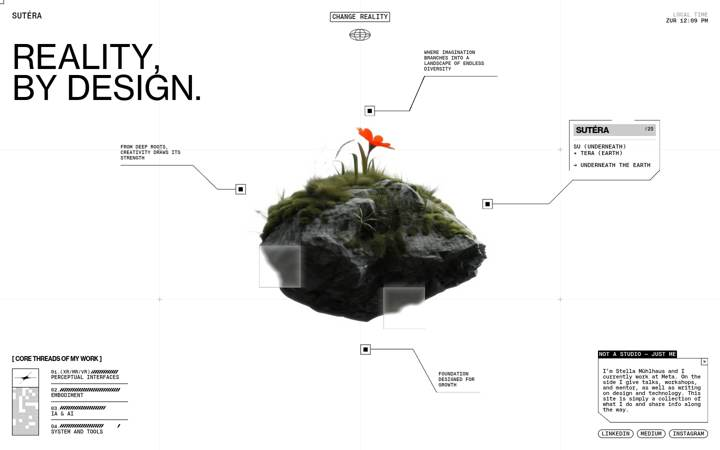
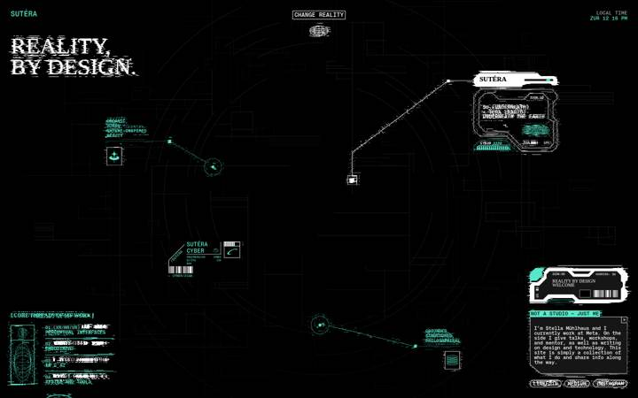


**Stack:** Nuxt 3 / Vue 3 (Vite chunks under `/_nuxt/`, `<div id="__nuxt">`, `builds/meta/*.json`), hosted on Vercel (`/_vercel/image?url=…&w=1536&q=100` optimizer), CMS Prismic (`sutera.cdn.prismic.io`, `images.prismic.io/sutera/…`, prismic-toolbar 4.1.7 iframe). Tailwind v4 (`--tw-*` custom props, `px-(--grid-margin)` syntax, `custom-tab:`/`custom-desktop:` variants in `entry.BR_myX4x.css`). Libraries in `bundles/CnqO9obZ.js` (1.2 MB raw / 293 KB over the wire; `ZF73RuYw.js` 324 KB is the Nuxt+Vue+Prismic runtime):
- GSAP **3.13.0** (`version:"3.13.0"` ×4). Plugins registered in one call `j.registerPlugin(qr,is,Ps,_c,Zl,wt,Fh,io,Yd)` = ScrollTrigger (`wt.update` fed by Lenis), CustomEase (`is.create("frame-custom-3", "M0,0 C0.126,0.382 …")`), Draggable (`Ps.create(…,{type:"x,y",inertia:!0,bounds})`) + InertiaPlugin, DrawSVGPlugin (`drawSVG:"0%"` ×25), ScrambleTextPlugin (`scrambleText:{chars:"Sutera*#/%^$@"}`), Observer (14 hits). `SplitText` string appears once only; `MorphSVG` 0, `ScrollSmoother` 3 hits (bundled, not instantiated; no `smooth:` / `pin:` / `scrub:` anywhere).
- Lenis **1.3.15** (`lenisVersion=I9`, `I9="1.3.15"`): `x=new G9({prevent:R=>R.id==="modal",syncTouch:!0}),x.stop(),x.on("scroll",wt.update),j.ticker.add(R=>{x.raf(R*1e3)},!1,!0),j.ticker.lagSmoothing(0)` — Lenis is started only after the loader (`function O(){x.start(),u.value=!0}`) and stopped while a project panel is open or something is being dragged (`toggleScroll`).
- three.js **r181** (`Mc="181"`, `__THREE__=Mc`) — used ONLY for the blueprint particle cloud (`Particle`/`BlueprintParticle` components: WebGLRenderer, two `WebGLRenderTarget`s ping-ponged, `ShaderMaterial` ×2). **No model loaders at all**: `GLTFLoader=0, DRACOLoader=0, KTX2Loader=0, MeshoptDecoder=0, OBJLoader=0, .glb/.gltf=0` in every bundle.
- Raw WebGL2 / WebGL (no library) for the two hero "video sequence" players (`getContext("webgl2",{alpha:!0})`, `x.createTexture`, `x.texImage2D`, hand-written GLSL 300 es).
- Canvas 2D for the reality-transition curtain and the loader.
- No framer-motion, pixi, ogl, lottie, rive, barba, swup, curtains. No `prefers-reduced-motion` anywhere (0 hits in CSS and JS).

**Fonts:** all self-hosted `@font-face` with `font-display:swap`: **NeueHaas** (NeueHaasGroteskText 400 + Bold 700, woff2 30 KB each) = "lab" reality display font; **Bitter** (serif, 300/400/700; the 300/700 weights ship as .ttf) = "blueprint" reality; **BrunoAce SC** = "cyber" reality; **PP Neue Montreal** 400 (72 KB woff2) = `--font-main`, the UI/label font everywhere. The display font is a CSS variable swapped per reality: `--font-lab:"NeueHaas"; --font-blueprint:"Bitter"; --font-cyber:"BrunoAce"; .reality-font{font-family:var(--reality-font)}` and each reality tree sets `style="--reality-font:var(--font-blueprint)"`. Measured (1440×900, `reality-states.json`): h1 "Reality, By Design" = NeueHaas 66.5px/400 (lab), Bitter 66.5px/300 (blueprint), BrunoAce 51.5px/400 (cyber); body/labels = PPNeueMontreal 10–11.7px, `uppercase`, letter-spaced; `.text-xxs` for the loader percentage; body base 16px.

**Layout & palette:** full-bleed "HUD" page: a fixed hairline grid (`.project-blured` SVG with `<line>`s at 1/4 columns and 1/3 rows, stroke `#f2f2f2`, plus small `+` crosshairs) behind everything, a huge left-aligned headline, a centred rotating hero object with 4 callout lines ending in small square markers, and bordered "window" boxes with `×` close buttons for copy. Three complete colour worlds ("realities") exist at once as three sibling DOM trees `.ctn` (v-show; `aria-hidden` on the hidden ones; `?realityID=0|1|2` query picks the start one): **lab** = white bg, black text; **blueprint** = white bg, everything `#344DBB` blue (`--color-blue`), photos tinted via `.blueprint-filter:before{background-color:var(--color-blue);mix-blend-mode:color;inset:0}` and separate pre-made blueprint PNG/SVG assets (`/inner-img/Blueprint-Arm.png`, `Blueprint-Projects-Grid.svg`, …); **cyber** = black bg, `#59E7CA` mint (`--color-green`) + white, HUD frames with barcodes. No gradients, no shadows, no glass. Page height 4770px desktop.

**Effects** (one bullet per effect):
- *Intro loader ("Loading 0%…100%")* — white screen, Sutéra logotype letters flicker in, "NOT A STUDIO — JUST ME" scrambles in, a percentage + thin bar at the bottom, then a square-pixel dissolve into the page (~4.3 s total; `loader-samples.json`: visible at 4082 ms, gone at 4549 ms). **Technique:** GSAP timeline with fake progress: `[{value:10,duration:.75},{25,.6},{35,.6},{55,.6},{70,.6},{100,.9}]` on CustomEase `"custom-loader"`, each step tweening the number (`modifiers:{value:Math.round}`), the bar `scaleX:P.value/100` and the label `xPercent:-P.value`; the whole thing is `tweenTo("end")` with duration = max(timeline length, `performance.getEntries()[0].duration`), i.e. never shorter than the real navigation. The dissolve is 120 `<span>` squares (`.loader-filter span{aspect-ratio:1/1;background:#fff;min-width:7.5%}` inline in `<head>`), sized to 13 columns (`clientWidth/13`), shuffled, then `stagger:{each:.03,from:"random"}` through keyframes `mixBlendMode:"difference" → "normal" → opacity:0`. Text: `scrambleText:{text, chars:"Sutera*#/%^$@", speed:2, revealDelay:.3}` in, and a second scramble to spaces out; the logo `<path>`s get `{opacity:0,1,0,1,0}` keyframe flickers with `repeat:2`. Loader emits `canLoadImgs` (frame sequences start fetching only then), `loaderStartEnding`, `loaderEnd` (+0.2 s) which calls `lenis.start()`. **Evidence:** `bundles/CnqO9obZ.js` `__name:"Loader"` component (`function y(){const U=[{value:10,duration:.75,ease:"custom-loader"}…`, `function S(){const U=u.value.clientWidth/13…stagger:{each:Z,from:"random"},keyframes:[{opacity:1,mixBlendMode:"difference"…`); screenshots `screenshot-loader.png`, `loader-1.png`.
- *"Change Reality" = blueprint-to-reality transition (the one we care about)* — clicking the header pill makes the whole page glitch for ~0.6 s (VHS tearing, black/white blocks flashing, the page flickering on/off) and when it settles you are in the next reality: lab → blueprint → cyber → lab. **Technique: it is NOT a shader crossfade, not a material mix, not scroll- or hover-driven. It is a hard DOM swap hidden under a click-triggered glitch curtain.** Concretely (component `CommonTransition`, first 9.5 KB of `CnqO9obZ.js`, saved as `chunk-CommonTransition.js`):
  1. State: `b=["lab","blueprint","cyber"]`, `k=b[f.value]`; click → `z(){m.value=!0}` (transition `isActive`) → `f.play(0)`.
  2. A fixed full-screen `<canvas>` (2D, `pointer-events-none z-10000`) holds a **20×20 grid of rects** (`h={cols:20,rows:20}`), each randomly `colorType:"light"|"dark"` from the *current* reality's palette (`lab:{light:"white",dark:"black"}, blueprint:{light:"white",dark:"#344DBB"}, cyber:{light:"#59E7CA",dark:"black"}`). The shuffled cells are switched on 2 at a time every 0.05 s (`f.set(O,{opacity:1,scaleX:()=>1+Math.random()*4,scaleY:()=>.5+Math.random()*.5}).set(O,{opacity:0},"<+=0.05")` for `(.4+.2)/.05` steps) and painted each tick by `onUpdate:m` (`c.fillRect` with `globalAlpha`).
  3. All `<section>`s get an SVG filter: `S.set(T,{filter:"url(#vhs-glitch-filter)"},1)` where the filter is `<feTurbulence type="fractalNoise" baseFrequency="0.005 0.05" numOctaves="1"/> <feDisplacementMap in="SourceGraphic" in2="noise" scale="0" xChannelSelector="R" yChannelSelector="G"/> <feMerge>`; every 0.05 s (0.2 s on ≤769px) the filter is re-randomised: `f.set(r.value,{attr:{baseFrequency:\`0.005 ${Math.random()*.4+.05}\`}}).set(a.value,{attr:{scale:()=>Math.max(0,Math.random()*t.maxDisplacement*2)}})` (`maxDisplacement` default 25 → horizontal tearing up to 50px; the last random value stays in the DOM: `transition-samples.json` shows `baseFrequency="0.005 0.3438…" scale="29.61"`). The Y frequency is 7–70× the X frequency, so the noise is horizontal streaks = VHS tearing.
  4. The visible page container `.ctn` and the transition canvas flicker `opacity` through 9 keyframes `[0,1,0,1,0,1,0,1,0]` over 0.4 s starting at t=0.2 s; at the end of that tween `emit("transitionEnd")` → parent `ee(){f.value=(f.value+1)%3; await nextTick(); m.value=!1}` — the reality index increments, Vue's `v-show` hides one `.ctn` and shows the next (`reality-states.json`: `visibleCtnClass` goes `"ctn …"` → `"ctn … text-blue blueprint"` → `"ctn … text-white cyber"`), `gsap.set("body",{backgroundColor:p[reality].bodyBg})` (white/white/black) — then a second 0.2 s `[0,1,0,1]` flicker and the filter is removed (`S.seek(0)`). Total ≈ 0.2 + 0.4 + 0.1 + 0.2 ≈ 0.9 s; the "reveal" is instantaneous inside a black-frame.
  5. What actually changes between realities is *content*, not a material: each reality tree has its own hero component (`Hero`/`BlueprintHero`/`CyberHero`), its own pre-rendered images (`Arm.png` vs `Blueprint-Arm.png`, `Lab-Statue.webp` vs `Blueprint-Statue.webp`, Prismic fields `blueprint_media`, `cyber_media`), its own display font (`--reality-font`) and colour tokens; photos in blueprint get the `mix-blend-mode:color` blue wash. There are no shared uniforms crossfading two textures anywhere in the bundle.
  **Evidence:** `chunk-CommonTransition.js` (full source), `transition-r2-0.png` (mid-glitch frame: torn text, white/black blocks, hidden sections), `reality-0.png`/`reality-1.png`/`reality-2.png` (lab/blueprint/cyber), `reality-states.json`, `transition-samples.json`.
- *Rotating hero object (lab: mossy rock with orange flower; cyber: translucent lily)* — a photoreal object slowly turns on a turntable, forever; in cyber you can grab it and spin it with inertia. **Technique: no 3D model. Pre-rendered turntable frame sequences (WebP) drawn onto a raw-WebGL full-screen quad.** `Lab-Rock` = 111 frames at `/video-sequence/lab-hero/Lab-Rock/lab-hero-N.webp`, `Cyber-Flower` = 121 frames at `/video-sequence/cyber-hero/Cyber-Flower/cyber-hero-N.webp`; responsive folders `-Mobile` (≤640), `-TabS` (≤991), `-Tab` (≤1200) (`function Xe(F){let q=\`${t.framePath}-Mobile${t.frameName}\`;window.innerWidth>1200?…}`). Desktop frames are **1080×1808 px, 96–163 KB each → 232 requests, 28.5 MB total** (`requests.json`: `type:"fetch"`, content-length sum 28,542,976; portrait aspect `$v=1808/1080`). Loading: after `canLoadImgs`, `fetch(url).blob() → createImageBitmap(blob,{imageOrientation:"flipY",resizeWidth:window.innerWidth}) → gl.texImage2D` (one GL texture per frame), interleaved in 8 passes (every 8th frame first via `Promise.all`, then the gaps, yielding 16 ms every 10 frames) so playback can start early; a helper `$()` walks back to the nearest already-loaded frame. Cached in a shared store (`getSequence("lab"|"cyber")`) so the other reality's player reuses the bitmaps. Playback: `gsap.to(T,{frame:frameCount-1,snap:"frame",ease:"none",duration:(frameCount-10)/24 ≈ 4.6 s, onComplete:()=>play(0)})` (lab version is a `repeat:-1` timeline), rendered only when the frame index changed or the mouse is moving; the tween is gated by `scrollTrigger:{start:"top top",end:"bottom top",trigger:canvas,toggleActions:"play pause play none",onLeave:()=>gsap.ticker.remove(render),onEnterBack:()=>gsap.ticker.add(render)}` → **idle auto-rotation, not scroll-driven**. Drag (cyber only): mousedown/touchstart pauses the tween, `frame = startFrame - (mouseX - startX) * 0.2` (`Df=.2` frames/px, wrapped mod frameCount), velocity tracked, on release `gsap.to(T,{frame:frame - clamp(v*200*.2, ±100), duration:min(.4+|v|*1.5,1.5), ease:"frame-custom-3", modifiers:{frame:wrap}})` then the loop resumes in the drag direction (`U.reversed(O<0)`). **Evidence:** `VideoSequencePlayer` / `CyberVideoSequencePlayer` components (`props:{frameCount,framePath,frameName,extension,…}`, `frameCount:121,framePath:"/video-sequence/cyber-hero/Cyber-Flower"`, `frameCount:111,framePath:"/video-sequence/lab-hero/Lab-Rock"`), `img/cyber-hero-1.webp` (1080×1808), `requests.json`, `screenshot-hero.png` vs `reality-1.png` (different turntable angles).
- *Cyber lily "liquid" distortion + chromatic aberration under the cursor* — moving the mouse over the lily smears it, splits RGB and over-saturates where the smear is strongest; pressing adds a bump. **Technique:** CPU-simulated displacement field + GLSL 300 es fragment shader. A `Float32Array(R*R*3)` (R=256, 512 if `isSmooth`) RGB32F texture is decayed each frame toward 0.5 (`J=(J-.5)*.95+.5`) and stamped with a radial brush of radius `R*0.1` carrying the smoothed mouse velocity (`V.vx+= (mouse-V.x)*.15; V.vx*=.8`, strength 20, 15 if smooth). Shader uniforms: `uniform sampler2D u_texture; uniform sampler2D u_displacement; uniform float u_displacement_factor; uniform vec2 u_resolution; uniform float u_time;` — `vec2 actual_disp=(texture(u_displacement,vUv).rg-0.5)*0.04; const float ABERRATION_FACTOR=0.1; uv_r=vUv+(actual_disp+actual_disp*ABERRATION_FACTOR)*0.5*u_displacement_factor; uv_g=vUv+(actual_disp*0.5)*u_displacement_factor; uv_b=vUv+(actual_disp-actual_disp*ABERRATION_FACTOR)*u_displacement_factor;` then `saturation_factor=mix(1.0,5.0,smoothstep(0,1,length(actual_disp)/0.04))` applied via luma mix. `u_displacement_factor` = 1 on landscape desktop, **0.2 on portrait/mobile** (`K=.2,se=.98`). **Evidence:** `custom-shaders.glsl` offset 914936, JS around `u_displacement_factor:null` (`function Be()…`, `function Fe()`).
- *Lab rock "pixel patch" flicker* — grey blurred squares pop on and off over the rock (visible in every lab screenshot), cluster under the cursor, and a click sends a ring of squares outward. **Technique:** WebGL1 fragment shader on the same frame quad, uniforms `uniform sampler2D u_texture; uniform vec2 u_resolution; uniform float u_time; uniform vec2 u_mouse; uniform float u_click; uniform float u_clickTime; uniform vec2 u_clickPos;`. Grid `gridSize=5.0` cells (aspect corrected); per cell a hashed seed picks a speed `mix(0.8,4.5,seed)` and threshold `mix(0.85,1.0,rand)`; active cells (`step(threshold, temporalNoise)`) are replaced by a **5×5 box-blur of the texture** (`blurSize=5.0/u_resolution.x`), only where the centre pixel is not transparent; mouse radius `0.175` forces ~65% of nearby cells on; click launches a ring `waveSpeed=1.8`, `waveThickness=0.2` from `u_clickPos`. Rendered at DPR 1 on <768px. **Evidence:** `custom-shaders.glsl` offset 1102702 (`float isCellActive(...)`, `// --- Blur 5x5 sur la couleur du patch ---`), `screenshot-hero.png`, `screenshot-mobile-hero.png`.
- *Blueprint hero: 160 000-point particle cloud on graph paper* — blue dotted streaks drifting, repelled by the cursor and by invisible pulsing circles; the four "core threads" sliders change its behaviour. **Technique:** three.js r181 GPGPU: `z=400,V=400` → `DataTexture(Float32Array(400*400*4))`, two `WebGLRenderTarget`s ping-ponged each tick (`_(h); f=h,h=V; o.uniforms.map.value=f.texture; c.uniforms.tPositions.value=f.texture`), simulation `ShaderMaterial` uniforms `tPositions, origin(vec3), timer, mouse(vec2), repellents[8](vec4 x,y,radius,strength), repellentCount, modulateRadius, flatMode` (`flatMode: window.innerWidth<768?0:1`); 2% of particles respawn at `origin` every frame (`rand(vUv+timer)>0.98`), the rest drift with `sin/cos` fields (×0.005), mouse repulsion radius 0.5; `origin` orbits with `sin(t*2), cos(t*2.5), sin(t*2.9)`. Render pass: `THREE.Points`, `pointColor:vec4(.2039,.302,.7333,α)` (= #344DBB), `pointSize:1.25*dpr/1500*innerWidth`, `blending:2` (AdditiveBlending), `depthWrite:false`. The 4 `levelsValues` (Draggable bars) map to `repellentCount`, speed (`.4+z*1.1`), alpha (`.075+V*.2`), `modulateRadius`. Camera fov 50, z=2. **Evidence:** `BlueprintParticle`/`Particle` components at offsets 633826 / 638628, `custom-shaders.glsl` offset 630615, `transition-r1-3.png` (blueprint hero).
- *Cyber background line drawing draws itself* — thin white orbital arcs/lines sketch in after the switch. **Technique:** GSAP DrawSVG on a static inline SVG: `.from(polylines,{drawSVG:"0%",stagger:{amount:2,from:"center"}}).from(lines,{drawSVG:"0%",…},"<").from(paths,{drawSVG:"0%",duration:.4,stagger:{amount:3,from:"random"}},"<+=2")`, `tweenTo(end,{ease:"power1.out",delay:.5})`. The hero callout lines (`.main-path`, `.main-dot`) are inline SVG `<path d="M0,0.5h135">` too (drawSVG used 25× in the bundle). **Evidence:** `CyberBg` setup (`j.utils.toArray("path",e.value)… drawSVG:"0%"`), `reality-2.png`.
- *Header pill hover* — "Change Reality" fills black with white text (blue / mint in other realities). **Technique:** GSAP timeline `fromTo(el,{backgroundColor:textColor},{color:textColor,backgroundColor:bgColor,duration:.7,ease:"none"})` scrubbed with `tweenTo("end",{ease:"expo.out"})` on mouseenter and `tweenTo(0)` on mouseleave. `onTouchstart` triggers the switch directly with `preventDefault`. **Evidence:** `MainHeader` component (`h={lab:{textColor:"white",bgColor:"black"},…}`, `function m(g){r.tweenTo(g,{ease:"expo.out"})}`), `hovers2.json` (inline `style="background-color: black; color: white;"`).
- *Project cards you can throw around* — the 9 project thumbnails are draggable with momentum inside their section; clicking one slides a project panel in from the right while the page behind blurs. **Technique:** `Draggable.create(cards,{type:"x,y",inertia:!0,bounds:section,onDragStart:()=>emit("toggleScroll",false)})` (Lenis stopped while dragging); panel: `timeline.from(panel,{xPercent:75|100,duration:1.5}).fromTo(".project-blured",{filter:"blur(0px)"},{filter:"blur(5px)"},"<")` then `tweenTo(end,{ease:"expo.inOut"})`; inside the panel a custom scroller with `ScrollTrigger{scroller:panel, toggleActions:"play reverse play reverse"}` highlights anchors. **Evidence:** `Projects` component at 857050 (`Ps.create(r.value,{type:"x,y",inertia:!0,bounds:a.value…`), `ProjectPage` (`.fromTo(".project-blured",{filter:"blur(0px)"},{filter:"blur(5px)"}`).
- *Live local clock* ("ZUR 12:09 PM") — **Technique:** `gsap.timeline({repeat:-1,onRepeat})` re-reading `Date` every 10 repeats. Evidence: `MainHeader` `function p(g){… time-hours/time-minutes`.
- *"lab reality - lab reality -" ticker strip* — a bordered marquee. **Technique:** undetermined: markup is `<div class="w-max py-[0.78em] whitespace-pre">` inside `overflow-hidden`; no `@keyframes` exist in the CSS and I could not isolate the GSAP tween that moves it in the minified bundle.
- *Easter-egg tooltips* (`LabEasterEgg`, `BlueprintEasterEgg`, `CyberEasterEgg`, e.g. "Zurich, Switzerland" on the clock) — mouse-following boxes shown on `mouseenter` (`isActive`, `mouse`, `win` props). Technique details not analysed.
- *Scroll behaviour (GSAP/ScrollTrigger pattern)* — **no pinning, no scrub, no scroll-linked values at all** (`pin:`/`scrub:` = 0 hits). Every ScrollTrigger in the bundle has the shape `scrollTrigger:{start:"top bottom"|"top top"|"top-=1px top", end:"bottom top", trigger:el, toggleActions:"play pause play pause"|"play pause play none", onLeave:()=>gsap.ticker.remove(loop), onEnterBack:()=>gsap.ticker.add(loop)}` — it is used purely as **visibility gating** to pause rAF loops/timelines that are off-screen. Lenis provides the smoothing (`syncTouch:true`, default `lerp:.1`), `scrollTo(0,{lerp:.1,duration:2,easing:quartInOut})` for the "top" footer link. Scroll screenshots `scroll-1…7.png` show no parallax or reveal-on-scroll; content is static except the always-running canvases.

**Mobile & loader notes:** at 390×844 (`screenshot-mobile-hero.png`, `screenshot-mobile.png`) the site keeps the same structure stacked in one column; the rock turntable still runs with the pixel-patch shader (WebGL at DPR 1: `const F=window.innerWidth<768?1:window.devicePixelRatio`; frames from the `-Mobile` folder; `createImageBitmap` downscaled to `innerWidth`; displacement factor 0.2 on portrait; particle sim in `flatMode`); the glitch transition re-randomises the SVG filter only every 0.2 s instead of 0.05 s on ≤769px; scrolling is Lenis `syncTouch`; "Change Reality" fires on `touchstart`. Touch detection: `"ontouchstart"in window||navigator.maxTouchPoints>0||matchMedia("(pointer: coarse)").matches` (`isTouchDevice`, `isInMobileMode: innerWidth<769`). The loader always plays (≥ ~4 s, never shorter than the navigation timing) and the ~28 MB of frames only start downloading after it. No `prefers-reduced-motion` handling.

**What to adopt for the arctic sketchbook**
- *Ink-to-colour as a global "reality" state, not a per-image trick* (M1 foundations / M4 sections). Sutera's strongest idea is that one click re-skins fonts, colour tokens and imagery together. Do the same with a React context + CSS variables (`--ink`, `--wash-opacity`, `--sketch-font`) and pre-authored paired assets (line-art SVG + watercolour fill layer for the same drawing) instead of shader crossfades. Cheap, works with rough.js output, and degrades to a crossfade for reduced-motion.
- *The transition mechanics, re-voiced as "bleed" instead of "glitch"* (M3 hero signature moment). Keep their exact machinery: an SVG `<filter>` with `feTurbulence` + `feDisplacementMap` whose `baseFrequency`/`scale` attributes are tweened by GSAP (`gsap.to(dispMap,{attr:{scale:0}})`), applied to the section during the switch. But run it as one continuous 0.8–1.2 s tween (`scale: 40 → 0`, `baseFrequency: 0.02 → 0.004`, isotropic noise, `ease:"power2.out"`) rather than random re-seeding, and reveal the colour layer under a growing `<mask>` (a rough.js blob path or a radial `feTurbulence`-displaced circle scaled with GSAP) so the wash visibly soaks in from the click point; the ink layer stays on top at full opacity so lines never disappear. Reduced-motion: mask jumps to 100% and colour layer fades 300 ms.
- *Loader = paper reveal* (M6 polish, or M1 if we decide to keep a loader). Their 13-column random square dissolve with `mixBlendMode:"difference"` keyframes is a tiny GSAP stagger; ours could be ink dots or torn-paper tiles with `stagger:{from:"random",each:.03}` — but gate it on real asset promises, not a fake percentage, and cap it at ~1.5 s.
- *Frame-sequence turntable for the "rotating 3D element"* (M3 hero or M5 design lab). If we want a spinning sketched object (iceberg, compass, tent) without a GLTF pipeline: pre-render 48–72 rough-shaded frames as WebP ≤30 KB each (Sutera's 1080×1808/110 KB × 232 = 28 MB is the anti-pattern), load them interleaved (every 8th first) with `createImageBitmap`, and drive `frame` with a single `gsap.to({frame},{snap:"frame",ease:"none",repeat:-1})` paused by ScrollTrigger `toggleActions:"play pause play none"` when off-screen. Draw to a 2D canvas (no shader needed) or an R3F `<meshBasicMaterial map>` if we also want the wobble shader. Drag-to-spin: GSAP Draggable + InertiaPlugin (both in gsap 3.13 core now, allowed) with their `frame = start − dx*0.2` and release `duration:min(.4+|v|*1.5,1.5)` numbers; or motion/react `drag="x"` + `useVelocity` for the same feel.
- *Lab rock "cell patch" shader → "wet patch" wobble* (M5 design lab / R3F shader budget). Their per-cell hashed timer + 5×5 blur + mouse radius + click ring is a 60-line fragment shader; swap the box-blur for a `feTurbulence`-like noise offset and use it on our hero watercolour plane in R3F: uniforms `u_texture, u_resolution, u_time, u_mouse, u_click, u_clickTime, u_clickPos` map 1:1. The click ring (`waveSpeed 1.8`, `waveThickness 0.2`) is a ready-made "drop of water" interaction.
- *ScrollTrigger as visibility gating only* (M2 scroll system). Copy their discipline: every canvas/timeline gets `scrollTrigger:{start:"top bottom",end:"bottom top",toggleActions:"play pause play pause",onLeave:()=>ticker.remove(loop),onEnterBack:()=>ticker.add(loop)}`; Lenis with `lenis.on("scroll",ScrollTrigger.update)` + `gsap.ticker.add(t=>lenis.raf(t*1000))` + `lagSmoothing(0)`; stop Lenis while a matter-js drag is active (`toggleScroll`). No pins, no scrub → satisfies our no-scroll-jacking rule.
- *DrawSVG callout lines* (M4 sections). Their hero labels are SVG paths drawn with `drawSVG:"0%"` staggered from centre — exactly our "draw" verb for rough.js annotation lines and rough-notation underlines.
- *Blueprint particle cloud → snow* (M5 design lab, optional). GPGPU ping-pong in R3F (drei `useFBO`) with their sim shader is a proven 160k-point setup; for us it would be a heavy way to get snowfall — matter-js or a 2D canvas with 300 flakes is enough. Note only if we later want a signature shader moment.

**What NOT to adopt and why**
- The hard swap under a glitch curtain as our ink→colour transition: nothing actually transitions, it hides a cut with a VHS/neon-flavoured effect (random `feDisplacementMap` re-seeds, black-frame flicker, chromatic aberration) that violates our no-neon rule and the "bleed/settle" vocabulary. We want to *see* the wash soak in.
- Three full DOM trees rendered at once (3× markup, hidden with v-show, `aria-hidden` juggling): heavy, confusing for screen readers and search; use tokens + swapped layers instead.
- 28.5 MB of 1080×1808 WebP frames (232 requests) plus a mandatory ≥4 s fake-progress loader before they even start; the whole site is unusable on slow networks and the loader lies about progress.
- Chromatic aberration + 5× saturation boost shader, HUD boxes with barcodes, VHS tearing, `mix-blend-mode:color` photo tints: all off-palette for a hand-drawn sketchbook (they read "cyberpunk", we read "ink and paper").
- No `prefers-reduced-motion` path and no pointer:none fallback for the WebGL canvases (they force DPR 1 instead); we must degrade to crossfades.
- Draggable-throw project cards with `inertia` and Lenis stop/start juggling: fun but it fights scrolling on touch (they had to `preventDefault` touches); our physics play belongs in the sandboxed matter-js "design lab" only.

**Screenshots:** screenshot.png (full page 1440), screenshot-hero.png, screenshot-loader.png, loader-1.png, loader-2.png, scroll-1.png … scroll-7.png, screenshot-mobile.png (full page 390), screenshot-mobile-hero.png, mobile-scroll-1.png … mobile-scroll-4.png, reality-0.png (lab), reality-1.png (blueprint), reality-2.png (cyber), reality-3.png (lab again), reality-1-scrolled.png, reality-2-scrolled.png, reality-3-scrolled.png, transition-r1-0…13.png, transition-r2-0…13.png (r2-0 = mid-glitch frame), transition-r3-0…13.png, hover-0.png, hover-1.png, hover-sible____text_Change_Reality.png, hover-_visible_a_href___linkedin__.png, hover-___text_Meta_Interaction_SDK.png, hover-____text_Restoring_Abilities.png. Supporting data: requests.json, requests3.json, page-info.json, reality-states.json, transition-samples.json, loader-samples.json, hovers.json, hovers2.json, mobile-info.json, rendered.html, raw.html, custom-shaders.glsl, chunk-CommonTransition.js, bundles/ (all JS/CSS), img/ (cyber-hero-1.webp, Lab-img2.png, Hand-lab.png).

---

## 11. https://scottmilton.com (→ https://www.scottmilton.com/)

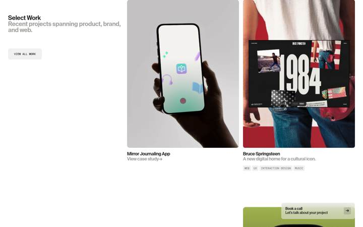

**Stack:** Framer (raw.html: `<!-- Made in Framer -->`, `<meta name="generator" content="Framer e0809aa">`, published Sep 11 2026). Hosting: Framer CDN (`framerusercontent.com` served 72 of 96 requests; `events.framer.com/script?v=2` analytics; `app.framerstatic.com` editor-bar chunks). Libraries in the 19 downloaded `.mjs` bundles (`bundles/`): React 18.2.0 (`react.BpKPsBQp.mjs` contains "18.2.0" ×4); Framer's bundled `motion` (`motion.Cn2IfUXD.mjs`, 151 KB, contains `whileHover`, `whileInView`, `inView`, `MotionValue`; no version string); Framer runtime `framer.7wPAVXif.mjs` (458 KB); Lenis smooth scroll loaded lazily (`Y5TKUKNP2.CaAy7_kg.mjs` → `import("./lenis.modern.Deh5nLWH.mjs")`, 10.7 KB; no version string in the minified file); rolldown bundler runtime. No gsap/ScrollTrigger/three/pixi/matter/lottie/rive/canvas/WebGL (0 `<canvas>`, 0 SVG filters, 0 `filter:`, 0 `clip-path`, computed `transition` on 0 elements — every animation is motion-driven inline style).

**Fonts:** Actually requested (requests.json, 3 font files): `Suisse Int'l Semi Bold` (custom, `framerusercontent.com/assets/1hjQNHJFGTyl9xNHER8Kk9vLGk.woff2`, weight 600), `Suisse Int'l Medium` (`do6kPKhFKFxVqY3xfYZQwHKzcY.woff2`, used once), `DM Mono 500` (Google Fonts `aFTR7PB1QTsUX8KYvumzEYOtbQ.woff2`, latin only). Declared but unused: Inter (14 faces), Suisse BP Int'l Regular/Antique, Suisse Int'l Mono. Body bg `#ffffff`; ink `rgb(26,26,26)` #1a1a1a; muted `rgb(155,156,151)` #9b9c97; link-current token `#bababa`.

**Type scale (desktop 1440, walk of every text node's parent, getComputedStyle; `typescale.json`)** — 12 unique combos, ONE typeface for everything except mono labels:

| # | family | size / line-height | weight | letter-spacing | case | n | colour | used for (example) |
|---|---|---|---|---|---|---|---|---|
| 1 | Suisse Int'l Semi Bold | 48 / 48 (1.0) | 900 (synthetic bold: `<strong>` inside p; only a 600 face exists) | -2.4px (-5%) | – | 1 | #1a1a1a | Hero statement "Design Director with over a decade…" (width 1152px) |
| 2 | Suisse Int'l Semi Bold | 48 / 48 (1.0) | 600 | -2.4px (-5%) | – | 5 | #1a1a1a | Services list "Product design / Websites / No-code development / Branding / Design systems" |
| 3 | Suisse Int'l Semi Bold | 48 / 38.4 (0.8) | 600 | -2.4px | – | 2 | #1a1a1a + #9b9c97 | Footer "Open to work" / "hello@scottmilton.com" (tight 0.8 leading for the stacked pair) |
| 4 | Suisse Int'l Semi Bold | 24 / 24 (1.0) | 600 | -0.6px (-2.5%) | – | 2 | #1a1a1a + #9b9c97 | Section heading "Select Work" + grey subline "Recent projects spanning…" (column 452px) |
| 5 | Suisse Int'l Semi Bold | 18 / 18 (1.0) | 600 | -0.72px (-4%) | – | 21 | 10 ink / 11 muted | Project-card title (marked up as `<h1>`!) + grey one-line description; also personal-grid titles |
| 6 | Suisse Int'l Semi Bold | 16 / 20 (1.25) | 600 | -0.64px (-4%) | – | 6 | white (via mix-blend difference) | Header: "Scott Milton", "Product Design Director", Work / About / Contact (`<h4>`) |
| 7 | Suisse Int'l Semi Bold | 16 / 16 (1.0) | 600 | -0.64px | – | 4 | #9b9c97 | Footer links Work / LinkedIn / Contact / About |
| 8 | Suisse Int'l Semi Bold | 15 / 15 | 600 | -0.15px (-1%) | – | 2 | white | Header clock "Berlin  01:09 PM" |
| 9 | Suisse Int'l Semi Bold | 14 / 14 | 600 | -0.4px | – | 1 | #1a1a1a | CTA pill line 1 "Book a call" |
| 10 | Suisse Int'l Medium | 14 / 14 | 500 | -0.4px | – | 1 | #1a1a1a | CTA pill line 2 "Let's talk about your project" (only use of the Medium face) |
| 11 | DM Mono | 11 / 11 | 500 | normal | UPPERCASE | 6 | ink / muted | Eyebrows + mini buttons: "SERVICES  WHAT I OFFER", "VIEW ALL WORK", "LEARN MORE" |
| 12 | DM Mono | 11 / 9.9 (0.9) | 500 | normal | UPPERCASE | 26 | #9b9c97 | Tag chips under cards ("PRODUCT", "BRAND", "UX", "MUSIC"…), grey chip bg, radius 4px |

Pattern: sizes 48 → 24 → 18 → 16 → 15 → 14 → 11 (roughly 2× steps at the top, then 1–2px steps for UI). Line-height is 1.0 almost everywhere (solid leading) — the "clean" feel comes from set-solid headlines plus tracking that tightens with size (-1% at 15px → -4% at 16–18px → -5% at 48px). Hierarchy is carried by colour (ink vs #9b9c97) and by ONE weight (600), not by size or weight changes: every title/subtitle pair is the same size, second line grey. Mono uppercase 11px is the only contrasting voice.

**Type scale (mobile 390, `typescale-mobile.json`):** 28/28 -1.2px (services), 28/25.2 -1.3px (footer), 24/24 w900 -1.2px (hero), 21/21 -0.6px (section heading), 18/18 -0.72 (card title), 16/16 -0.64 (card subtitle), 14 (CTA), 13/20 and 13/13 -0.26px (header), 13/13 -0.52px (nav), DM Mono 11 unchanged. i.e. display ≈ 0.58×, headings ≈ 0.85×, UI text unchanged.

**Layout & palette (`spacing.json`):** White page, 32px outer gutter at 1440 (content 1376px). Everything sits on a 6-column grid: `grid-template-columns: 221px ×6`, column-gap 10px, row-gap 80px (`Grid - Work`). Heading column = 2 cols (452px, `position: sticky; top: 60px`), card column = 4 cols (914px) holding a 2×444px card grid with 16/20px gaps; Personal grid = 4×332px gap 16; hero paragraph spans 1152px (≈ 5 cols). Vertical rhythm: hero `text` block padding 60px top / 240px bottom; `Work` padding-bottom 160px, inner gap 32px; `Services` and `Personal` padding-bottom 260px, gap 32px; footer padding 40px 10px, title padding-bottom 80px. Hero = 100vh (900px) auto-scrolling image carousel. Card media radius 10px, chips radius 4px, CTA pill radius 4px. Palette: #fff / #1a1a1a / #9b9c97 / #bababa only — all colour comes from project imagery. Header text is white via `mix-blend-mode: difference` (fixed, top 16px, left/right 32px), so it reads black over the white body and white over photos.

**Effects** (one bullet per effect):
- *Hero auto-scrolling image ticker* — full-viewport strip of 800px-wide project shots slides sideways continuously (translateX went -3324 → -3452 px in 0.9 s ≈ 140 px/s). **Technique:** custom Framer code component driven by motion's `useAnimationFrame`: offset += speed × dt, wraps at half of a duplicated item list; touch-drag overrides (`touches[0].clientY`, direction `down` variant for mobile). Not scroll-linked. **Evidence:** `bundles/kk8QZ…DSuM5Mcp.mjs`: `speed:140`, `direction:\`down\``, and `function ht(e){let{items…,gap:r=20,speed:i=50}…ee((e,t)=>{…let n=f.current.scrollHeight/2,r=i,a=t/1e3;…c(e=>{let t=e+r*a;return t>=n?t-n:t})})`; hover.json diff on `transform: translateX(...)`.
- *Fade-in "appear" on cards and grids* — cards fade from transparent when they enter the viewport. **Technique:** Framer appear effects: JSON in `<script type="framer/appear" id="__framer__appearAnimationsContent">`, e.g. `m5z5rc` (cards): opacity 0.001→1, tween 0.4 s ease [0.5,0,0.88,0.77]; `dcaive`/`1m9j8gh` (grids): 0.5 s, delay 0.2, ease [0.44,0,0.56,1]. Only opacity animates (x/y/scale all 0/1). Run by `animator.animateAppearEffects(...)` with `prefers-reduced-motion: reduce` check baked in (`data-framer-appear-animation="no-preference"`); after hydration motion's `inView`/`whileInView` (`__framer__threshold: .5`, `__framer__animateOnce:false`). **Evidence:** raw.html script above; `data-framer-appear-id` on 27 elements.
- *Scroll-triggered slide-up of hero text and scale-in of CTA* — the big statement slides up ~150px over the carousel as it enters view; the "Book a call" pill scales 0.8→1. **Technique:** Framer "Scroll transform" (`__framer__styleTransformEffectEnabled`, `__framer__transformTargets:[{y:-150},{y:-150}]` on `text`, `[{y:-100},{y:-100}]` inner, `[{scale:.8},{scale:1}]` on the CTA container, `__framer__transformTrigger:\`onInView\``). Tween, not scrubbed. **Evidence:** `bundles/kk8QZ…mjs` (grep `__framer__transformTargets`, 10 hits).
- *Smooth scrolling* — inertial wheel scroll. **Technique:** Lenis, lazily imported from a Framer "Smooth Scroll" component: `new Lenis({duration:intensity/10, smoothWheel:true, wheelMultiplier:1.5, touchMultiplier:2, easing:t=>Math.min(1,1.001-2**(-10*t))})`, own rAF loop, disabled on touch devices (`disableOnTouch`). **Evidence:** `bundles/Y5TKUKNP2.CaAy7_kg.mjs` + `bundles/lenis.modern.Deh5nLWH.mjs`.
- *Custom cursor (dot / "view")* — the native cursor is hidden and a 15px white dot follows the pointer, inverting over content; over project cards it becomes a 24px "View Cursor". **Technique:** Framer cursor feature: `cursor: none` on 515 elements (computed), fixed `div[data-framer-name="Dot Cursor"]` with inline SVG circle and `mix-blend-mode: difference`, per-element `data-framer-cursor` attribute selects the variant; position driven by motion. **Evidence:** `Y5TKUKNP2…mjs` `displayName=\`Cursor\``, `.framer-6v6gj.framer-1tb37j {… mix-blend-mode: difference …}`; `DUoS0MURk…mjs` `displayName=\`View Cursor\``; `"data-framer-cursor":\`1xnob7m\`` in home bundle.
- *Header blend* — header stays fixed at top 16px and inverts over imagery. **Technique:** CSS `position:fixed; mix-blend-mode:difference` on the header container (no JS). **Evidence:** rendered.html `.framer-n9hmi-container{mix-blend-mode:difference;z-index:10;position:fixed;top:16px;left:32px;right:32px}`.
- *Nav link hover chip* — hovering Work/About/Contact fades in a frosted chip. **Technique:** Framer variant: `hover` class added to the `<a>`, motion animates inline `backdrop-filter: blur(12px); background-color: rgba(255,255,255,0.05)` (inner div blur(10px)/0.08). **Evidence:** hover.json target "nav a: Work".
- *Project-card hover* — subtitle swaps to "View case study→", tag row collapses, video cards start playing. **Technique:** Framer `hover` variant (`.framer-mRPLh.framer-v-m5z5rc.hover .framer-12wh2x1 {min-height:60px}` etc.) + Framer Video component `onMouseEnter`/`onMouseLeave` calling `.play()`/`.pause()`; card `<video>`s are `autoplay=false loop muted`, hero videos autoplay. **Evidence:** hover.json (`cls … => … hover …`), `bundles/zFvRD4pN5.Bv5uY44W.mjs` (`.play()`, `.pause()`, `onMouseEnter:k`), hover-3.png.
- *Live local time* — "Berlin 01:09 PM" in the header. **Technique:** code component formatting `Date` with `timeZone: "Europe/Berlin"`. **Evidence:** `bundles/r28mDFWw1.By2pUgF3.mjs`.
- *Sticky section heading* — "Select Work" column stays pinned while the card grid scrolls. **Technique:** CSS `position: sticky; top: 60px` on `[data-framer-name="title"]`. **Evidence:** effects.json stickies.
- *Fixed frosted CTA pill* — "Book a call" stays at bottom-right. **Technique:** CSS `position:fixed; bottom:32px` + `backdrop-filter: blur(16px)`. **Evidence:** rendered.html `.framer-1qkc9q2-container{…position:fixed;bottom:32px;left:50%;transform:translate(-50%)}`; effects.json backdrop list.
- *Footer email hover* — "hello@scottmilton.com" is an `email-hover` component with a hover variant (`mailto:hello@scottmilton.com?subject=Hey Scott!`); what the variant reveals beyond the colour change is **undetermined** (the variant CSS only sets layout, animation values are inside motion props I did not fully decode).

**What to adopt for the arctic sketchbook**
- *One-typeface, one-weight, colour-carried hierarchy* (M1 type system): use our handwriting/serif display face at exactly one weight, set solid (line-height 1.0 for ≥24px), tracking tightening with size (-1% → -5%), and make every title/subtitle pair the same size with the second line in a muted "pencil grey". Tailwind 4 `@theme` tokens: `--text-display: 48px/1`, `--text-h: 24px/1`, `--text-card: 18px/1`, `--text-ui: 16px/1.25`, `--text-label: 11px/1 mono uppercase`. No new dependency.
- *Mono 11px uppercase as the only second voice* (M1): eyebrows, chips and small buttons in a monospaced "typewriter label" style instead of a third font size; mobile keeps UI sizes identical and scales only display (0.58×) and headings (0.85×).
- *6-column 221px grid with 10px gutter, 32px page margin, 2-col sticky heading + 4-col content* (M2 layout): plain CSS grid + `position: sticky; top: 60px` for section titles; big vertical rhythm (160–260px section bottoms, 80px row gaps, 32px inner gaps). No new dependency.
- *Header inverted with `mix-blend-mode: difference`* (M2): free way to keep a fixed nav legible over watercolour imagery — but check our paper-grain layer doesn't make text muddy; alternative is a rough.js-drawn label box.
- *Appear = opacity only, 0.4–0.5 s, custom cubic-bezier, threshold 0.5, replays* (M3 scroll): map to GSAP ScrollTrigger `once:false` with our "bleed" vocabulary (opacity + watercolour mask reveal) rather than y-slides; keep their prefers-reduced-motion gate (they degrade to instant — we degrade to crossfade).
- *Lenis with `wheelMultiplier 1.5`, exponential easing, disabled on touch* (M3): copy the config verbatim (`duration ≈ 1.0`, `easing: t => Math.min(1, 1.001 - 2**(-10*t))`, `syncTouch:false`) — we already allow lenis.
- *Hover-play videos and "hover variant" text swap* (M4 hover): motion/react `whileHover` on the card, `onHoverStart`→`video.play()`, subtitle crossfade to "View sketch →"; wobble via rough.js redraw instead of a min-height collapse.
- *Custom cursor with `mix-blend-mode: difference`* (M4): motion/react `useMotionValue`+`useSpring` following pointer, `cursor:none` scoped to the work grid only; our version could be a small ink blot. No new dependency.
- *Hero rAF ticker* (M2 or M5 lab): motion's `useAnimationFrame` advancing a translate by speed×dt with wrap at half a duplicated list — simple, no ScrollTrigger; could carry the "drift" of sketchbook pages. Pause on `prefers-reduced-motion`.

**What NOT to adopt and why**
- `backdrop-filter: blur()` frosted chips/CTA — violates our "no glass" rule; use a paper-coloured fill with a rough.js border.
- Card titles as `<h1>` ×10 on one page — bad semantics/SEO; use `<h3>` inside `<article>`.
- Synthetic bold (`<strong>` w900 on a 600-only face) — browser fake-bold smears; ship the real weight or don't bold.
- Global `cursor: none` on 515 elements — accessibility/latency risk on low-end devices; scope it.
- 0.8 line-height on the 48px footer pair — works only because the glyphs have no descenders in "Open to work"; with a handwriting face it will collide.
- Declaring 20+ unused `@font-face`s (Inter ×14, Suisse BP…) — dead CSS weight; only load what's used.
- Framer editor-bar/analytics chunks (`app.framerstatic.com`, `events.framer.com`) — not applicable.

**Screenshots:** screenshot.png (desktop 1440 full page), screenshot-mobile.png (390×844 full page), hover-0.png … hover-9.png (nav links, D-Mirror/D-Bruce/D-PinkFloyd/D-Backpocket/D-Evercare cards, hero image), scroll-0.png … scroll-5.png (six scroll steps). Data: requests.json, rendered.html, raw.html, typescale.json, typescale-mobile.json, spacing.json, effects.json, hover.json, scroll.json, basics.json, bundles/ (19 .mjs + lenis).

---


Source of truth: `DavidHDev/react-bits` main @ `c49d6978` (shallow clone at `(scratchpad clone of DavidHDev/react-bits)`, 2026-09-17). The TS+Tailwind variants live in `src/ts-tailwind/<Category>/<Name>/<Name>.tsx`; copies are in `(scratchpad) refs/reactbits/<Name>/`. Registry JSON (`public/r/<Name>-TS-TW.json`) is served live at `https://reactbits.dev/r/<Name>-TS-TW.json` (all four 200). Docs pages are a Vite/React SPA (`src/App.jsx` route `/:category/:subcategory`); rendered with Playwright — screenshots + `requests.json` per component folder, tab list in `live-pages.json`.

**CLI install pattern** (`src/utils/cli.js`): the page's Install panel has a `CLI | Manual` toggle and a `shadcn | jsrepo` picker; commands are built as
`npx shadcn@latest add @react-bits/<Name>-<JS|TS>-<CSS|TW>` and `npx jsrepo@latest add https://reactbits.dev/r/<Name>-<JS|TS>-<CSS|TW>`; Manual = `npm install <deps>`. Live page defaults to the JS-CSS variant (captured: `npx shadcn@latest add @react-bits/SplashCursor-JS-CSS`, `…/ImageTrail-JS-CSS`, `…/Ballpit-JS-CSS`; FallingText defaulted to Manual `npm install matter-js`). TS+TW commands per component are listed below.

Dependency check vs. our allowed list (react, vite, tailwind, gsap, lenis, motion, three/r3f/drei, roughjs, rough-notation, perfect-freehand, matter-js, d3-geo, topojson-client, world-atlas): **none of the four needs a new dependency.** matter-js, gsap and three are all allowed; SplashCursor is raw WebGL with zero deps. (React Bits also ships `ogl` for other components — not used by these four.)

---

## 12. React Bits components (reactbits.dev)

### 12.1 FallingText — https://reactbits.dev/text-animations/falling-text
**Stack:** React + `matter-js@^0.20.0` (registry `dependencies: ["matter-js@^0.20.0"]`, `registry/FallingText-TS-TW.json`). TS+TW source: `FallingText/FallingText.tsx`, **201 lines** (JS+CSS variant 190 + 31 css). CLI: `npx shadcn@latest add @react-bits/FallingText-TS-TW` / `npx jsrepo@latest add https://reactbits.dev/r/FallingText-TS-TW` / manual `npm install matter-js`. All deps allowed.
**Fonts:** none loaded by the component; inherits page font, `fontSize` prop (demo uses `2rem`/`4rem`), `lineHeight: 1.4`.
**Layout & palette:** a `relative overflow-hidden` container with an inline-block text div and an absolutely positioned canvas underneath (`z-0`). Highlight words get `text-cyan-500 font-bold` (neon cyan — not ours).
**Effects:**
- *Words fall and tumble, draggable with the mouse* — paragraph sits still until trigger, then every word drops, bounces on the floor and can be flicked. **Technique:** matter-js rigid bodies mirrored to DOM spans. **How the bodies map to DOM words:** (1) `text.split(' ')` → each word becomes an `<span class="inline-block …">` injected via `innerHTML` (L33-46). (2) On trigger, `getBoundingClientRect()` of each span is taken relative to the container and a `Bodies.rectangle(cx, cy, w, h, {restitution:0.8, frictionAir:0.01, friction:0.2})` is created at the word's centre with a small random x-velocity and angular velocity (L106-126). (3) Spans are switched to `position:absolute` (L128-133) so layout no longer holds them. (4) Static floor/walls/ceiling rectangles 50px thick sit just outside the container (L100-103). (5) `MouseConstraint` with `stiffness` prop gives drag (L135-143). (6) A rAF loop writes `left/top = body.position` and `transform: translate(-50%,-50%) rotate(${body.angle}rad)` on every span each frame (L151-160). Trigger modes `auto | scroll (IntersectionObserver 0.1) | click | hover` (L49-67, L174-178). **Evidence:** file lines above. **Bugs to not copy:** `Runner.run` AND a manual `Matter.Engine.update(engine)` inside the rAF loop → engine steps twice per frame (L147-158); the rAF loop is never cancelled in cleanup (L163-171); `Matter.Render` creates a full debug canvas even though every body is `fillStyle:'transparent'` — pure overhead unless `wireframes` is on; the initial `left/top` formula at L130-131 is nonsense (`position.x - bounds.max.x + bounds.min.x/2`) but is overwritten on the first frame.
**What to adopt for the arctic sketchbook:**
- **M5 (design lab / physics):** keep the *DOM-span ↔ body* mapping idea exactly: measure spans → rectangles → absolute-position → per-frame `transform`. Rewrite as a ~120-line hook (`useFallingWords(ref, {trigger, gravity})`) that uses only `Engine`, `Runner` (or a single manual `Engine.update(engine, dt)` in our GSAP ticker — pick one), `Bodies`, `MouseConstraint`; drop `Matter.Render` entirely (no canvas). Use `gsap.ticker` for the loop so it pauses with the rest of our motion.
- **M5:** the "fall / settle" vocabulary maps 1:1. Use `restitution ≈ 0.3`, higher `friction` and `frictionAir ≈ 0.02` so words *settle* like paper cut-outs instead of bouncing like rubber; add slight random `angle` so they land crooked.
- **M5:** trigger via GSAP ScrollTrigger `onEnter` (once) instead of the raw IntersectionObserver so it lives in the same scroll system.
- **M1/M5 reduced-motion:** if `prefers-reduced-motion`, skip physics and crossfade the words to their resting positions (opacity + a single `y` tween) — the component has no such fallback.
- Word spans should be rendered by React (or SplitText `type:"words"`) rather than `innerHTML` string templating (XSS + React-reconciliation hazard).
**What NOT to adopt and why:** `Matter.Render` canvas (invisible, wasteful); the neon `text-cyan-500` highlight (design rule: no neon — use rough-notation underline/highlight in our ink colour instead); the double engine stepping; the un-cancelled rAF; `innerHTML` injection.
**Screenshots:** `FallingText/screenshot-preview.png`, `FallingText/screenshot-code-tab.png` (shows Install panel CLI/Manual toggle: `npm install matter-js`).

---

### 12.2 SplashCursor — https://reactbits.dev/animations/splash-cursor
**Stack:** React + raw WebGL2 (falls back to WebGL1 + `OES_texture_half_float`), **no npm dependencies** (registry `dependencies: []`). TS+TW source: `SplashCursor/SplashCursor.tsx`, **1317 lines** (JS+CSS 1086). Derived from Pavel Dobryakov's "WebGL-Fluid-Simulation" (same shader names/structure). CLI: `npx shadcn@latest add @react-bits/SplashCursor-TS-TW` / `npx jsrepo@latest add https://reactbits.dev/r/SplashCursor-TS-TW`. Live page canvas count: 1.
**Fonts:** n/a.
**Layout & palette:** `fixed top-0 left-0 z-50 pointer-events-none w-full h-full` wrapper with a full-screen canvas (L1310-1314); listens on `window`/`document.body` so it works through the overlay. Default `RAINBOW_MODE` picks a random HSV hue per pointer, scaled ×0.15 (L1182-1190); `COLOR="#ff0000"` when not rainbow; `TRANSPARENT` default true.
**Effects:**
- *Glowing rainbow smoke that curls behind the cursor and dissipates* — **Technique:** GPU stable-fluids (Stam) simulation on ping-pong framebuffers, drawn with premultiplied additive blending. **How the fluid sim works (with uniform names):**
  - **Textures/FBOs** (`initFramebuffers` L805-836): `dye` = double FBO at `DYE_RESOLUTION` (1440) RGBA16F; `velocity` = double FBO at `SIM_RESOLUTION` (128) RG16F; `divergence`, `curl` = single R16F; `pressure` = double R16F. `getResolution` scales the short side to the given number and the long side by aspect (L843-854). **Ping-pong:** `createDoubleFBO` holds `read`/`write` and `swap()` (L745-768); every pass reads `.read.attach(n)` and blits into `.write`, then swaps.
  - **Blit** (L648-674): one static full-screen quad (`[-1,-1,-1,1,1,1,1,-1]`, 2 triangles) bound once; `blit(target)` sets viewport/framebuffer and `drawElements`.
  - **Shared vertex shader** (L353-374): outputs `vUv` plus 4 neighbour coords `vL vR vT vB` offset by `uniform vec2 texelSize` — every stencil pass uses these.
  - **Per-frame `step(dt)`** (L960-1033), `dt` clamped ≤ 1/60 (L861-867): (1) `curlShader` → curl FBO (`uniform sampler2D uVelocity`; vorticity = R−L−T+B, L539-560). (2) `vorticityShader` → adds confinement force to velocity (`uCurl`, `curl`=CURL prop 3, `dt`; L562-595). (3) `divergenceShader` → divergence FBO with reflecting boundary (`if (vL.x < 0.0) L = -C.x` …, L509-537). (4) `clearShader` multiplies previous pressure by `value`=PRESSURE (0.1) as a warm start (L390-403). (5) `pressureShader` Jacobi iterations ×`PRESSURE_ITERATIONS` (20): `pressure = (L+R+B+T - divergence) * 0.25` (`uPressure`, `uDivergence`; L597-621). (6) `gradientSubtractShader`: `velocity -= vec2(R-L, T-B)` (L623-646) → divergence-free velocity. (7) `advectionShader` on velocity itself, then on dye (`uVelocity`, `uSource`, `texelSize`, `dyeTexelSize`, `dt`, `dissipation`): semi-Lagrangian back-trace `coord = vUv - dt * velocity * texelSize; result = texture2D(uSource, coord) / (1.0 + dissipation*dt)` (L468-506); `MANUAL_FILTERING` keyword does a manual bilerp when linear filtering of half-float is unsupported. `VELOCITY_DISSIPATION`=2, `DENSITY_DISSIPATION`=3.5 give the fade.
  - **The splat** (`splat()` L1067-1096, `splatShader` L446-466): uniforms `uTarget`, `aspectRatio`, `color`, `point`, `radius`. `splat = exp(-dot(p,p)/radius) * color; out = base + splat` — a Gaussian blob added to the target. It is run **twice per pointer move**: once into `velocity` with `color = (dx*SPLAT_FORCE, dy*SPLAT_FORCE, 0)` (pointer delta in texcoords, L1058-1062), once into `dye` with the pointer's RGB colour. `radius = SPLAT_RADIUS/100` aspect-corrected (L1098-1102). Clicks call `clickSplat` with 10× colour and a random impulse (L1064-1071).
  - **Display** (`displayShaderSource` L405-444, `drawDisplay` L1041-1053): samples `uTexture` (= dye.read); with `#define SHADING` computes a fake normal from neighbour luminance (`dx = length(rc)-length(lc)`) and darkens (`diffuse = clamp(dot(n,l)+0.7, 0.7, 1.0)`) to give the "3D smoke" look; `alpha = max(r, max(g,b))`; drawn with `gl.blendFunc(ONE, ONE_MINUS_SRC_ALPHA)` (L1035-1039). `uDithering`/`ditherScale` are declared but never bound (dead uniforms — no dither texture is ever loaded).
  - **Pointer input** (L1201-1289): `mousemove` on `window` writes `texcoordX = x/canvas.width`, `texcoordY = 1 - y/canvas.height`, delta aspect-corrected (`correctDeltaX/Y`); `applyInputs()` splats once per frame if `moved` (L950-957). The rAF loop only starts on first mouse move / touch (`handleFirstMouseMove`, L1213-1221).
  - **Colour cycling:** `updateColors` re-rolls the pointer colour every `1/COLOR_UPDATE_SPEED` seconds (L939-948).
  **Evidence:** all line refs above in `SplashCursor/SplashCursor.tsx`. **Bugs to not copy:** none of the `window`/`document.body` listeners are removed and the rAF is never cancelled (no cleanup in the effect at all, L1291-1308) → leaks on route change; `Date.now()` instead of rAF timestamp; dead dither uniforms; `precision mediump sampler2D` is not valid in WebGL2 GLSL ES 1.00 for float textures on some drivers (works because of the extension path).
- *Rainbow hue cycling / neon glow* — **Technique:** HSV random hue ×0.15 additive-blended over dark background (L1182-1198). Pure neon — out.
**What to adopt for the arctic sketchbook — the "ice melt" reveal (M4, hero or project section, R3F shader):**
- Keep the *architecture* (two-pass splat + advect on ping-pong render targets, single full-screen quad, `texelSize` neighbour varyings) but throw away 80 % of it: **no pressure/divergence/curl passes**. A melt trail does not need an incompressible fluid; it needs a *decaying heat texture*. Plan, all inside `@react-three/fiber` + `drei`'s `useFBO`:
  1. **Trail FBO** (`heat`, ping-pong, `RedFormat`/`HalfFloatType`, ~256 px short side — same `getResolution` aspect trick). Each frame run one "trail" pass whose fragment shader is a merge of their *splat* and *advection/decay*: `float prev = texture2D(uPrev, vUv).r * uDecay; float splat = exp(-dot(p,p)/uRadius); gl_FragColor = vec4(max(prev, prev + splat*uStrength), 0,0,1)`. `uDecay ≈ 0.985` (per frame) is their `1/(1+dissipation*dt)`. Optionally keep a tiny drift (`coord = vUv - dt * vec2(0, -0.02)`) so the melt "runs" downward like water — that is their advection with a constant velocity instead of a velocity texture; no velocity FBO needed.
  2. **Reveal pass** (full-screen `ShaderMaterial` or `shaderMaterial` from drei): uniforms `uIce` (ice/frost texture: paper-grain + feTurbulence-baked PNG, or procedural noise), `uImage` (project image), `uHeat` (trail.read), `uNoise`. `float h = texture2D(uHeat, vUv).r; float edge = smoothstep(0.35, 0.65, h + (noise-0.5)*0.25); vec3 col = mix(ice, image, edge);` — the noise term jitters the boundary so it reads as hand-drawn/meltwater, not a soft brush. Add a thin darker rim at `smoothstep(0.3,0.4,h) - smoothstep(0.4,0.5,h)` for the wet edge (ink, not glow).
  3. Pointer → `uPoint` in the same texcoord convention (`x/w`, `1 - y/h`) and aspect-corrected radius (`correctRadius`); trigger only inside the section, not on `window`; splat strength proportional to pointer speed (their `deltaX*SPLAT_FORCE`) so slow hovering melts more than fast swipes — or the inverse, tune.
  4. `dt` clamp and the "start loop on first pointer move" idea are worth keeping; cancel rAF/remove listeners on unmount (they don't).
  5. **Reduced motion / touch:** skip the heat FBO and drive `uReveal` with a single GSAP tween 0→1 on ScrollTrigger enter → the smoothstep becomes a global crossfade. Mobile: lower resolution to 128.
- **M4 shader hygiene:** their shader `Material.setKeywords` `#define` approach (L318-350) is a neat way to compile SHADING/MANUAL_FILTERING variants — with R3F just pass `defines`.
- Everything above uses only `three` + `@react-three/fiber` + `drei` — **no new dependency**.
**What NOT to adopt and why:** full Navier–Stokes (curl/vorticity/divergence/20× Jacobi pressure = ~26 full-screen passes per frame; heavy on mobile, and the swirling look is the "liquid neon" cliché the design rules forbid); rainbow HSV colour cycling; additive `ONE, ONE_MINUS_SRC_ALPHA` glow on dark; `fixed z-50` full-window overlay (would sit over every section — we want one signature moment per section); missing cleanup.
**Screenshots:** `SplashCursor/screenshot-preview.png`, `SplashCursor/screenshot-code-tab.png` (Install panel: `npx shadcn@latest add @react-bits/SplashCursor-JS-CSS`, Usage props).

---

### 12.3 ImageTrail — https://reactbits.dev/animations/image-trail
**Stack:** React + `gsap@^3.13.0` (registry `dependencies: ["gsap@^3.13.0"]`), core gsap only — no plugins. TS+TW source: `ImageTrail/ImageTrail.tsx`, **1416 lines** (JS+CSS 1262 + 31 css) — but that is 8 near-duplicate variant classes of ~150 lines each; the real mechanism is ~120 lines. CLI: `npx shadcn@latest add @react-bits/ImageTrail-TS-TW` / `npx jsrepo@latest add https://reactbits.dev/r/ImageTrail-TS-TW`. Based on Codrops "Image Trail" demos (class/markup names `.content__img`, `.content__img-inner` are Codrops'). All deps allowed.
**Fonts:** n/a (demo heading "Hover Me." is page chrome).
**Layout & palette:** container `w-full h-full relative z-[100] overflow-visible`; each item is a `190px` wide, `aspect-[1.1]`, `rounded-[15px]`, `opacity-0` absolutely positioned div with an inner `bg-cover` div sized `calc(100%+20px)` and offset −10px (bleed for the filter/scale variants) (L1401-1413). Images set as CSS `background-image` from the `items` URL array.
**Effects:**
- *Images spawn under the cursor as it moves, each one drifting toward the cursor and fading/shrinking away; fast movement leaves a trail* — **Technique:** GSAP timelines on pooled absolutely-positioned DOM elements; rAF distance gate. **How it queues images:** (1) The pool is fixed: one DOM element per `items` entry, all pre-rendered hidden (L1402-1412), wrapped as `ImageItem` which caches its `getBoundingClientRect()` and resets on `resize` (L30-61). (2) Pointer position is tracked on `mousemove`/`touchmove` relative to the container (`getLocalPointerPos`, L8-22); the render loop starts on the first move (L100-109) and runs every frame. (3) Each frame: `cacheMousePos` lerps toward `mousePos` (factor 0.1; 0.3 in v6/v7) and `distance = hypot(mousePos - lastMousePos)`; **if `distance > threshold` (80 px) → `showNextImage()` and `lastMousePos = mousePos`** (L115-131). So the trail is spatially sampled: one image every 80 px of pointer travel, regardless of speed. (4) `showNextImage` is a **ring buffer**: `imgPosition = (imgPosition+1) % imagesTotal` (L135-137), `++zIndexVal` so newer is on top, `gsap.killTweensOf(el)` then a timeline that `fromTo`s the element from the *lagged* position (`cacheMousePos - w/2`) to the *current* pointer (`mousePos - w/2`) over 0.4 s `power1`, then at t=0.4 tweens `opacity:0, scale:0.2` over 0.4 s `power3` (L138-172). `onStart/onComplete` count `activeImagesCount`; when it returns to 0, `isIdle=true` and `zIndexVal` resets to 1 (L126-128, L191-200). (5) Variant differences (grep of tween props): v2 `scale 2.8 → 1` + `filter: brightness(250%→100%)`; v3 adds an exit fling `xPercent random(-30,30), yPercent -200`; v4 brightness/contrast scaled by pointer speed; v5 rotates each image to the angle of travel (`rotation: startAngle → lastAngle`); v6 speed-mapped `grayscale/brightness/blur` filters; v7 keeps up to `visibleImagesTotal = 9` images visible and explicitly fades the *oldest* (`getNewPosition`, L1027-1034, L1145-1158) instead of auto-fading each — a true FIFO queue; v8 3D `rotationX/Y` tilt from pointer offset. Cleanup is correct (cancel rAF, remove listeners, kill tweens, L174-189). **Evidence:** line refs above in `ImageTrail/ImageTrail.tsx`.
**What to adopt for the arctic sketchbook:**
- **M3 (project/gallery section, "one signature moment"):** the distance-gated ring buffer is exactly right for a "photos tossed onto the desk" trail. Rewrite as one ~100-line hook `useImageTrail(containerRef, {threshold: 90, max: 6})` = variant 7's FIFO (limit visible count, fade the oldest) + variant 5's travel-angle rotation reduced to ±6° so photos land slightly crooked like polaroids on a sketchbook page. Keep GSAP (allowed). Use `motion/react` only if we want drag on the settled photos.
- **M3 styling:** replace `rounded-[15px]` + bleed inner div with a rough.js-drawn paper frame (SVG `<rect>` via `roughjs` with `roughness: 1.5`, thin ink stroke, off-white 8 px border) and a `feTurbulence`/`feDisplacementMap` filter on the image for the watercolour edge; no shadow (rule), suggest a second slightly offset rough outline instead for depth.
- **M3 motion vocabulary:** "fall / settle": tween `y: -8 → 0` with `rotation` easing `back.out(1.4)` instead of scale-to-0.2 exit; exit = "bleed"/crossfade to 0 over 0.6 s.
- **M1 reduced motion / touch:** when `prefers-reduced-motion` or no fine pointer, show the images as a static scattered stack (same positions, no trail) — the component has no fallback and does nothing on touch until the finger moves.
- Keep: element pool pre-rendered (no DOM churn), `killTweensOf` before reuse, rect caching on resize, correct `destroy()`.
**What NOT to adopt and why:** the 8-variant copy-paste (1400 lines for one behaviour); CSS `filter: blur/brightness` variants (blurry-glow reads as glass/neon); `z-[100]` container; `background-image` divs (use `` for real images/alt text); `key={i}` on items.
**Screenshots:** `ImageTrail/screenshot-preview.png`, `ImageTrail/screenshot-code-tab.png`.

---

### 12.4 Ballpit — https://reactbits.dev/backgrounds/ballpit
**Stack:** React + `three@^0.180.0` + `gsap@^3.13.0` (registry deps `["gsap@^3.13.0","three@^0.180.0"]`). **gsap is imported and `Observer` registered (L1-2, L29) but never used** — dead dependency. Imports `three/examples/jsm/environments/RoomEnvironment.js`. TS+TW source: `Ballpit/Ballpit.tsx`, **907 lines** (JS+CSS 775). Vanilla three (not R3F). Credits Kevin Levron (`meta/ballpitCode.js`: "Component inspired by Kevin Levron"). CLI: `npx shadcn@latest add @react-bits/Ballpit-TS-TW` / `npx jsrepo@latest add https://reactbits.dev/r/Ballpit-TS-TW`. All deps allowed (three/r3f/drei in our list). Live page canvas count: 1.
**Fonts:** n/a.
**Layout & palette:** a single `<canvas class="w-full h-full">` sized to its parent (`size:'parent'` + ResizeObserver, L129-135). Demo palette purple/white/black glossy spheres (`colors` prop), `MeshPhysicalMaterial` with `clearcoat:1`, `metalness:0.5`, `roughness:0.5` + PMREM `RoomEnvironment` reflections + `ACESFilmicToneMapping` (L485-509, L695-700, L790).
**Effects:**
- *A pile of glossy spheres that fall, stack, bounce off the container walls and are shoved by a cursor-following sphere* — **Technique:** `InstancedMesh` of spheres + hand-written O(n²) sphere-sphere physics on CPU, one draw call. **How it wires three + physics:**
  - **Class `X`** (L47-297) — a minimal three "app": `PerspectiveCamera`, `Scene`, `WebGLRenderer({antialias, alpha, powerPreference:'high-performance'})`, `outputColorSpace = SRGBColorSpace`; `resize()` reads parent `offsetWidth/Height`, clamps FOV between `cameraMinAspect/MaxAspect` (`#adjustFov`, L186-190; Ballpit sets `cameraMaxAspect = 1.5`) and computes the **visible world size at z=0**: `wHeight = 2·tan(fov/2)·|camera.position|`, `wWidth = wHeight·aspect` (L192-202). The rAF loop (`#startAnimation` L236-250) uses `three.Timer` for `delta`, calls `onBeforeRender` → `render` → `onAfterRender`, and is started/stopped by an `IntersectionObserver` on the canvas and `document.visibilitychange` (L137-143, L225-234) — good hygiene. `dispose()` L279-297 tears down observers, listeners, renderer.
  - **Class `W`** (physics, L314-429): flat `Float32Array`s `positionData(3n)`, `velocityData(3n)`, `sizeData(n)`. `update({delta})`: for each ball `vel.y -= delta·gravity·size` (heavier = bigger), `vel *= friction` (0.9975), `clampLength(0, maxVelocity)` (0.15), `pos += vel` (L350-367). Then **pairwise collision** for `i<j`: if `dist < r_i + r_j`, push both apart by half the overlap and subtract a velocity correction proportional to `max(|vel|,1)` (L369-393) — positional correction, not impulse-based, so it is stable but not physically accurate. Ball 0 is the **cursor ball**: when `controlSphere0` it lerps to `center` (the pointer's world position) with factor 0.1 and pushes others with a stronger correction (L353-358, L394-403). Walls: reflect `vel.x/y/z *= -wallBounce` and clamp inside `±maxX/maxY/maxZ` (L404-424); with `gravity===0` the top wall also bounces so balls float.
  - **Class `Y`** (L431-483) — `MeshPhysicalMaterial` subclass whose `onBeforeCompile` injects a *subsurface-scattering* term: prepends uniforms `thicknessPower/Scale/Distortion/Ambient/Attenuation`, defines `RE_Direct_Scattering(...)` (`scatteringDot = pow(saturate(dot(viewDir, -scatteringHalf)), thicknessPower) * thicknessScale`, multiplied by `vColor`), and patches `ShaderChunk.lights_fragment_begin` to call it after every `RE_Direct(...)` (L471-478). This is what gives the balls their translucent candy look.
  - **Class `Z extends InstancedMesh`** (L687-782): `SphereGeometry` + `Y` material with `envMap` from `PMREMGenerator.fromScene(new RoomEnvironment())`, `count` instances; owns a `W`; `setColors()` builds a colour ramp over the `colors` array and `setColorAt(i, ramp(i/count))` (L715-756); `update()` runs physics then writes each ball's `Object3D` matrix (`position`, uniform `scale = size`) with `setMatrixAt` and `instanceMatrix.needsUpdate = true`; the `PointLight` rides on ball 0 (L758-781). `followCursor=false` scales ball 0 to 0 (hidden but still pushing).
  - **`createBallpit()`** (L784-862): camera at `z=20`, pointer handling via a module-level `pointerMap` + `document.body` `pointermove/click/touch*` listeners (L511-686) that map `clientX/Y` to NDC `nPosition`, then `Raycaster.setFromCamera` + `ray.intersectPlane(Plane(z=0))` → `physics.center` (L802-816); `onAfterResize` sets `maxX = wWidth/2`, `maxY = wHeight/2` so the walls always equal the visible viewport edges (L832-835). `updateConfig` re-creates the mesh only when `count` changes (L846-855).
  **Evidence:** line refs in `Ballpit/Ballpit.tsx`. **Perf note:** collision is O(n²) per frame with `new Vector3()` allocations inside the loops (L361-362, L371-375) — fine at 100–200, GC-heavy beyond.
**What to adopt for the arctic sketchbook:**
- **M5 (design lab):** the *world-size-from-FOV* helper (`wHeight = 2·tan(fov/2)·dist`) and "walls = visible viewport edges on resize" are the right way to keep a physics toy inside its section in R3F — port those 15 lines into a `useViewportWorldSize()` (drei's `useThree().viewport` already gives `width/height` at a distance — use that instead of hand-rolling).
- **M5:** `InstancedMesh` + typed-array physics is the pattern for a 2D "pebbles/ice chunks settle" toy. But for our lab we already have **matter-js**: run the bodies in matter-js (2D, proper impulses, sleeping) and only *render* them as instances in R3F (or as rough.js circles on a canvas — no WebGL). That keeps one physics engine across FallingText + this.
- **M5 hygiene:** IntersectionObserver + visibilitychange start/stop of the rAF (L137-143, L225-234), and the pointer→plane raycast for cursor interaction, are worth copying verbatim (`useFrame` in R3F + `frameloop="demand"`/`invalidate` covers the first).
- **M4 shader:** the `onBeforeCompile` SSS injection is a clean example of patching a built-in three material; if we ever want "translucent ice" chunks, this is the recipe (with `thicknessScale` low and a matte, paper-grain colour — no clearcoat).
**What NOT to adopt and why:** glossy `clearcoat` + `RoomEnvironment` reflections + ACES tone mapping (reads as glass/plastic — design rule: no glass); PointLight riding the cursor ball (glow); the dead `gsap` import; module-level `document.body` pointer listeners shared across instances (fine for one canvas, brittle in a multi-section site); O(n²) physics with per-frame allocations; a full-viewport cursor-follower ball as a *background* (background motion under text violates "one signature moment per section").
**Screenshots:** `Ballpit/screenshot-preview.png` (demo: purple/white/black spheres over hero copy, controls "Display Cursor / Ball Count 100 / Gravity 0 / Friction 0.998 / Wall Bounce 0.95"), `Ballpit/screenshot-code-tab.png`.

---

### Files saved in `(scratchpad) refs/reactbits/`
- `FallingText/FallingText.tsx` (201 L), `FallingText/FallingText.ts-default.css`, `SplashCursor/SplashCursor.tsx` (1317 L), `ImageTrail/ImageTrail.tsx` (1416 L), `ImageTrail/ImageTrail.ts-default.css`, `Ballpit/Ballpit.tsx` (907 L)
- `registry/<Name>-TS-TW.json` (shadcn registry items incl. dependency versions)
- `meta/*Demo.jsx` (docs-page demos: default prop values), `meta/*Code.js` (usage snippets + declared deps), `meta/jsrepo.config.ts`, `meta/package.json`
- `<Name>/requests.json`, `<Name>/screenshot-preview.png`, `<Name>/screenshot-code-tab.png`, `live-pages.json`, `pw.js`, `SOURCE.txt`
